# Gradle基础

# Gradle Files
对于一个gradle 项目，最基础的文件配置如下：

一个项目有一个setting.gradle、包括一个顶层的 build.gradle文件、每个Module 都有自己的一个build.gradle文件。
* **setting.gradle**:这个 setting 文件定义了哪些module 应该被加入到编译过程，对于单个module 的项目可以不用需要这个文件，但是对于 multimodule 的项目我们就需要这个文件，否则gradle 不知道要加载哪些项目。这个文件的代码在初始化阶段就会被执行。
* **顶层的build.gradle**:顶层的build.gradle文件的配置最终会被应用到所有项目中。它典型的配置如下：
```
buildscript {
    repositories {
        jcenter()
    }

    dependencies {
        classpath 'com.android.tools.build:gradle:1.2.3'
    }
}

allprojects{
    repositories{
        jcenter()
    }
}
```
1. buildscript：定义了 Android 编译工具的类路径。repositories中,jCenter是一个著名的 Maven 仓库。
2. allprojects:中定义的属性会被应用到所有 moudle 中，但是为了保证每个项目的独立性，我们一般不会在这里面操作太多共有的东西

* **每个项目单独的 build.gradle**：针对每个moudle 的配置，如果这里的定义的选项和顶层build.gradle定义的相同，后者会被覆盖。典型的 配置内容如下：
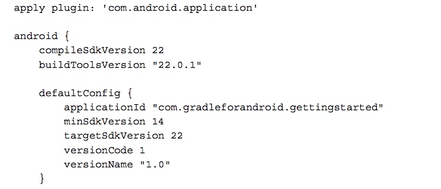
1. apply plugin:第一行代码应用了Android 程序的gradle插件，作为Android 的应用程序，这一步是必须的，因为plugin中提供了Android 编译、测试、打包等等的所有task。
2. android:这是编译文件中最大的代码块，关于android 的所有特殊配置都在这里，这就是又我们前面的声明的 plugin 提供的。
* defaultConfig就是程序的默认配置，注意，如果在AndroidMainfest.xml里面定义了与这里相同的属性，会以这里的为主。
* 这里最有必要要说明的是applicationId的选项：在我们曾经定义的AndroidManifest.xml中，那里定义的包名有两个用途：一个是作为程序的唯一识别ID,防止在同一手机装两个一样的程序；另一个就是作为我们R资源类的包名。在以前我们修改这个ID会导致所有用引用R资源类的地方都要修改。但是现在我们如果修改applicationId只会修改当前程序的ID,而不会去修改源码中资源文件的引用。
* buildTypes:定义了编译类型，针对每个类型我们可以有不同的编译配置，不同的编译配置对应的有不同的编译命令。默认的有debug、release 的类型。
* dependencies:是属于gradle 的依赖配置。它定义了当前项目需要依赖的其他库。

# Gradle Wrapper
Gradle 不断的在发展，新的版本难免会对以往的项目有一些向后兼容性的问题，这个时候,gradle wrapper就应运而生了。

gradlw wrapper 包含一些脚本文件和针对不同系统下面的运行文件。wrapper 有版本区分，但是并不需要你手动去下载，当你运行脚本的时候，如果本地没有会自动下载对应版本文件。

在不同操作系统下面执行的脚本不同，在 Mac 系统下执行./gradlew ...，在windows 下执行gradle.bat进行编译。

如果你是直接从eclipse 中的项目转换过来的，程序并不会自动创建wrapper脚本，我们需要手动创建。在命令行输入以下命令即可

```
gradle wrapper --gradle-version 2.4
```
它会创建如下目录结构：

wrapper 就是我们使用命令行编译的开始。下面我们看看 wrapper 有什么样的作用。
## Gradle basics
Gradle 会根据build 文件的配置生成不同的task，我们可以直接单独执行每一个task。通过./gradlew tasks列出所有task。如果通过同时还想列出每个task 对应依赖的其他task，可以使用./gradlew tasks -all。
其实每当我们在Android Studio点击 build,rebuild,clean菜单的时候，执行的就是一些gradle task.

## Android tasks
有四个基本的 task, Android 继承他们分别进行了自己的实现：
* assemble：对所有的 buildType 生成 apk 包。
* clean:移除所有的编译输出文件，比如apk
* check:执行lint检测编译。
* build:同时执行assemble和check命令
这些都是基本的命令，在实际项目中会根据不同的配置，会对这些task 设置不同的依赖。比如 默认的 assmeble 会依赖 assembleDebug 和assembleRelease，如果直接执行assmeble，最后会编译debug，和release 的所有版本出来。如果我们只需要编译debug 版本，我们可以运行assembleDebug。

除此之外还有一些常用的新增的其他命令，比如 install命令，会将编译后的apk 安装到连接的设备。

我们运行的许多命令除了会输出到命令行，还会在build文件夹下生产一份运行报告。比如check命令会生成lint-results.html.在build/outputs中。

# Configuration
## BuildConfig
这个类相信大家都不会陌生，我们最常用的用法就是通过BuildConfig.DEBUG来判断当前的版本是否是debug版本，如果是就会输出一些只有在 debug 环境下才会执行的操作。 这个类就是由gradle 根据 配置文件生成的。为什么gradle 可以直接生成一个Java 字节码类，这就得益于我们的 gradle 的编写语言是Groovy, Groovy 是一种 JVM 语言，JVM 语言的特征就是，虽然编写的语法不一样，但是他们最终都会编程 JVM 字节码文件。同是JVM 语言的还有 Scala,Kotlin 等等。

这个功能非常强大，我们可以通过在这里设置一些key-value对，这些key-value 对在不同编译类型的 apk 下的值不同，比如我们可以为debug 和release 两种环境定义不同的服务器。比如：
除此之外，我们还可以为不同的编译类型的设置不同的资源文件，比如：
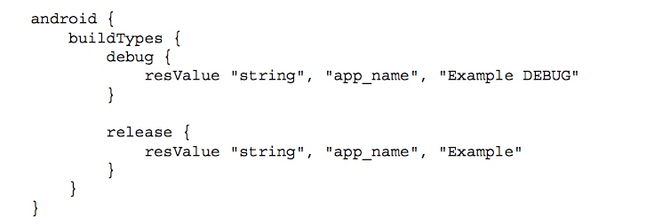

# Repositories
Repositories 就是代码仓库，这个相信大家都知道，我们平时的添加的一些 dependency 就是从这里下载的，Gradle 支持三种类型的仓库：Maven,Ivy和一些静态文件或者文件夹。在编译的执行阶段，gradle 将会从仓库中取出对应需要的依赖文件，当然，gradle 本地也会有自己的缓存，不会每次都去取这些依赖。

gradle 支持多种 Maven 仓库，一般我们就是用共有的jCenter就可以了。
有一些项目，可能是一些公司私有的仓库中的，这时候我们需要手动加入仓库连接：

如果仓库有密码，也可以同时传入用户名和密码

我们也可以使用相对路径配置本地仓库，我们可以通过配置项目中存在的静态文件夹作为本地仓库：


# Dependencies
我们在引用库的时候，每个库名称包含三个元素：组名:库名称:版本号,如下：

如果我们要保证我们依赖的库始终处于最新状态，我们可以通过添加通配符的方式，比如：
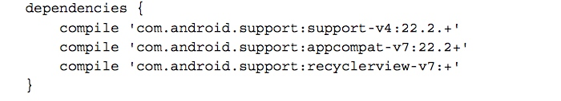
但是我们一般不要这么做，这样做除了每次编译都要去做网络请求查看是否有新版本导致编译过慢外，最大的弊病在于我们使用过的版本很很困难是测试版，性能得不到保证，所以，在我们引用库的时候一定要指名依赖版本。
## Local dependencies
### File dependencies
通过files()方法可以添加文件依赖，如果有很多jar文件，我们也可以通过fileTree()方法添加一个文件夹，除此之外，我们还可以通过通配符的方式添加，如下：

### Native libraries
配置本地 .so库。在配置文件中做如下配置，然后在对应位置建立文件夹，加入对应平台的.so文件。

文件结构如下：

## Library projects
如果我们要写一个library项目让其他的项目引用，我们的bubild.gradle的plugin 就不能是andrid plugin了，需要引用如下plugin
```
apply plugin: 'com.android.library'
```
引用的时候在setting文件中include即可。

如果我们不方便直接引用项目，需要通过文件的形式引用，我们也可以将项目打包成aar文件，注意，这种情况下，我们在项目下面新建arrs文件夹，并在build.gradle 文件中配置 仓库：
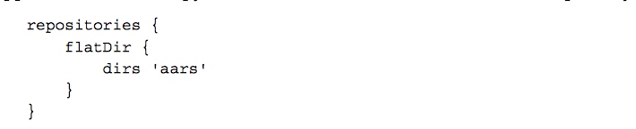
当需要引用里面的某个项目时，通过如下方式引用：


# Build Variants
在开发中我们可能会有这样的需求：

我们需要在debug 和 release 两种情况下配置不同的服务器地址；
当打市场渠道包的时候，我们可能需要打免费版、收费版，或者内部版、外部版的程序。
渠道首发包通常需要要求在欢迎页添加渠道的logo。等等
为了让市场版和debug版同时存在与一个手机，我们需要编译的时候自动给debug版本不一样的包名。
这些需求都需要在编译的时候动态根据当前的编译类型输出不同样式的apk文件。这时候就是我们的buildType大展身手的时候了。

## Build Type
android 默认的带有Debug和Release两种编译类型。比如我们现在有一个新的statging的编译类型


## Source sets
每当创建一个新的build type 的时候，gradle 默认都会创建一个新的source set。我们可以建立与main文件夹同级的文件夹，根据编译类型的不同我们可以选择对某些源码直接进行替换。
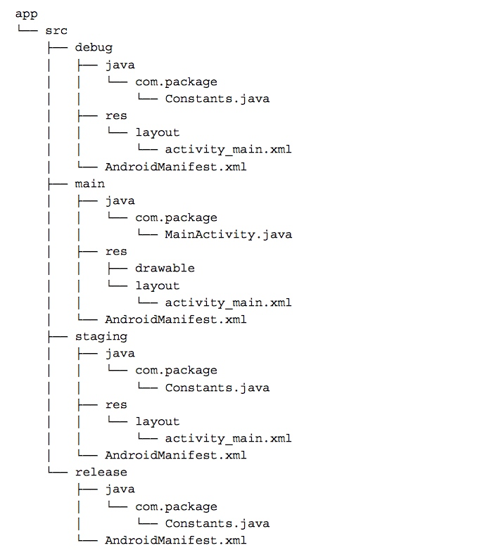
除了代码可以替换，我们的资源文件也可以替换
除此之外，不同编译类型的项目，我们的依赖都可以不同，比如，如果我需要在staging和debug两个版本中使用不同的log框架，我们这样配置：
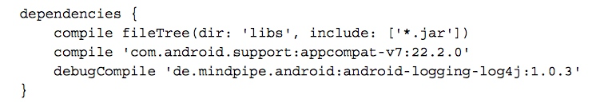

## Product flavors
前面我们都是针对同一份源码编译同一个程序的不同类型，如果我们需要针对同一份源码编译不同的程序（包名也不同），比如 免费版和收费版。我们就需要Product flavors。
注意,Product flavors和Build Type是不一样的，而且他们的属性也不一样。所有的 product flavor 版本和defaultConfig 共享所有属性！
像Build type 一样，product flavor 也可以有自己的source set文件夹。除此之外，product flavor 和 build type 可以结合，他们的文件夹里面的文件优先级甚至高于 单独的built type 和product flavor 文件夹的优先级。如果你想对于 blue类型的release 版本有不同的图标，我们可以建立一个文件夹叫blueRelease，注意，这个顺序不能错，一定是 flavor+buildType 的形式。
更复杂的情况下，我们可能需要多个product 的维度进行组合，比如我想要 color 和 price 两个维度去构建程序。这时候我们就需要使用flavorDimensions：

根据我们的配置，再次查看我们的task,发现多了这些task:


# Resource merge priority
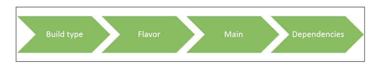
在Build Type中定义的资源优先级最大，在Library 中定义的资源优先级最低。

# Signing configurations
如果我们打包市场版的时候，我们需要输入我们的keystore数据。如果是debug 版本，系统默认会帮我们配置这些信息。这些信息在gradle 中都配置在signingConfigs中。
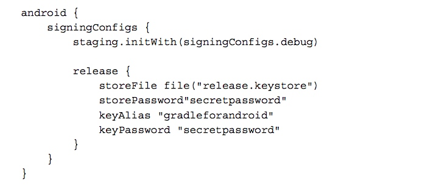
配置之后我们需要在build type中直接使用
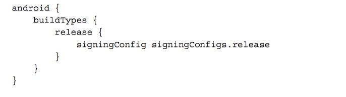

# Optimize
## Speeding up multimodule builds
   可以通过以下方式加快gradle 的编译：
  * 开启并行编译：在项目根目录下面的 gradle.properties中设置
    ```
    org.gradle.parallel=true
    ```
  * 开启编译守护进程：该进程在第一次启动后回一直存在，当你进行二次编译的时候，可以重用该进程。同样是在gradle.properties中设置。
    ```
    org.gradle.daemon=true
    ```
  * 加大可用编译内存：
    ```
    org.gradle.jvmargs=-Xms256m -Xmx1024m
    ```
## Reducing apk file
  在编译的时候，我们可能会有很多资源并没有用到，此时就可以通过shrinkResources来优化我们的资源文件，除去那些不必要的资源。
  

如果我们需要查看该命令帮我们减少了多少无用的资源，我们也可以通过运行shrinkReleaseResources命令来查看log.

某些情况下，一些资源是需要通过动态加载的方式载入的，这时候我也需要像 Progard 一样对我们的资源进行keep操作。方法就是在res/raw/下建立一个keep.xml文件，通过如下方式 keep 资源：
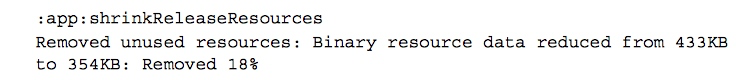
### Manual shrinking
对一些特殊的文件或者文件夹，比如 国际化的资源文件、屏幕适配资源，如果我们已经确定了某种型号，而不需要重新适配，我们可以直接去掉不可能会被适配的资源。这在为厂商适配机型定制app的时候是很用的。做法如下：
比如我们可能有非常多的国际化的资源，如果我们应用场景只用到了English,Danish,Dutch的资源，我们可以直接指定我们的resConfig:

对于尺寸文件我们也可以这样做
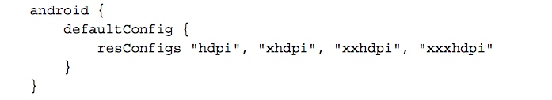
## Profiling
当我们执行所有task的时候我们都可以通过添加--profile参数生成一份执行报告在reports/profile中。示例如下：

我们可以通过这份报告看出哪个项目耗费的时间最多，哪个环节耗费的时间最多。

# Practice
在开发的过程中，我们可能会遇到很多情况需要我们能够自己定义task，在自定义task 之前，我们先简单看看groovy 的语法。
## Groovy
我们前面看到的那些build.gradle 配置文件，和xml 等的配置文件不同，这些文件可以说就是可以执行的代码，只是他们的结构看起来通俗易懂，和配置文件没什么两样，这也是Google 之所以选择Groovy 的原因。除此之外，Groovy 是一门JVM 语言，也就是，Groovy 的代码最终也会被编译成JVM 字节码，交给虚拟机去执行，我们也可以直接反编译这些字节码文件。
我们这里简单地说一下 groovy 一些语法。
### 变量
在groovy 中，没有固定的类型，变量可以通过def关键字引用，比如：
```
def name = 'Andy'
```
我们通过单引号引用一串字符串的时候这个字符串只是单纯的字符串，但是如果使用双引号引用，在字符串里面还支持插值操作，
```
def name = 'Andy'
def greeting = "Hello, $name!"
```
### 方法
类似 python 一样，通过def关键字定义一个方法。方法如果不指定返回值，默认返回最后一行代码的值。
```
def square(def num) {
    num * num
}
square 4
```
### 类
Groovy 也是通过Groovy 定义一个类：
```
class MyGroovyClass {
    String greeting
    String getGreeting() {
        return 'Hello!'
    }
}
```
* 在Groovy 中，默认所有的类和方法都是pulic的，所有类的字段都是private的；
* 和java一样，我们通过new关键字得到类的实例，使用def接受对象的引用：def instance = new MyGroovyClass()
* 而且在类中声明的字段都默认会生成对应的setter,getter方法。所以上面的代码我们可以直接调用instance.setGreeting 'Hello, Groovy!'，注意，groovy 的方法调用是可以没有括号的，而且也不需要分号结尾。除此之外，我们甚至也可以直接调用；
* 我们可以直接通过instance.greeting这样的方式拿到字段值，但其实这也会通过其get方法，而且不是直接拿到这个值。

### map、collections
在 Groovy 中，定义一个列表是这样的：
```
List list = [1, 2, 3, 4, 5]
```
遍历一个列表是这样的：

```
list.each() { element ->

println element

}
```
定义一个 map 是这样的：
```
Map pizzaPrices = [margherita:10, pepperoni:12]
```
获取一个map 值是这样的：
```
pizzaPrices.get('pepperoni')
pizzaPrices['pepperoni']
```
### 闭包
在Groovy 中有一个闭包的概念。闭包可以理解为就是 Java 中的匿名内部类。闭包支持类似lamda形式的语法调用。如下：
```
def square = { num ->
    num * num
}
square 8
```
如果只有一个参数，我们甚至可以省略这个参数，默认使用it作为参数，最后代码是这样的：
```
Closure square = {
    it * it
}
square 16
```
理解闭包的语法后，我们会发现，其实在我们之前的配置文件里，android,dependencies这些后面紧跟的代码块，都是一个闭包而已。

### Groovy in Gradle
了解完 groovy 的基本语法后，我们来看看 gradle 里面的代码就好理解多了。
* apply
```
apply plugin: 'com.android.application'
```
这段代码其实就是调用了project对象的apply方法，传入了一个以plugin为key的map。完整写出来就是这样的：
```
project.apply([plugin: 'com.android.application'])
```
* dependencies
我们看到的是这样：

实际调用的时候会传入一个DependencyHandler的闭包,代码如下:


### Task
* 创建一个task

运行该 task
```
./gradlew hello
```
**注意：我们前面说过，gradle的生命周期分三步，初始化，配置和执行。上面的代码在配置过程就已经执行了，所以，打印出的字符串发生在该任务执行之前，如果要在执行阶段才执行任务中的代码应该如下设置**：

* 添加Action:前面我们说过task 包含系列的action,当task 被执行的时候，所有的action 都会被依次执行。如果我们要加入自己的action,我们可以通过复写doFirst()和doLast()方法。
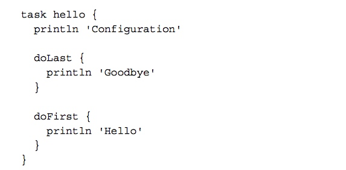
打印出来是这样的：

* Task 依赖：前面我们也说过，task 之间的关系就是依赖关系，关于Task 的依赖有两种，must    RunAfter和dependsOn。比如：
```
task task1 <<{
    printfln 'task1'
}

task task2 <<{
    printfln 'task2'
}
task2.mustRunAfter task1
```
和
```
task task1 <<{
    printfln 'task1'
}

task task2 <<{
    printfln 'task2'
}
task2.dependsOn task1
```
他们的区别是，运行的的时候前者必须要都按顺序加入gradlew task2 task1执行才可以顺利执行，否则单独执行每个任务，后者只需要执行gradlew task2即可同时执行两个任务。

# Practice
  我们可以通过两个例子来实践task。
## keystore 保护
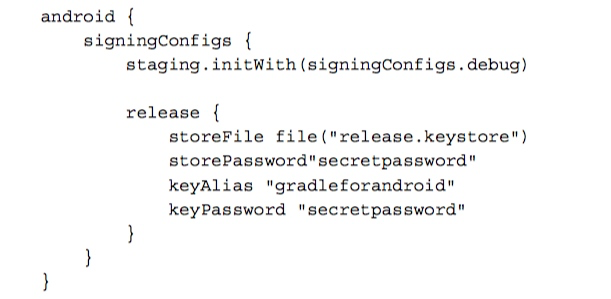
这里直接将 store 的密码明文写在这里对于产品的安全性来说不太好，特别是如果该源码开源，别人就可以用你的 id 去发布app。对于这种情况，我们需要构建一个动态加载任务，在编译release 源码的时候从本地文件（未加入git）获取keystore 信息，如下：

你还可以设置一个保险措施，万一我们的没有找到对应的文件需要用户从控制台输入密码
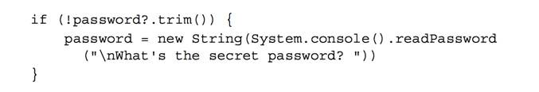
最后设置最终值
然后设置release 任务依赖于我们刚刚设置的任务

通过 hook Android 编译插件 重命名 apk

最后编译出来的apk 名字类似 app-debug-1.0.apk。


