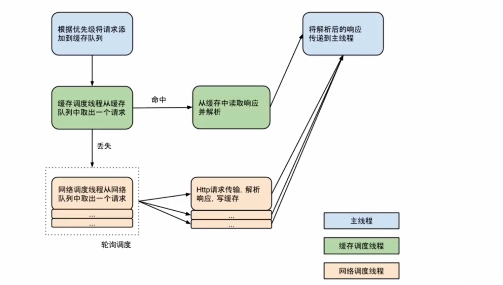

### 一、Volley使用简介

Volley是谷歌官方推出的网络请求框架，适合数据量小但通信频繁的网络操作。
**android {
    useLibrary 'org.apache.http.legacy'}**

1.首先需要获取一个RequestQueue对象

2.创建一个StringRequest对象

3.讲StringRequest对象添加到RequestQueue里面

源码解读：
https://github.com/soyoungboy/Volley

```
private RequestQueue mQueue;
//第一步
mQueue = Volley.newRequestQueue(MainActivity.this);

    //volley字符串请求
    private void volleyStringRequest() {
        //第二步
        StringRequest stringRequest = new StringRequest("http://www.baidu.com",
                new Response.Listener<String>() {
                    @Override
                    public void onResponse(String response) {
                        Log.d(TAG, "onResponse: " + response);
                    }
                }, new Response.ErrorListener() {
            @Override
            public void onErrorResponse(VolleyError error) {
                Log.e(TAG, "onErrorResponse: " + error.getMessage(), error);
            }
        });
        //第三步
        mQueue.add(stringRequest);
    }
```
```
//volleyJson请求
private void volleyJsonRequest() {
    //第二步
    JsonObjectRequest jsonObjectRequest = new               JsonObjectRequest("http://www.weather.com.cn/data/sk/101010100.html", null,
        new Response.Listener<JSONObject>() {
            @Override
            public void onResponse(JSONObject response) {
                Log.d(TAG, "onResponse: " + response.toString());
            }
        }, new Response.ErrorListener() {
            @Override
            public void onErrorResponse(VolleyError error) {
                Log.e(TAG, "onErrorResponse: " + error.getMessage(), error);
            }
    });
    //第三步
    mQueue.add(jsonObjectRequest);
}
```
总结：通过newRequestQueue()函数新建并启动一个请求队列RequestQueue后，只需要往这个RequestQueue不断add Request即可。

### 二、Volley源码分析

在mQueue = Volley.newRequestQueue(MainActivity.this);中，其newRequestQueue(context);方法的实现如下：

```
public static RequestQueue newRequestQueue(Context context) {
    return newRequestQueue(context, null);
}
```

可以看到它调用了有两个参数的newRequestQueue(context, stack)方法，该方法的实现如下：

```
public static RequestQueue newRequestQueue(Context context, HttpStack stack) {
   return newRequestQueue(context, stack, -1);
}
```
可以看到它调用了有三个参数的newRequestQueue(context,stack,maxDiskCacheBytes)方法，该方法的实现如下：

```
public static RequestQueue newRequestQueue(Context context, HttpStack stack, int maxDiskCacheBytes) {
    File cacheDir = new File(context.getCacheDir(), DEFAULT_CACHE_DIR); //获取缓存目录

    String userAgent = "volley/0";
    try {
        String packageName = context.getPackageName(); //获取包名
        PackageInfo info = context.getPackageManager().getPackageInfo(packageName, 0); //获取包信息
        userAgent = packageName + "/" + info.versionCode; //设置用户代理信息
    } catch (NameNotFoundException e) {
    }

    if (stack == null) { //如果网络栈为空，为stack新建对应的栈
        if (Build.VERSION.SDK_INT >= 9) { //如果SDK版本大于等于9
            stack = new HurlStack();
        } else { ////如果SDK版本小于9
            // Prior to Gingerbread, HttpUrlConnection was unreliable.
            stack = new HttpClientStack(AndroidHttpClient.newInstance(userAgent));
        }
    }

    Network network = new BasicNetwork(stack); //用网络栈新建Network
    
    RequestQueue queue; //请求队列
    //根据最大磁盘缓存字节生成对应的请求队列
    if (maxDiskCacheBytes <= -1) //如果最大磁盘缓存字节小于等于-1，不指定最大缓存值
    {
       // No maximum size specified
       queue = new RequestQueue(new DiskBasedCache(cacheDir), network);
    }
    else
    { //为请求队列指定最大缓存值
       // Disk cache size specified
       queue = new RequestQueue(new DiskBasedCache(cacheDir, maxDiskCacheBytes), network);
    }

    queue.start(); //开启请求队列

    return queue; //返回请求队列
}
```
倒数第二行的queue.start();的start()方法的实现如下：

```
/**
 * Starts the dispatchers in this queue.
 */
public void start() {
    stop();  // Make sure any currently running dispatchers are stopped.
    // Create the cache dispatcher and start it.
    mCacheDispatcher = new CacheDispatcher(mCacheQueue, mNetworkQueue, mCache, mDelivery);
    mCacheDispatcher.start();

    // Create network dispatchers (and corresponding threads) up to the pool size.
    for (int i = 0; i < mDispatchers.length; i++) {
        NetworkDispatcher networkDispatcher = new NetworkDispatcher(mNetworkQueue, mNetwork,
                mCache, mDelivery);
        mDispatchers[i] = networkDispatcher;
        networkDispatcher.start();
    }
}
```
第二行的stop()方法的实现如下：

```
/**
 * Stops the cache and network dispatchers.
 */
public void stop() {
    if (mCacheDispatcher != null) {
        mCacheDispatcher.quit();
    }
    for (int i = 0; i < mDispatchers.length; i++) {
        if (mDispatchers[i] != null) {
            mDispatchers[i].quit();
        }
    }
}
```
对于第三步的mQueue.add(stringRequest);的add方法，实现如下：

```
/**
 * Adds a Request to the dispatch queue. 插入请求到分发队列
 * @param request The request to service 请求的服务
 * @return The passed-in request 通过的请求
 */
public <T> Request<T> add(Request<T> request) {
    // Tag the request as belonging to this queue and add it to the set of current requests.
    request.setRequestQueue(this);
    synchronized (mCurrentRequests) {
        mCurrentRequests.add(request); //把传入的请求加入请求集合中
    }

    // Process requests in the order they are added.
    request.setSequence(getSequenceNumber()); //设置请求的顺序
    request.addMarker("add-to-queue"); //添加标记

    // If the request is uncacheable, skip the cache queue and go straight to the network.
    if (!request.shouldCache()) { //如果传入的请求不能缓存
        mNetworkQueue.add(request); //将传入的请求添加到网络队列
        return request; //返回传入的请求
    }

    // Insert request into stage if there's already a request with the same cache key in flight.
    synchronized (mWaitingRequests) {
        String cacheKey = request.getCacheKey(); //获取缓存的key
        if (mWaitingRequests.containsKey(cacheKey)) { //如果等待请求的map包含此key
            // There is already a request in flight. Queue up.
            Queue<Request<?>> stagedRequests = mWaitingRequests.get(cacheKey); //取出该请求队列
            if (stagedRequests == null) { //如果请求队列为空
                stagedRequests = new LinkedList<Request<?>>(); //将请求队列指定为新的请求链表
            }
            stagedRequests.add(request); //将当前的请求加入请求队列
            mWaitingRequests.put(cacheKey, stagedRequests); //将更新后的请求队列存回等待请求的map
            if (VolleyLog.DEBUG) {
                VolleyLog.v("Request for cacheKey=%s is in flight, putting on hold.", cacheKey);
            }
        } else { //如果map不包含当前的key
            // Insert 'null' queue for this cacheKey, indicating there is now a request in
            // flight.
            mWaitingRequests.put(cacheKey, null); //将此key存入等待请求的map中
            mCacheQueue.add(request); //将传入的请求添加到快缓存队列
        }
        return request; //返回传入的请求
    }
}
```
在上上段代码中出现的CacheDispatcher的代码如下：

```
public class CacheDispatcher extends Thread {
```
可以看到CacheDispatcher是Thread的子类，下面看其关键的run方法：

```
@Override
public void run() {
    if (DEBUG) VolleyLog.v("start new dispatcher");
    Process.setThreadPriority(Process.THREAD_PRIORITY_BACKGROUND);

    // Make a blocking call to initialize the cache.
    mCache.initialize(); //初始化缓存

    Request<?> request; //声明请求
    while (true) {
        // release previous request object to avoid leaking request object when mQueue is drained.
        request = null; //将请求置空
        try {
            // Take a request from the queue.
            request = mCacheQueue.take(); //从缓存队列中取出请求
        } catch (InterruptedException e) {
            // We may have been interrupted because it was time to quit.
            if (mQuit) { //如果临时中断就结束函数
                return;
            }
            continue;
        }
        try {
            request.addMarker("cache-queue-take"); //为请求设置标记

            // If the request has been canceled, don't bother dispatching it.
            if (request.isCanceled()) { //如果请求被取消
                request.finish("cache-discard-canceled"); //结束请求
                continue;
            }

            // Attempt to retrieve this item from cache.
            Cache.Entry entry = mCache.get(request.getCacheKey()); //从缓存中取出entry
            if (entry == null) { //如果entry为空
                request.addMarker("cache-miss"); //设置缓存未命中标记
                // Cache miss; send off to the network dispatcher.
                mNetworkQueue.put(request); //将请求网络队列
                continue;
            }

            // If it is completely expired, just send it to the network.
            if (entry.isExpired()) { //entry过期
                request.addMarker("cache-hit-expired"); //给请求设置缓存过期标志
                request.setCacheEntry(entry); //给请求设置缓存entry
                mNetworkQueue.put(request); //将请求添加到网络队列
                continue;
            }

            // We have a cache hit; parse its data for delivery back to the request.
            request.addMarker("cache-hit"); //给请求设置缓存命中标志
            Response<?> response = request.parseNetworkResponse(
                    new NetworkResponse(entry.data, entry.responseHeaders)); //解析网络响应
            request.addMarker("cache-hit-parsed"); //给请求设置缓存命中解析标志

            if (!entry.refreshNeeded()) { //如果entry不需要刷新
                // Completely unexpired cache hit. Just deliver the response.
                mDelivery.postResponse(request, response); //提交请求与响应
            } else {
                // Soft-expired cache hit. We can deliver the cached response,
                // but we need to also send the request to the network for
                // refreshing.
                request.addMarker("cache-hit-refresh-needed"); //给请求设置缓存命中并需要刷新标志
                request.setCacheEntry(entry); //给请求设置缓存entry

                // Mark the response as intermediate.
                response.intermediate = true; //设置响应马上执行

                // Post the intermediate response back to the user and have
                // the delivery then forward the request along to the network.
                final Request<?> finalRequest = request;
                mDelivery.postResponse(request, response, new Runnable() { //提交请求与响应并执行runnable
                    @Override
                    public void run() {
                        try {
                            mNetworkQueue.put(finalRequest); //把最终请求存入网络队列
                        } catch (InterruptedException e) {
                            // Not much we can do about this.
                        }
                    }
                });
            }
        } catch (Exception e) {
            VolleyLog.e(e, "Unhandled exception %s", e.toString()); //打印错误日志
        }
    }
}
```
可以看到run()方法中开启了while循环，先从缓存中取出entry，如果entry为空的话，将请求加入网络请求的的队列里；如果entry不为空则判断是否过期，如果过期把请求加入网络请求队列中。最后会调用parseNetworkResponse()方法进行数据的解析，之后将解析出来的数据进行回调。

与CacheDispatcher相对应的NetworkDispatcher类也继承自Thread，NetworkDispatcher的run方法如下：

```
@Override
public void run() {
    Process.setThreadPriority(Process.THREAD_PRIORITY_BACKGROUND);
    Request<?> request;
    while (true) {
        long startTimeMs = SystemClock.elapsedRealtime();
        // release previous request object to avoid leaking request object when mQueue is drained.
        request = null;
        try {
            // Take a request from the queue.
            request = mQueue.take(); //取出响应
        } catch (InterruptedException e) {
            // We may have been interrupted because it was time to quit.
            if (mQuit) {
                return;
            }
            continue;
        }

        try {
            request.addMarker("network-queue-take");

            // If the request was cancelled already, do not perform the
            // network request.
            if (request.isCanceled()) {
                request.finish("network-discard-cancelled");
                continue;
            }

            addTrafficStatsTag(request);

            // Perform the network request.
            NetworkResponse networkResponse = mNetwork.performRequest(request); //执行网络请求
            request.addMarker("network-http-complete");

            // If the server returned 304 AND we delivered a response already,
            // we're done -- don't deliver a second identical response.
            if (networkResponse.notModified && request.hasHadResponseDelivered()) {
                request.finish("not-modified");
                continue;
            }

            // Parse the response here on the worker thread.
            Response<?> response = request.parseNetworkResponse(networkResponse); //解析响应
            request.addMarker("network-parse-complete");

            // Write to cache if applicable.
            // TODO: Only update cache metadata instead of entire record for 304s.
            if (request.shouldCache() && response.cacheEntry != null) {
                mCache.put(request.getCacheKey(), response.cacheEntry);
                request.addMarker("network-cache-written");
            }

            // Post the response back.
            request.markDelivered();
            mDelivery.postResponse(request, response); //提交响应
        } catch (VolleyError volleyError) {
            volleyError.setNetworkTimeMs(SystemClock.elapsedRealtime() - startTimeMs);
            parseAndDeliverNetworkError(request, volleyError);
        } catch (Exception e) {
            VolleyLog.e(e, "Unhandled exception %s", e.toString());
            VolleyError volleyError = new VolleyError(e);
            volleyError.setNetworkTimeMs(SystemClock.elapsedRealtime() - startTimeMs);
            mDelivery.postError(request, volleyError);
        }
    }
}
```
可以看到run()方法中开启了while循环，先从缓存中取出request，并用performRequest()方法执行请求，获取响应之后，解析响应，最后用提交响应。

执行的流程图如下：



