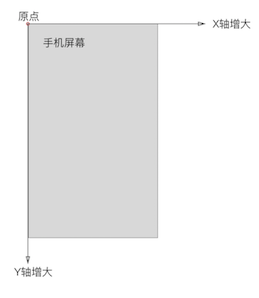
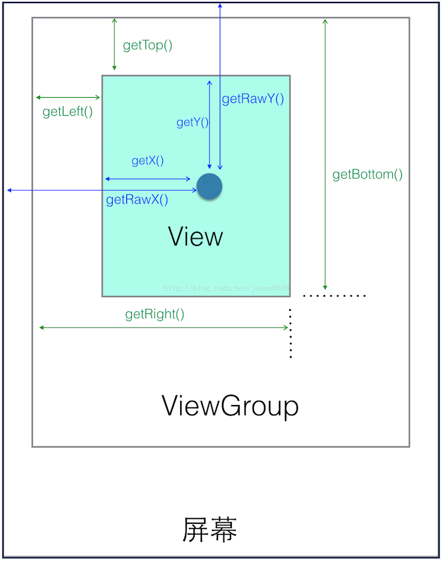
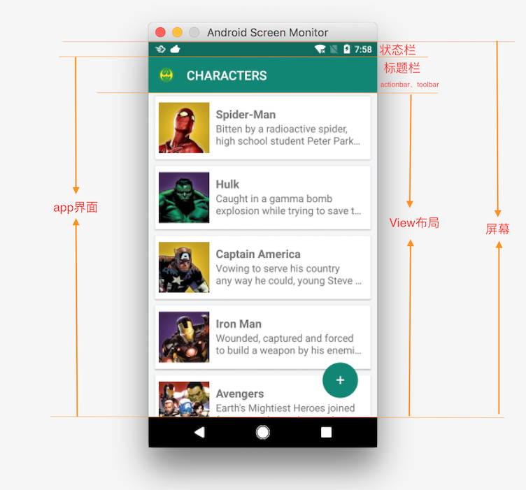

# View的坐标系
屏幕左上角为坐标原点，向右为x轴增大方向，向下为y轴增大方向


View的坐标系统是相对于父控件而言的.


* view获取自身坐标:

方法            |  描述
---------------|---------------------------------
getLeft()      |  view自身的左边到其父布局左边的距离
getTop()       |  view自身的顶边到其父布局顶边的距离
getRight()     |  view自身的右边到其父布局左边的距离
getBottom()    |  view自身的底边到其父布局顶边的距离

* view获取自身宽高:

方法                     |  描述
------------------------|---------------------------------
getHeight()             |  layout后有效，返回值是mBottom-mTop，一般会参考measure的高度（measure可能没用），但不是必须的。
getWidth()              |  layout后有效，返回值是mRight-mLeft，一般会参考measure的宽度（measure可能没用），但不是必须的。
getMeasuredWidth()	    |  返回measure过程得到的mMeasuredWidth值，供layout参考，或许没用。
getMeasuredHeight()	 |  返回measure过程得到的mMeasuredHeight值，供layout参考，或许没用。

* motionEvent获取坐标:

方法                     |  描述
------------------------|---------------------------------
getX()                  | 获取点击事件相对控件左边的x轴坐标，即点击事件距离控件左边的距离
getY()                  | 获取点击事件相对控件顶边的y轴坐标，即点击事件距离控件顶边的距离
getRawX()               | 获取点击事件相对整个屏幕左边的x轴坐标，即点击事件距离整个屏幕左边的距离
getRawY()               | 获取点击事件相对整个屏幕顶边的y轴坐标，即点击事件距离整个屏幕顶边的距离

* View的位置坐标 Activity的onWindowFocusChanged ()方法之后使用:

方法                         |  描述
----------------------------|---------------------------------
Rect getLocalVisibleRect()  | 获取View自身可见的坐标区域，坐标以自己的左上角为原点(0,0)，另一点为可见区域右下角相对自己(0,0)点的坐标 Rect自身的大小
Rect getGlobalVisibleRect() | 获取View在屏幕绝对坐标系中的可视区域，坐标以屏幕左上角为原点(0,0)，另一个点为可见区域右下角相对屏幕原点(0,0)点的坐标。 Rect在屏幕中的坐标
getLocationOnScreen()       | 坐标是相对整个屏幕而言，Y坐标为View左上角到屏幕顶部的距离。
getLocationInWindow()       | 如果为普通Activity则Y坐标为View左上角到屏幕顶部（此时Window与屏幕一样大）；如果为对话框式的Activity则Y坐标为当前Dialog模式Activity的标题栏顶部到View左上角的距离。

* View滑动相关坐标系:
View的scrollTo()和scrollBy()是用于滑动View中的内容，而不是改变View的位置；改变View在屏幕中的位置可以使用offsetLeftAndRight()和offsetTopAndBottom()方法，他会导致getLeft()等值改变。

方法                             |  描述
--------------------------------|---------------------------------
offsetLeftAndRight(int offset)  | 水平方向挪动View，offset为正则x轴正向移动，移动的是整个View，getLeft()会变的
offsetTopAndBottom(int offset)  | 垂直方向挪动View，offset为正则y轴正向移动，移动的是整个View，getTop()会变的
scrollTo(int x, int y)          | 将View中内容（不是整个View）滑动到相应的位置，参考坐标原点为ParentView左上角，x，y为正则向xy轴反方向移动，反之同理。
scrollBy(int x, int y)	         | 在scrollTo()的基础上继续滑动xy。
setScrollX(int value)	         | 实质为scrollTo()，只是只改变Y轴滑动。
setScrollY(int value)	         | 实质为scrollTo()，只是只改变X轴滑动。
getScrollX()/getScrollY()	      | 获取当前滑动位置偏移量。

## Android屏幕区域划分
如图：

1.获取屏幕区域的宽高尺寸
```
DisplayMetrics metrics = new DisplayMetrics();
getWindowManager().getDefaultDisplay().getMetrics(metrics);
int widthPixels = metrics.widthPixels;
int heightPixels = metrics.heightPixels;
```
2.获取状态栏高度
```
//1.通过系统尺寸资源获取
int statusBar = -1;  
//获取status_bar_height资源的ID  
int resourceId = getResources().getIdentifier("status_bar_height", "dimen", "android");  
if (resourceId > 0) {  
    //根据资源ID获取响应的尺寸值  
    statusBar = getResources().getDimensionPixelSize(resourceId);  
}  
//2.通过R类的反射
 int statusBar = -1;  
        try {  
            Class<?> clazz = Class.forName("com.android.internal.R$dimen");  
            Object object = clazz.newInstance();  
            int height = Integer.parseInt(clazz.getField("status_bar_height")  
                    .get(object).toString());  
            statusBar = getResources().getDimensionPixelSize(height);  
        } catch (Exception e) {  
            e.printStackTrace();  
        }  
//3.app界面的top属性,状态栏位于屏幕最顶端，其位置从(0,0)开始，故而应用区域的顶端位置（高度 = Y坐标 - 0）。在Activity的回调方法onWindowFocusChanged()中执行
 Rect rectangle= new Rect();  
 getWindow().getDecorView().getWindowVisibleDisplayFrame(rectangle);  //app界面区域
 statusBar = rectangle.top;         
```
3.标题栏高度   在Activity的回调方法onWindowFocusChanged()中执行
```
//View布局的顶端位置
Rect viewRect = new Rect();  
getWindow().findViewById(Window.ID_ANDROID_CONTENT).getDrawingRect(viewRect);
int viewTop = getWindow().findViewById(Window.ID_ANDROID_CONTENT).getTop(); 
//app界面区域 
Rect appRect = new Rect();
getWindow().getDecorView().getWindowVisibleDisplayFrame(appRect);  

//1.View布局的顶端位置 - app区域的顶端位置 
int titleHeight = viewTop - appRect.top;  
//2.标题栏高度 = app界面高度 - View布局高度
int titleHeight = appRect.height() - viewRect.height();  
```


