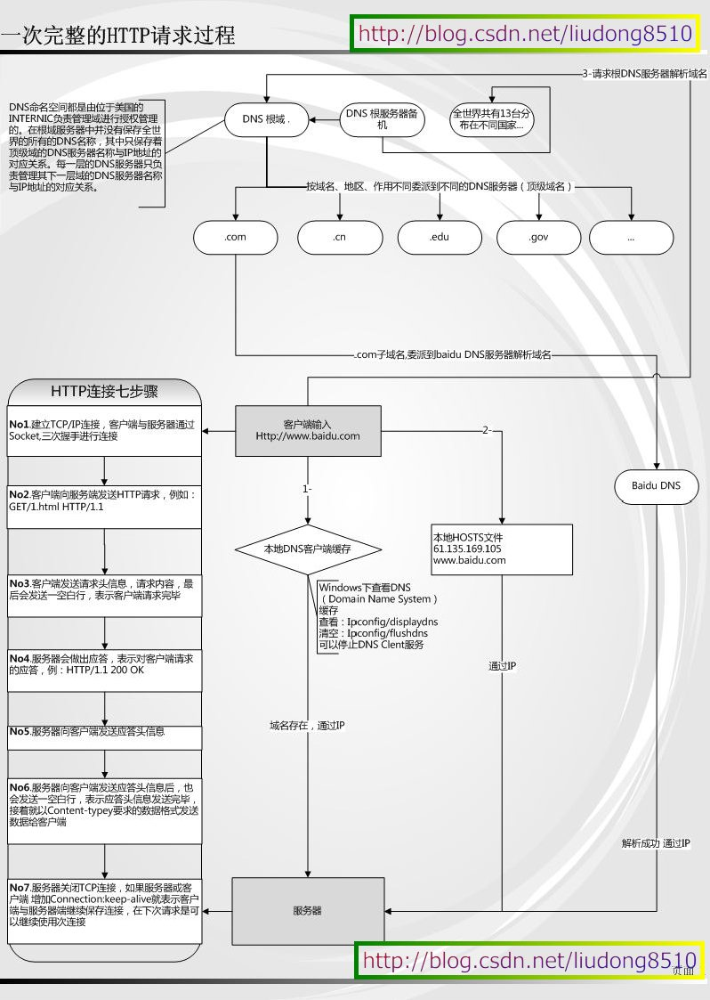

### 如何导入外部数据库
把原数据库包括在项目源码的 res/raw <br>
android系统下数据库应该存放在 /data/data/com..（package name）/ 目录下，所以我们需要做的是把已有的数据库传入那个目录下.操作方法是用FileInputStream读取原数据库，再用FileOutputStream把读取到的东西写入到那个目录.

### 本地广播和全局广播有什么差别
本地广播数据在本应用范围内传播，不用担心隐私数据泄露的问题。 不用担心别的应用伪造广播，造成安全隐患。 相比在系统内发送全局广播，它更高效。

### intentService作用是什么,AIDL解决了什么问题
生成一个工作队列且与主线程互相独立的工作者线程来传送Intent对象给你的onHandleIntent()方法，同一时刻只传送一个Intent对象，这样一来，你就不必担心多线程的问题。在所有的请求(Intent)都被执行完以后会自动停止服务，所以，你不需要自己去调用stopSelf()方法来停止。
该服务提供了一个onBind()方法的默认实现，它返回null

AIDL (Android Interface Definition Language) 是一种IDL 语言，用于生成可以在Android设备上两个进程之间进行进程间通信(interprocess communication, IPC)的代码。如果在一个进程中（例如Activity）要调用另一个进程中（例如Service）对象的操作，就可以使用AIDL生成可序列化的参数。 AIDL IPC机制是面向接口的，像COM或Corba一样，但是更加轻量级。它是使用代理类在客户端和实现端传递数据。

### 进程间通信方式
1、Activity可以跨进程调用其他应用程序的Activity。 

```
Intent intent = new Intent(Intent.ACTION_CALL,Uri.parse("tel:123456"));
```

2、Content Provider可以跨进程访问其他应用程序中的数据（以Cursor对象形式返回） 
Content Provider存在的目的向其他应用程序共享数据和允许其他应用程序对数据进行增、删、改操作

3、Broadcast可以向android系统中所有应用程序发送广播，而需要跨进程通讯的应用程序可以监听这些广播 

4、AIDL服务。

### Activity/Window/View三者的差别,fragment的特点
1、在Activity中调用attach，创建了一个Window <br>
2、创建的window是其子类PhoneWindow，在attach中创建PhoneWindow <br>
3、在Activity中调用setContentView(R.layout.xxx)<br>
4、其中实际上是调用的getWindow().setContentView()<br>
5、调用PhoneWindow中的setContentView方法<br>
6、创建ParentView：作为ViewGroup的子类，实际是创建的DecorView(作为FramLayout的子类）<br>
7、将指定的R.layout.xxx进行填充通过布局填充器进行填充【其中的parent指的就是DecorView】<br>
8、调用到ViewGroup<br>
9、调用ViewGroup的removeAllView()，先将所有的view移除掉<br>
10、添加新的view：addView()

#### fragment 特点
* Fragment可以作为Activity界面的一部分组成出现；
* 可以在一个Activity中同时出现多个Fragment，并且一个Fragment也可以在多个Activity中使用；
* 在Activity运行过程中，可以添加、移除或者替换Fragment；
* Fragment可以响应自己的输入事件，并且有自己的生命周期，它们的生命周期会受宿主Activity的生命周期影响。

### 描述一次网络请求的流程


### Handler,Thread和HandlerThread的差别
[链接1](http://blog.csdn.net/guolin_blog/article/details/9991569)
[链接2](http://droidyue.com/blog/2015/11/08/make-use-of-handlerthread/)<br>
从Android中Thread（java.lang.Thread -> java.lang.Object）描述可以看出，Android的Thread没有对Java的Thread做任何封装，但是Android提供了一个继承自Thread的类HandlerThread（android.os.HandlerThread -> java.lang.Thread），这个类对Java的Thread做了很多便利Android系统的封装。

android.os.Handler可以通过Looper对象实例化，并运行于另外的线程中，Android提供了让Handler运行于其它线程的线程实现，也是就HandlerThread。HandlerThread对象start后可以获得其Looper对象，并且使用这个Looper对象实例Handler。

### 低版本SDK实现高版本api
自己实现或@TargetApi annotation

### Ubuntu编译安卓系统
1. 进入源码根目录
2. . build/envsetup.sh
3. lunch
4. full(编译全部)
5. userdebug(选择编译版本)
6. make -j8(开启8个线程编译)

### LaunchMode应用场景
1. standard，创建一个新的Activity。
2. singleTop，栈顶不是该类型的Activity，创建一个新的Activity。否则，onNewIntent。
3. singleTask，回退栈中没有该类型的Activity，创建Activity，否则，onNewIntent+ClearTop。<br>
4. singleInstance，回退栈中，只有这一个Activity，没有其他Activity。<br>
**注意:**<br>

* 设置了"singleTask"启动模式的Activity，它在启动的时候，会先在系统中查找属性值affinity等于它的属性值taskAffinity的Task存在； 如果存在这样的Task，它就会在这个Task中启动，否则就会在新的任务栈中启动。因此， 如果我们想要设置了"singleTask"启动模式的Activity在新的任务中启动，就要为它设置一个独立的taskAffinity属性值。
* 如果设置了"singleTask"启动模式的Activity不是在新的任务中启动时，它会在已有的任务中查看是否已经存在相应的Activity实例， 如果存在，就会把位于这个Activity实例上面的Activity全部结束掉，即最终这个Activity 实例会位于任务的Stack顶端中。
* 在一个任务栈中只有一个”singleTask”启动模式的Activity存在。他的上面可以有其他的Activity。这点与singleInstance是有区别的。<br>

**场景**<br>
singleTop适合接收通知启动的内容显示页面。<br>
例如，某个新闻客户端的新闻内容页面，如果收到10个新闻推送，每次都打开一个新闻内容页面是很烦人的。<br>

singleTask适合作为程序入口点。<br>
例如浏览器的主界面。不管从多少个应用启动浏览器，只会启动主界面一次，其余情况都会走onNewIntent，并且会清空主界面上面的其他页面。<br>

singleInstance应用场景<br>
闹铃的响铃界面。 你以前设置了一个闹铃：上午6点。在上午5点58分，你启动了闹铃设置界面，并按 Home 键回桌面；在上午5点59分时，你在微信和朋友聊天；在6点时，闹铃响了，并且弹出了一个对话框形式的 Activity(名为 AlarmAlertActivity) 提示你到6点了(这个 Activity 就是以 SingleInstance 加载模式打开的)，你按返回键，回到的是微信的聊天界面，这是因为 AlarmAlertActivity 所在的 Task 的栈只有他一个元素， 因此退出之后这个 Task 的栈空了。如果是以 SingleTask 打开 AlarmAlertActivity，那么当闹铃响了的时候，按返回键应该进入闹铃设置界面。

### Touch事件传递流程
[事件分发机制面试](事件分发机制面试.md)

### View绘制流程
[View绘制流程](View绘制流程.md)

### 多线程
* Activity.runOnUiThread(Runnable)
* View.post(Runnable),View.postDelay(Runnable,long)
* Handler
* AsyncTask

### 单例

```
public class Singleton{
   private Singleton(){}
   
   public static class SingletonHolder{
      public static final Singleton INSTANCE = new Singleton();
   }
   
   public static final Singleton getSingleton(){
      return SingletonHolder.INSTANCE;
   }
}

```
### 什么情况导致内存泄漏
1. 资源对象没关闭造成的内存泄漏<br>
资源性对象比如(Cursor，File文件等)往往都用了一些缓冲，我们在不使用的时候，应该及时关闭它们，以便它们的缓冲及时回收内存。它们的缓冲不仅存在于 java虚拟机内，还存在于java虚拟机外。

2. 构造Adapter时，没有使用缓存的convertView<br>
以构造ListView的BaseAdapter为例，在BaseAdapter中提供了方法： public View getView(int position, ViewconvertView, ViewGroup parent) 来向ListView提供每一个item所需要的view对象。

```
public View getView(int position, ViewconvertView, ViewGroup parent) {
	View view = new Xxx(...); 
	... ... 
	return view; 
} 

//修正示例代码：
public View getView(int position, ViewconvertView, ViewGroup parent) {
	View view = null; 
	if (convertView != null) { 
		view = convertView; 
		populate(view, getItem(position)); 
	... 
	} else { 
		view = new Xxx(...); 
		... 
	} 
	return view; 
} 
```

3.Bitmap对象不在使用时调用recycle()释放内存<br>
有时我们会手工的操作Bitmap对象，如果一个Bitmap对象比较占内存，当它不在被使用的时候，可以调用Bitmap.recycle()方法回收此对象的像素所占用的内存，但这不是必须的，视情况而定。

4.试着使用关于application的context来替代和activity相关的context<br>
这是一个很隐晦的内存泄漏的情况。有一种简单的方法来避免context相关的内存泄漏。最显著地一个是避免context逃出他自己的范围之外。使用Application context。这个context的生存周期和你的应用的生存周期一样长，而不是取决于activity的生存周期。如果你想保持一个长期生存的对象，并且这个对象需要一个context,记得使用application对象。你可以通过调用 Context.getApplicationContext() or Activity.getApplication()来获得。

5.注册没取消造成的内存泄漏<br>
一些Android程序可能引用我们的Anroid程序的对象(比如注册机制)。即使我们的Android程序已经结束了，但是别的引用程序仍然还有对我们的Android程序的某个对象的引用，泄漏的内存依然不能被垃圾回收。调用registerReceiver后未调用unregisterReceiver。 比如:假设我们希望在锁屏界面(LockScreen)中，监听系统中的电话服务以获取一些信息(如信号强度等)，则可以在LockScreen中定义一个 PhoneStateListener的对象，同时将它注册到TelephonyManager服务中。对于LockScreen对象，当需要显示锁屏界面的时候就会创建一个LockScreen对象，而当锁屏界面消失的时候LockScreen对象就会被释放掉。 但是如果在释放 LockScreen对象的时候忘记取消我们之前注册的PhoneStateListener对象，则会导致LockScreen无法被垃圾回收。如果不断的使锁屏界面显示和消失，则最终会由于大量的LockScreen对象没有办法被回收而引起OutOfMemory,使得system_process 进程挂掉。 虽然有些系统程序，它本身好像是可以自动取消注册的(当然不及时)，但是我们还是应该在我们的程序中明确的取消注册，程序结束时应该把所有的注册都取消掉。

6.集合中对象没清理造成的内存泄漏<br>
我们通常把一些对象的引用加入到了集合中，当我们不需要该对象时，并没有把它的引用从集合中清理掉，这样这个集合就会越来越大。如果这个集合是static的话，那情况就更严重了。

### ANR定位和修正
* 如果开发机器上出现问题，我们可以通过查看/data/anr/traces.txt即可，最新的ANR信息在最开始部分。
* 主线程被IO操作（从4.0之后网络IO不允许在主线程中）阻塞。
* 主线程中存在耗时的计算
* 主线程中错误的操作，比如Thread.wait或者Thread.sleep等 Android系统会监控程序的响应状况，一旦出现下面两种情况，则弹出ANR对话框
* 应用在5秒内未响应用户的输入事件（如按键或者触摸）
* BroadcastReceiver未在10秒内完成相关的处理
* Service在特定的时间内无法处理完成 20秒
* 使用AsyncTask处理耗时IO操作。
* 使用Thread或者HandlerThread时，调用Process.setThreadPriority(Process.THREAD_PRIORITY_BACKGROUND)设置优先级，否则仍然会降低程序响应，因为默认Thread的优先级和主线程相同。
* 使用Handler处理工作线程结果，而不是使用Thread.wait()或者Thread.sleep()来阻塞主线程。
* Activity的onCreate和onResume回调中尽量避免耗时的代码
* BroadcastReceiver中onReceive代码也要尽量减少耗时，建议使用IntentService处理。

### 什么情况导致oom
[链接](http://www.jcodecraeer.com/a/anzhuokaifa/androidkaifa/2015/0920/3478.html)<br>
1）使用更加轻量的数据结构 <br>
2）Android里面使用Enum <br>
3）Bitmap对象的内存占用 <br>
4）更大的图片 <br>
5）onDraw方法里面执行对象的创建 <br>
6）StringBuilder

### Service与Activity之间通信的几种方式
* 通过Binder对象
* 通过broadcast(广播)的形式

### Android各个版本API的区别
[链接](http://blog.csdn.net/lijun952048910/article/details/7980562)

### Android代码中实现WAP方式联网
[链接](http://blog.csdn.net/asce1885/article/details/7844159)

### 如何保证service在后台不被Kill
#### 一、onStartCommand方法，返回START_STICKY
1. START_STICKY 在运行onStartCommand后service进程被kill后，那将保留在开始状态，但是不保留那些传入的intent。不久后service就会再次尝试重新创建，因为保留在开始状态，在创建service后将保证调用onstartCommand。如果没有传递任何开始命令给service，那将获取到null的intent。
2. START_NOT_STICKY 在运行onStartCommand后service进程被kill后，并且没有新的intent传递给它。Service将移出开始状态，并且直到新的明显的方法（startService）调用才重新创建。因为如果没有传递任何未决定的intent那么service是不会启动，也就是期间onstartCommand不会接收到任何null的intent。
3. START_REDELIVER_INTENT 在运行onStartCommand后service进程被kill后，系统将会再次启动service，并传入最后一个intent给onstartCommand。直到调用stopSelf(int)才停止传递intent。如果在被kill后还有未处理好的intent，那被kill后服务还是会自动启动。因此onstartCommand不会接收到任何null的intent。

#### 二、提升service优先级
在AndroidManifest.xml文件中对于intent-filter可以通过android:priority = "1000"这个属性设置最高优先级，1000是最高值，如果数字越小则优先级越低，同时适用于广播。
#### 三、提升service进程优先级
Android中的进程是托管的，当系统进程空间紧张的时候，会依照优先级自动进行进程的回收。Android将进程分为6个等级,它们按优先级顺序由高到低依次是:<br>
1. 前台进程( FOREGROUND_APP)<br>
2. 可视进程(VISIBLE_APP )<br>
3. 次要服务进程(SECONDARY_SERVER )<br>
4. 后台进程 (HIDDEN_APP)<br>
5. 内容供应节点(CONTENT_PROVIDER)<br>
6. 空进程(EMPTY_APP)<br>
当service运行在低内存的环境时，将会kill掉一些存在的进程。因此进程的优先级将会很重要，可以使用startForeground 将service放到前台状态。这样在低内存时被kill的几率会低一些。

#### 四、onDestroy方法里重启service
service +broadcast  方式，就是当service走ondestory的时候，发送一个自定义的广播，当收到广播的时候，重新启动service；
#### 五、Application加上Persistent属性
#### 六、监听系统广播判断Service状态
通过系统的一些广播，比如：手机重启、界面唤醒、应用状态改变等等监听并捕获到，然后判断我们的Service是否还存活，别忘记加权限啊。

### Requestlayout,onlayout,onDraw,DrawChild区别与联系
requestLayout()方法 ：会导致调用measure()过程 和 layout()过程 。 将会根据标志位判断是否需要ondraw<br>
onLayout()方法(如果该View是ViewGroup对象，需要实现该方法，对每个子视图进行布局)<br>
调用onDraw()方法绘制视图本身   (每个View都需要重载该方法，ViewGroup不需要实现该方法)<br>
drawChild()去重新回调每个子视图的draw()方法

### invalidate()和postInvalidate()的区别及使用
[链接](http://blog.csdn.net/mars2639/article/details/6650876)

### Android动画框架实现原理
[链接](http://blog.csdn.net/guolin_blog/article/details/43536355)<br>
**帧动画(frame-by-frame animation)**<br>
**补间动画(tweened animation)**<br>
**属性动画(property animation)**<br>
Animation框架定义了透明度，旋转，缩放和位移几种常见的动画，而且控制的是整个View，实现原理是每次绘制视图时View所在的ViewGroup中的drawChild函数获取该View的Animation的Transformation值，然后调用canvas.concat(transformToApply.getMatrix())，通过矩阵运算完成动画帧，如果动画没有完成，继续调用invalidate()函数，启动下次绘制来驱动动画，动画过程中的帧之间间隙时间是绘制函数所消耗的时间，可能会导致动画消耗比较多的CPU资源，最重要的是，动画改变的只是显示，并不能相应事件。

### Android为每个应用程序分配的内存大小是多少
android程序内存一般限制在16M，也有的是24M

### View刷新机制
invalidate()得在UI线程中被调动，在工作者线程中可以通过Handler来通知UI线程进行界面更新。

而postInvalidate()在工作者线程中被调用


