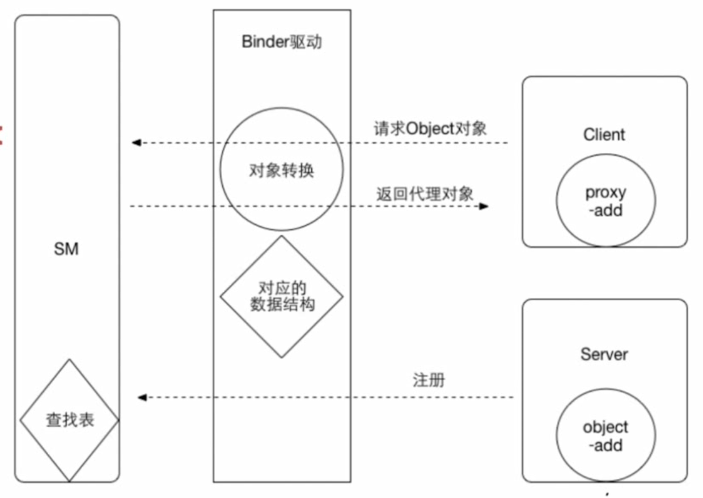

### 一、Linux内核的基础知识

#### 1.进程隔离/虚拟地址空间

进程隔离 ：在操作系统中，为了保证某些进程互不干扰，为了避免进程A可以操作进程B的数据的情况采用的方法。进程隔离使用了虚拟地址空间，进程A的虚拟地址空间和进程B的虚拟地址空间是不同的，可以防止进程A的数据写入进程B中。进程间需要通信的话，需要进行跨进程通信，Android中使用的机制就是Binder。

#### 2.系统调用

操作系统中需要分权限进行控制，用户只能访问某些许可的资源，不许可的资源是访问不到的。用户可以通过系统调用在用户空间访问内核的某些程序。

#### 3.Binder驱动

在Android系统中，Binder驱动是运行在内核空间中的，负责各个用户进程通过Binder通信的内核来进行交互的一个模块。

### 二、Binder通信机制介绍

#### 1.为什么使用Binder

1)Android使用的Linux内核拥有着非常多的跨进程通信机制。

2)性能：Binder相对于传统的Socket有着更高效的性能。

3)安全：传统的进程间通信机制对于通信双方没有作出严格的认证，而Binder支持通信双方的校验，有更好地安全性。

#### 2.Binder通信模型

1)通信录：ServiceManager。里面存有所需要的对象的连接方式。

2)电话基站：Binder驱动。连接服务端与客户端。

#### 3.Binder通信进制原理

Server服务端通过Binder驱动在ServiceManager中注册所有的类和方法，在Client客户端请求服务端的方法的时候，会通过Binder驱动到ServiceManager中查找已注册的方法，ServiceManager找到该方法之后会返回该方法对应的代理对象的方法。当客户端调用该方法的时候，代理对象会通过驱动调用服务端的方法，服务端的方法执行完之后，会通过ServiceManager返回给客户端。
