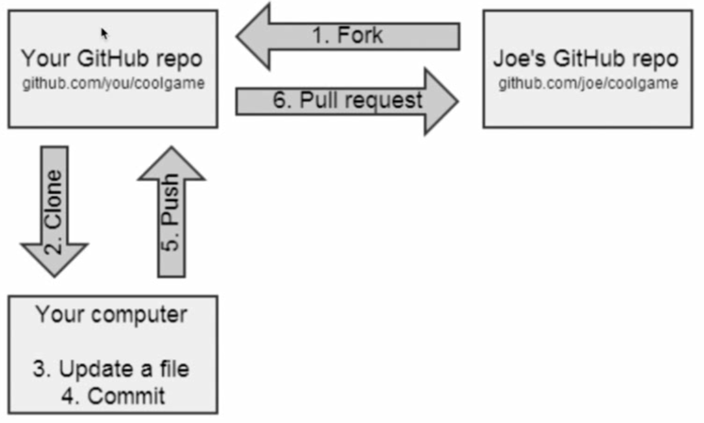

### 一、Git容易混淆的两个概念

#### 1.工作区 ：就是在电脑中所看见的文件目录。该目录下有一个.git文件，包含了git版本库的信息。

#### 2.gitignore文件 ：该文件在Android Studio的app文件夹中，可以进行配置不上传到git库的文件。

### 二、一些常用的Git命令

1.git init ：创建git库。

2.git status ：查看当前仓库的状态。

3.git diff ：查看本次修改与上次修改的内容的区别。

4.git add 文件名 ：把现在所要添加的文件放到暂存区中。

5.git commit ：把git add到暂存区的内容提交到代码区中。

6.git clone ：从远程仓库拷贝代码到本地。

7.git branch ：查看当前的分支名称。

8.git checkout ：切换分支。

### 三、Git的两种工作流
#### 1.Fork/Clone

(1)从外部仓库克隆一份到自己的远程仓库上。

(2)克隆自己的远程仓库的内容到本地。

(3)修改文件。

(4)提交代码。

(5)将本地代码提交到自己的远程仓库。

(6)将自己远程仓库的代码提交到外部仓库。

2.Clone

该方法与上面类似，不需要远程仓库的参与。

