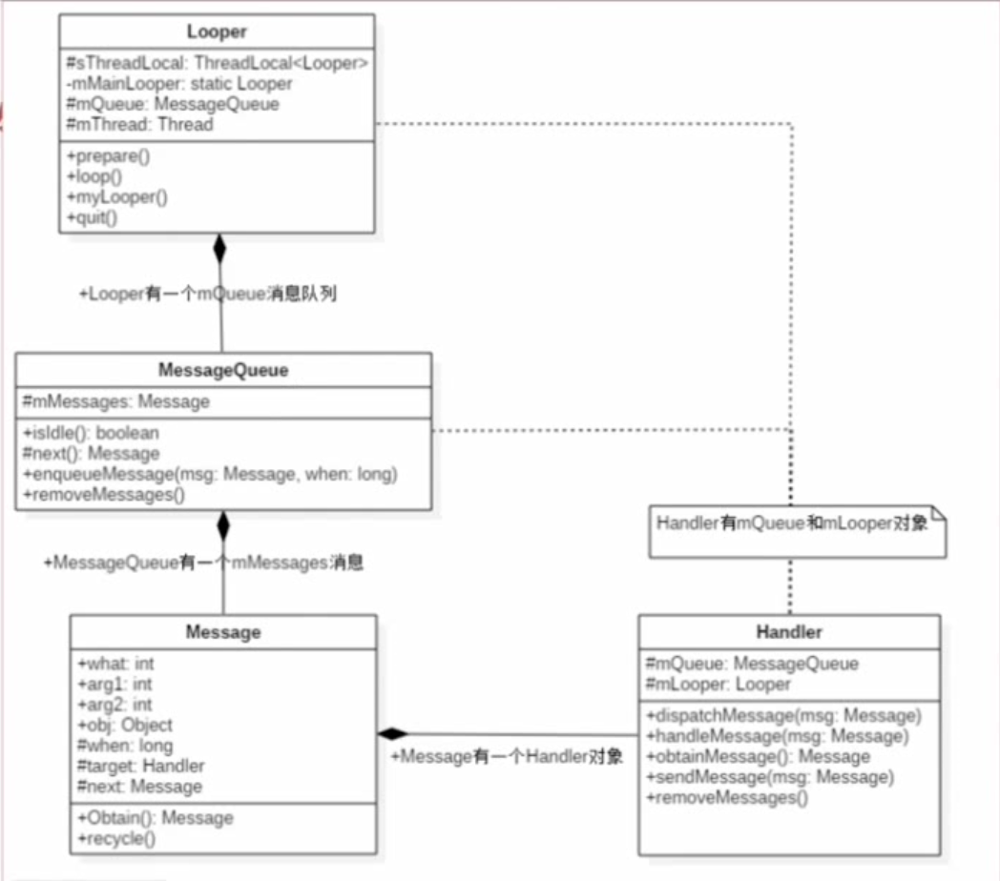
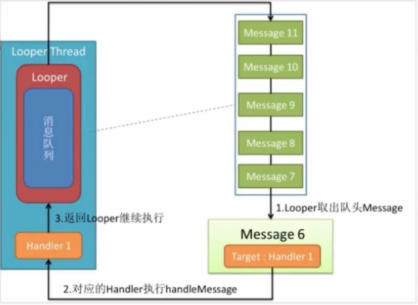
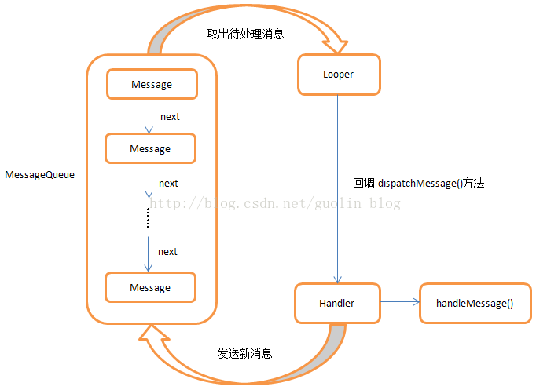

### 一、什么是handler
http://blog.csdn.net/iispring/article/details/47180325 <br>
http://droidyue.com/blog/2015/11/08/make-use-of-handlerthread/<br>
  异常：CalledFromWrongThreadException：only the original thread that created a view hierarchy can touch its views
  
android app启动时会创建一个主线程，负责ui显示，消息分发等，所以说有时候称主线程是ui线程，android的ui控件是非线程安全的
  所以引用handler机制，可以在子线程中做耗时操作发送消息通知ui线程更新ui
  
  handler是android消息机制的上层接口，平时开发复写一些方法即可
  **handler是通过发送和处理Message和Runnable对象来关联相对应线程的MessageQueue**
  
  1.可以让对应的Message和Runnable在未来的某个时间点进行相应处理
  
  2.让自己想要处理的耗时操作放在子线程，让更新ui的操作放在主线程

### 二、handler的使用方法
    new handler() 创建后会绑定到当前线程中
    post(runnable)延时操作  底层也是调用sendMessage
    sendMessage() 方法更新  发送handler.sendMessage()  处理消息handleMessage方法

### 三、handler机制原理


    Looper通过loop()读取MessageQueue队列中消息，读到消息后把消息发送给handler进行处理
    MessageQueue消息队列先进先出的方式来管理message，创建完Looper以后就会创建MessageQueue对象并关联到一起
    Message对象有许多属性 what int，arg1 Object......
    Handler对象有2个作用发送消息和处理消息，looper发送消息也是通过handler进行的，handler只能发送消息到其相关的线程的MessageQueue中
           而MessageQueue又和Looper相关联，所以handler要想发送消息必须有一个维护它的Looper对象 三者关联到一起

    Handler构造方法中:  handler已经和MessageQueue关联  MessageQueue又是通过looper管理
         创建looper对象：
           mLooper = Looper.myLooper(); 通过Looper的myLooper()方法
	          Looper myLooper() {
	          return sThreadLocal.get();   //ThreadLocal<Looper> sThreadLocal java机制
	         }
	         sThreadLocal通过不同的线程访问sThreadLocal对象，不管是set或者get方法所做的读写操作仅限于各自的线程，保证每一个线程有单独唯一的looper对象
	         sThreadLocal什么时候设置looper的呢？
	         在Looper中：
	         void prepareMainLooper()方法中调用prepare方法 创建looper对象并且设置到sThreadLocal中
               private static void prepare(boolean quitAllowed) {
		        if (sThreadLocal.get() != null) {
		            throw new RuntimeException("Only one Looper may be created per thread");
		        }
		        sThreadLocal.set(new Looper(quitAllowed));  //
		       }
        创建MessageQueue对象：
         通过looper对象的成员变量mQueue创建了MessageQueue   mQueue = mLooper.mQueue;

        Looper的loop方法：
        死循环从MessageQueue对象中逐个获取消息
        msg.target.dispatchMessage(msg); //进行消息分发 
        Message中的target就是Handler对象
        dispatchMessage方法如下：
        public void dispatchMessage(Message msg) {
	        if (msg.callback != null) {    //callback 就是runnable接口 Runnable callback;
	            handleCallback(msg);
	        } else {
	            if (mCallback != null) {
	                if (mCallback.handleMessage(msg)) {
	                    return;
	                }
	            }
	            handleMessage(msg);
	        }
        }

        总结：
        handler添加消息到messageQueue队列中，looper的loop循环消息从消息队列中取出消息，通过msg.handler的dispatchMessage分发消息
        进行消息处理
        

### 四、handler引起的内存泄漏已经解决办法
泄漏原因：当Handler不是静态内部类的时候，它会隐秘地持有Activity的引用；当Activity想要回收的时候，Handler内部可能在做一些耗时操作，Handler不能被释放，所以它所持有地Activity的引用也不能被释放。导致Activity没有被回收，造成了内存泄漏。

解决办法：

1.Handler内部持有外部Activity的弱引用。

2.把Handler改成静态内部类。

3.调用mHandler.removeCallback()。

<br>
<br>
<br>
### 常见问题
在程序中创建两个Handler对象，一个在主线程中创建，一个在子线程中创建，代码如下所示：

```
public class MainActivity extends Activity {  
    private Handler handler1;  
    private Handler handler2;  
    @Override  
    protected void onCreate(Bundle savedInstanceState) {  
        super.onCreate(savedInstanceState);  
        setContentView(R.layout.activity_main);  
        handler1 = new Handler();  
        new Thread(new Runnable() {  
            @Override  
            public void run() {  
                handler2 = new Handler();  
            }  
        }).start();  
    }  
}  
```
错误信息为 **Can't create handler inside thread that has not called Looper.prepare()** 。说是不能在没有调用Looper.prepare() 的线程中创建Handler，那我们尝试在子线程中先调用一下Looper.prepare()呢，代码如下所示：

```
new Thread(new Runnable() {  
    @Override  
    public void run() {  
        Looper.prepare();  
        handler2 = new Handler();  
    }  
}).start(); 
```
Handler的无参构造函数如下所示：

```
mLooper = Looper.myLooper();  
    if (mLooper == null) {  
        throw new RuntimeException(  
            "Can't create handler inside thread that has not called Looper.prepare()");  
    }  
    mQueue = mLooper.mQueue;  
```
Looper.myLooper()方法获取了一个Looper对象，如果Looper对象为空则会抛出一个运行时异常，提示的错误正是 Can't create handler inside thread that has not called Looper.prepare()！那什么时候Looper对象才可能为空呢？这就要看看Looper.myLooper()中的代码了，如下所示：

```
public static final Looper myLooper() {  
    return (Looper)sThreadLocal.get();  
}
```
这个方法非常简单，就是从sThreadLocal对象中取出Looper。如果sThreadLocal中有Looper存在就返回Looper，如果没有Looper存在自然就返回空了。因此你可以想象得到是在哪里给sThreadLocal设置Looper了吧，当然是Looper.prepare()方法！我们来看下它的源码：

```
public static final void prepare() {  
    if (sThreadLocal.get() != null) {  
        throw new RuntimeException("Only one Looper may be created per thread");  
    }  
    sThreadLocal.set(new Looper());  
}
```
**可以看到，首先判断sThreadLocal中是否已经存在Looper了，如果还没有则创建一个新的Looper设置进去。这样也就完全解释了为什么我们要先调用Looper.prepare()方法，才能创建Handler对象。同时也可以看出每个线程中最多只会有一个Looper对象。**

主线程中的Handler也没有调用Looper.prepare()方法，为什么就没有崩溃呢？这是由于在程序启动的时候，系统已经帮我们自动调用了Looper.prepare()方法。查看ActivityThread中的main()方法，代码如下所示：

```
public static void main(String[] args) {  
    SamplingProfilerIntegration.start();  
    CloseGuard.setEnabled(false);  
    Environment.initForCurrentUser();  
    EventLogger.setReporter(new EventLoggingReporter());  
    Process.setArgV0("<pre-initialized>");  
    Looper.prepareMainLooper();   //调用Looper.prepare()方法
    ActivityThread thread = new ActivityThread();  
    thread.attach(false);  
    if (sMainThreadHandler == null) {  
        sMainThreadHandler = thread.getHandler();  
    }  
    AsyncTask.init();  
    if (false) {  
        Looper.myLooper().setMessageLogging(new LogPrinter(Log.DEBUG, "ActivityThread"));  
    }  
    Looper.loop();  
    throw new RuntimeException("Main thread loop unexpectedly exited");  
}  

public static final void prepareMainLooper() {  
    prepare();   //调用Looper.prepare()方法
    setMainLooper(myLooper());  
    if (Process.supportsProcesses()) {  
        myLooper().mQueue.mQuitAllowed = false;  
    }  
}  
```
因此我们应用程序的主线程中会始终存在一个Looper对象，从而不需要再手动去调用Looper.prepare()方法了。<br>
总结一下就是在主线程中可以直接创建Handler对象，而在子线程中需要先调用Looper.prepare()才能创建Handler对象。

#### 发送消息
创建Handler之后，接下来我们看一下如何发送消息，这个流程相信大家也已经非常熟悉了，new出一个Message对象，然后可以使用setData()方法或arg参数等方式为消息携带一些数据，再借助Handler将消息发送出去就可以了，示例代码如下：

```
new Thread(new Runnable() {  
    @Override  
    public void run() {  
        Message message = new Message();  
        message.arg1 = 1;  
        Bundle bundle = new Bundle();  
        bundle.putString("data", "data");  
        message.setData(bundle);  
        handler.sendMessage(message);  
    }  
}).start();
```

可是这里Handler到底是把Message发送到哪里去了呢？为什么之后又可以在Handler的handleMessage()方法中重新得到这条Message呢？Handler中提供了很多个发送消息的方法，其中除了sendMessageAtFrontOfQueue()方法之外，其它的发送消息方法最终都会辗转调用到sendMessageAtTime()方法中，这个方法的源码如下所示：

```
public boolean sendMessageAtTime(Message msg, long uptimeMillis)  {  
    boolean sent = false;  
    MessageQueue queue = mQueue;  
    if (queue != null) {  
        msg.target = this;   //把handler对象赋值给 msg.target
        sent = queue.enqueueMessage(msg, uptimeMillis);  
    }  
    else {  
        RuntimeException e = new RuntimeException(  
            this + " sendMessageAtTime() called with no mQueue");  
        Log.w("Looper", e.getMessage(), e);  
    }  
    return sent;  
}  
```
sendMessageAtTime()方法接收两个参数，其中msg参数就是我们发送的Message对象，而uptimeMillis参数则表示发送消息的时间，它的值等于自系统开机到当前时间的毫秒数再加上延迟时间，如果你调用的不是sendMessageDelayed()方法，延迟时间就为0，然后将这两个参数都传递到MessageQueue的enqueueMessage()方法中。这个MessageQueue又是什么东西呢？其实从名字上就可以看出了，它是一个消息队列，用于将所有收到的消息以队列的形式进行排列，并提供入队和出队的方法。**这个类是在Looper的构造函数中创建的，因此一个Looper也就对应了一个MessageQueue。**

```
final boolean enqueueMessage(Message msg, long when) {  
    if (msg.when != 0) {  
        throw new AndroidRuntimeException(msg + " This message is already in use.");  
    }  
    if (msg.target == null && !mQuitAllowed) {  
        throw new RuntimeException("Main thread not allowed to quit");  
    }  
    synchronized (this) {  
        if (mQuiting) {  
            RuntimeException e = new RuntimeException(msg.target + " sending message to a Handler on a dead thread");  
            Log.w("MessageQueue", e.getMessage(), e);  
            return false;  
        } else if (msg.target == null) {  
            mQuiting = true;  
        }  
        msg.when = when;  
        Message p = mMessages;  
        if (p == null || when == 0 || when < p.when) {  
            msg.next = p;  
            mMessages = msg;  
            this.notify();  
        } else {  
            Message prev = null;  
            while (p != null && p.when <= when) {  
                prev = p;  
                p = p.next;  
            }  
            msg.next = prev.next;  
            prev.next = msg;  
            this.notify();  
        }  
    }  
    return true;  
}  
```
首先你要知道，MessageQueue并没有使用一个集合把所有的消息都保存起来，它只使用了一个mMessages对象表示当前待处理的消息。然后观察上面的代码的16~31行我们就可以看出，所谓的入队其实就是将所有的消息按时间来进行排序，这个时间当然就是我们刚才介绍的uptimeMillis参数。具体的操作方法就根据时间的顺序调用msg.next，从而为每一个消息指定它的下一个消息是什么。当然如果你是通过sendMessageAtFrontOfQueue()方法来发送消息的，它也会调用enqueueMessage()来让消息入队，只不过时间为0，这时会把mMessages赋值为新入队的这条消息，然后将这条消息的next指定为刚才的mMessages，这样也就完成了添加消息到队列头部的操作。

现在入队操作我们就已经看明白了，那出队操作是在哪里进行的呢?这个就需要看一看Looper.loop()方法的源码了，如下所示：

```

public static final void loop() {  
    Looper me = myLooper();  
    MessageQueue queue = me.mQueue;  
    while (true) {  
        Message msg = queue.next(); // might block  
        if (msg != null) {  
            if (msg.target == null) {  
                return;  
            }  
            if (me.mLogging!= null) me.mLogging.println(  
                    ">>>>> Dispatching to " + msg.target + " "  
                    + msg.callback + ": " + msg.what  
                    );  
            msg.target.dispatchMessage(msg);  
            if (me.mLogging!= null) me.mLogging.println(  
                    "<<<<< Finished to    " + msg.target + " "  
                    + msg.callback);  
            msg.recycle();  
        }  
    }  
}
```

可以看到，这个方法从第4行开始，进入了一个死循环，然后不断地调用的MessageQueue的next()方法，我想你已经猜到了，这个next()方法就是消息队列的出队方法。不过由于这个方法的代码稍微有点长，我就不贴出来了，它的简单逻辑就是如果当前MessageQueue中存在mMessages(即待处理消息)，就将这个消息出队，然后让下一条消息成为mMessages，否则就进入一个阻塞状态，一直等到有新的消息入队。继续看loop()方法的第14行，每当有一个消息出队，就将它传递到msg.target的dispatchMessage()方法中，那这里msg.target又是什么呢？其实就是Handler啦，你观察一下上面sendMessageAtTime()方法的第6行就可以看出来了。接下来当然就要看一看Handler中dispatchMessage()方法的源码了，如下所示：

```
public void dispatchMessage(Message msg) {  
    if (msg.callback != null) {  
        handleCallback(msg);  
    } else {  
        if (mCallback != null) {  
            if (mCallback.handleMessage(msg)) {  
                return;  
            }  
        }  
        handleMessage(msg);  
    }  
} 
```
在第5行进行判断，如果mCallback不为空，则调用mCallback的handleMessage()方法，否则直接调用Handler的handleMessage()方法，并将消息对象作为参数传递过去。这样我相信大家就都明白了为什么handleMessage()方法中可以获取到之前发送的消息了吧！

因此，一个最标准的异步消息处理线程的写法应该是这样：

```
class LooperThread extends Thread {  
      public Handler mHandler;  
  
      public void run() {  
          Looper.prepare();  
  
          mHandler = new Handler() {  
              public void handleMessage(Message msg) {  
                  // process incoming messages here  
              }  
          };  
  
          Looper.loop();  
      }  
  }  
```

那么我们还是要来继续分析一下，为什么使用异步消息处理的方式就可以对UI进行操作了呢？这是由于Handler总是依附于创建时所在的线程，比如我们的Handler是在主线程中创建的，而在子线程中又无法直接对UI进行操作，于是我们就通过一系列的发送消息、入队、出队等环节，最后调用到了Handler的handleMessage()方法中，这时的handleMessage()方法已经是在主线程中运行的，因而我们当然可以在这里进行UI操作了。整个异步消息处理流程的示意图如下图所示：



另外除了发送消息之外，我们还有以下几种方法可以在子线程中进行UI操作：

1. Handler的post()方法
2. View的post()方法
3. Activity的runOnUiThread()方法

我们先来看下Handler中的post()方法，代码如下所示：

```
public final boolean post(Runnable r)  
{  
   return  sendMessageDelayed(getPostMessage(r), 0);  
} 
```
原来这里还是调用了sendMessageDelayed()方法去发送一条消息啊，并且还使用了getPostMessage()方法将Runnable对象转换成了一条消息，我们来看下这个方法的源码：

```
private final Message getPostMessage(Runnable r) {  
    Message m = Message.obtain();  
    m.callback = r;  
    return m;  
}  
```

在这个方法中将消息的callback字段的值指定为传入的Runnable对象。咦？这个callback字段看起来有些眼熟啊，喔！在Handler的dispatchMessage()方法中原来有做一个检查，如果Message的callback等于null才会去调用handleMessage()方法，否则就调用handleCallback()方法。那我们快来看下handleCallback()方法中的代码吧：

```
private final void handleCallback(Message message) {  
    message.callback.run();  
}  
```
也太简单了！竟然就是直接调用了一开始传入的Runnable对象的run()方法。因此在子线程中通过Handler的post()方法进行UI操作就可以这么写：

```
public class MainActivity extends Activity {  
  
    private Handler handler;  
  
    @Override  
    protected void onCreate(Bundle savedInstanceState) {  
        super.onCreate(savedInstanceState);  
        setContentView(R.layout.activity_main);  
        handler = new Handler();  
        new Thread(new Runnable() {  
            @Override  
            public void run() {  
                handler.post(new Runnable() {  
                    @Override  
                    public void run() {  
                        // 在这里进行UI操作  
                    }  
                });  
            }  
        }).start();  
    }  
}  
```
虽然写法上相差很多，但是原理是完全一样的，我们在Runnable对象的run()方法里更新UI，效果完全等同于在handleMessage()方法中更新UI。

然后再来看一下View中的post()方法，代码如下所示：

```
public boolean post(Runnable action) {  
    Handler handler;  
    if (mAttachInfo != null) {  
        handler = mAttachInfo.mHandler;  
    } else {  
        ViewRoot.getRunQueue().post(action);  
        return true;  
    }  
    return handler.post(action);  
} 
```
原来就是调用了Handler中的post()方法，我相信已经没有什么必要再做解释了。

最后再来看一下Activity中的runOnUiThread()方法，代码如下所示：

```
public final void runOnUiThread(Runnable action) {  
    if (Thread.currentThread() != mUiThread) {  
        mHandler.post(action);  
    } else {  
        action.run();  
    }  
}  
```
如果当前的线程不等于UI线程(主线程)，就去调用Handler的post()方法，否则就直接调用Runnable对象的run()方法。还有什么会比这更清晰明了的吗？
通过以上所有源码的分析，我们已经发现了，不管是使用哪种方法在子线程中更新UI，其实背后的原理都是相同的，必须都要借助异步消息处理的机制来实现


