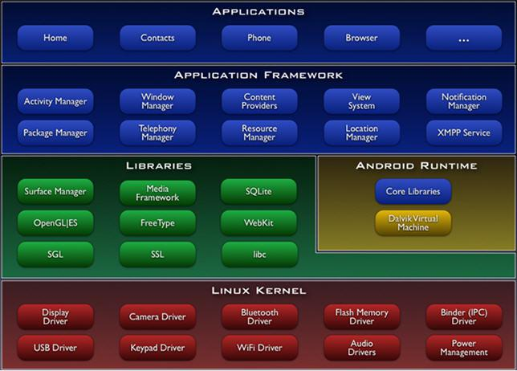
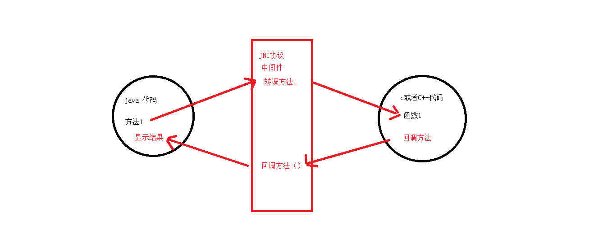

### JNI理解
Andriod系统架构<br>



jni相当于桥梁的作用



**java native interface： java本地开发接口<br>
通过jni就可以让java与C/C++代码实现互调**

#### 为什么使用JNI
native coder执行高效：大量的运算（极品飞车），万能解码（ffmpeg）,Opengl(3D 渲染)<br>
通过jni技术，可以扩展Android手机的功能-wifi热点<br>
代码的复用：ffmpeg,onencv(人脸识别库)，7-zip<br>
使用场景：考虑特殊情况(效率/操作硬件)<br>

### NDK
Native Develop Kits(本地开发工具包)<br>
Android提供的用来做JNI开发的工具包<br>
提高JNI开发的效率：<br>

* 生成代码<br>
* 代码提示<br>
* 多平台交叉编译<br>

### 开发

#### 开发流程(AndroidStudio)
##### 基本流程

   1. 在Java类中定义native方法

   2. 生成包含对应JNI函数声明的头文件

   3. 实现生成的JNI函数

   4. 借助NDK编译生成动态链接库文件(.so)

   5. 在Java类中加载动态连接库并调用native的方法

##### 详细流程

1. 在Java类中定义native方法<br>
HelloJni类: <br>
   
	```
	public class HelloJni {
	    static {
	        System.loadLibrary("hello");
	    }
	    public native String getStrFromC();
   }
	```

2. 生成包含对应JNI函数声明的头文件<br>
 1). 在命令行中执行:<br>
 
    ```
    cd src/main/java
    javah -d ../jni cn.junechiu.interview.jni.HelloJni
    ```
    **说明有的电脑可能会提示GBK的不可映射字符: 添加 -encoding utf-8**<br>
 2). 在src/main/java/jni下会生成一个头文件: <br>

 ```
 cn_junechiu_interview_jni_HelloJni.h
 
 ```
 3). 新建hello.c文件native方法对应的JNI函数:<br>
 
 ```
	#include "cn_junechiu_interview_jni_HelloJni.h"
JNIEXPORT jstring JNICALL Java_cn_junechiu_interview_jni_HelloJni_getStrFromC
        (JNIEnv *env, jobject jobj){
    return (*env)->NewStringUTF(env, "Hello from C");
}
```
4).编写Android.mk和Application.mk两个文件,编译so库<br>
 
 ```
 LOCAL_PATH := $(call my-dir)
include $(CLEAR_VARS)
LOCAL_MODULE := hello #指定生成的so文件的唯一标识
LOCAL_SRC_FILES := hello.c #指定包含JNI函数的c文件名
include $(BUILD_SHARED_LIBRARY)
 ```
 ```
 APP_ABI := armeabi armeabi-v7a
 ```
 在 src/main/java/jni目录下执行编译命令
 
 ```
 ndk-build
 ```
 会在src/main/java/libs/目录下生成<br>
 armeabi/libhello.so<br>
 armeabi-v7a/libhello.so<br>
 
 5).将生成的so库拷贝到src/main/jniLibs目录
  调用函数：

  ```
  var hello = HelloJni()
  Log.d("HelloJni: ",hello.getStrFromC());
  ```
  **注意：<br>**
  在gradle文件中兼容某平台so库的配置<br>
  
  ```
  defaultConfig {  
      ndk {
            abiFilters "armeabi", "armeabi-v7a"
      }
  }
  ```
#### 详解NDK开发
##### Java调用C函数
头文件中定义日志输出函数<br>

	```
	Android.mk中添加
	LOCAL_LDLIBS    := -llog  #log库
	```
头文件中定义

   ```
   #include <android/log.h>
#define LOG_TAG "helloJNI"
#define LOGD(...) __android_log_print(ANDROID_LOG_DEBUG, LOG_TAG, __VA_ARGS__)
#define LOGI(...) __android_log_print(ANDROID_LOG_INFO, LOG_TAG, __VA_ARGS__)
#define LOGE(...) __android_log_print(ANDROID_LOG_ERROR, LOG_TAG, __VA_ARGS__)
   ```	
java端

	```
	//将传入的两个int值相加并返回
	public native int sum(int x, int y); 
	//将两个字符串拼接后返回
	public native String sayHello(String s);
	////将数组中的每个元素增加10
	public native int[] increaseArrayEles(int[] intArray);
	
   ```
c端
   
   ```
   JNIEXPORT jint JNICALL Java_cn_junechiu_interview_jni_HelloJni_sum
        (JNIEnv *env, jobject jobj, jint x, jint y) {
	    int sum = x + y; //jint可以直接进行算术运算
	    //stdio.h头文件
	    printf("printf c sum=%d\n", sum);//问题: 直接输出,在logcat中看不到输出
	    LOGD("printf c sum=%d\n", sum);
	    return sum; //可直接将int类型数据作为jint返回
}
   ```   
   
   ```
   JNIEXPORT jstring JNICALL Java_cn_junechiu_interview_jni_HelloJni_sayHello
        (JNIEnv *env, jobject jobj, jstring js){
	    //1. 将jstring类型的js转换为char*类型数据
	    char* cs1 = _JString2CStr(env, js);
	    //2. 指定另一部分字符串
	    char* cs2 = " Hello By C";
	    //3. 将拼接两个char*类型字符串拼接在第一个上
	    char* cs3 = strcat(cs1, cs2);
	    //4. 将结果转换为jstring类型返回
	    return (*env)->NewStringUTF(env, cs3);
}
   ``` 
  
   ```
   JNIEXPORT jintArray JNICALL Java_cn_junechiu_interview_jni_HelloJni_increaseArrayEles
        (JNIEnv *env, jobject jobj, jintArray arr) {
	    //1. 得到数组的长度
	    //jsize (*GetArrayLength)(JNIEnv*, jarray);
	    jsize length = (*env)->GetArrayLength(env, arr);
	    //2. 得到数组
	    //jint* (*GetIntArrayElements)(JNIEnv*, jintArray, jboolean*);
	    jint *array = (*env)->GetIntArrayElements(env, arr, JNI_FALSE);
	    //3. 遍历数组, 并将每个元素+10
	    int i;
	    for (i = 0; i < length; i++) {
	        *(array + i) += 10;
	    }
	    //4. 返回数组
	    return arr;
}
   ```
##### C回调Java方法
	C回调Java方法的核心思想: 反射<br>
	得到一个方法的签名<br>
	1). 在命令行窗口中, 进入应用的classes/debug/目录
	2). 执行命令: javap -s CCallJava.class, 显示所有方法的签名信息

   CCallJava.java：

   	```
   	  //回调带int参数方法
    public native void callbackAdd();

    //回调一般方法(无参无返回)
    public native void callbackHelloFromJava();

    //回调带String参数方法
    public native void callbackPrintString();

    //回调静态方法
    public native void callbackSayHello();

    public int add(int x, int y) {
        Log.e("CCallJava", "add() x=" + x + " y=" + y);
        return x + y;
    }

    public void helloFromJava() {
        Log.e("CCallJava", "helloFromJava()");
    }

    public void printString(String s) {
        Log.e("CCallJava", "C中输入的：" + s);
    }

    public static void sayHello(String s) {
        Log.e("CCallJava", "我是java代码中的JNI."
                + "java中的sayHello(String s)静态方法，我被C调用了:" + s);
    }
   	```
   	
   CCallJava.h
   	
   	```
   	/*
	 * Class:     cn_junechiu_interview_jni_CCallJava
	 * Method:    callbackAdd
	 * Signature: ()V
	 */
	JNIEXPORT void JNICALL Java_cn_junechiu_interview_jni_CCallJava_callbackAdd
	  (JNIEnv *, jobject);
	
	/*
	 * Class:     cn_junechiu_interview_jni_CCallJava
	 * Method:    callbackHelloFromJava
	 * Signature: ()V
	 */
	JNIEXPORT void JNICALL Java_cn_junechiu_interview_jni_CCallJava_callbackHelloFromJava
	  (JNIEnv *, jobject);
	
	/*
	 * Class:     cn_junechiu_interview_jni_CCallJava
	 * Method:    callbackPrintString
	 * Signature: ()V
	 */
	JNIEXPORT void JNICALL Java_cn_junechiu_interview_jni_CCallJava_callbackPrintString
	  (JNIEnv *, jobject);
	
	/*
	 * Class:     cn_junechiu_interview_jni_CCallJava
	 * Method:    callbackSayHello
	 * Signature: ()V
	 */
	JNIEXPORT void JNICALL Java_cn_junechiu_interview_jni_CCallJava_callbackSayHello
	  (JNIEnv *, jobject);
   	```
   	
   	ccalljava.c
   	
   	```
   	/*
	 * Class:     cn_junechiu_interview_jni_CCallJava
	 * Method:    callbackAdd
	 * Signature: ()V
	 */
	JNIEXPORT void JNICALL Java_cn_junechiu_interview_jni_CCallJava_callbackAdd
	        (JNIEnv *env, jobject jobj) {
	    //1. 加载类得到class对象
	    jclass jc = (*env)->FindClass(env, "cn/junechiu/interview/jni/CCallJava");
	    //2. 得到对应方法的Method对象
	    jmethodID method = (*env)->GetMethodID(env, jc, "add", "(II)I");
	    //3. 创建类对象
	    jobject obj2 = (*env)->AllocObject(env, jc);
	    //4. 调用方法
	    (*env)->CallIntMethod(env, obj2, method, 3, 4);
	    (*env)->DeleteLocalRef(env, obj2);
	}
	
	/*
	 * Class:     cn_junechiu_interview_jni_CCallJava
	 * Method:    callbackHelloFromJava
	 * Signature: ()V
	 * 产生Local Reference的操作有：
	1.FindClass
	2.NewString/ NewStringUTF/NewObject/NewByteArray
	3.GetObjectField/GetObjectClass/GetObjectArrayElement
	4.GetByteArrayElements和GetStringUTFChars
	 */
	JNIEXPORT void JNICALL Java_cn_junechiu_interview_jni_CCallJava_callbackHelloFromJava
	        (JNIEnv *env, jobject jobj) {
	    //1. 加载类得到jclass对象:
	    //jclass (*FindClass)(JNIEnv*, const char*);
	    jclass jc = (*env)->FindClass(env, "cn/junechiu/interview/jni/CCallJava");
	    //2. 得到对应方法的Method对象 : GetMethodId()
	    //jmethodID (*GetMethodID)(JNIEnv*, jclass, const char*, const char*)
	    jmethodID method = (*env)->GetMethodID(env, jc, "helloFromJava", "()V");
	    //3. 创建类对象
	//    jobject (*AllocObject)(JNIEnv*, jclass);
	    jobject obj2 = (*env)->AllocObject(env, jc);
	    //4. 调用方法
	    (*env)->CallVoidMethod(env, obj2, method);
	//    用完java传递过来的obj之后，释放
	    (*env)->DeleteLocalRef(env, obj2);
	}
	
	/*
	 * Class:     cn_junechiu_interview_jni_CCallJava
	 * Method:    callbackPrintString
	 * Signature: ()V
	 */
	JNIEXPORT void JNICALL Java_cn_junechiu_interview_jni_CCallJava_callbackPrintString
	        (JNIEnv *env, jobject jobj) {
	    //1. 加载类得到class对象
	    jclass jc = (*env)->FindClass(env, "cn/junechiu/interview/jni/CCallJava");
	//2. 得到对应方法的Method对象
	    jmethodID method = (*env)->GetMethodID(env, jc, "printString", "(Ljava/lang/String;)V");
	//3. 创建类对象
	    jobject obj2 = (*env)->AllocObject(env, jc);
	//4. 调用方法
	    jstring js = (*env)->NewStringUTF(env, "I from C");
	    (*env)->CallVoidMethod(env, obj2, method, js);
	    (*env)->DeleteLocalRef(env, obj2);
	}
	
	/*
	 * Class:     cn_junechiu_interview_jni_CCallJava
	 * Method:    callbackSayHello
	 * Signature: ()V
	 */
	JNIEXPORT void JNICALL Java_cn_junechiu_interview_jni_CCallJava_callbackSayHello
	        (JNIEnv *env, jobject jobj) {
	    //1. 加载类得到class对象
	    jclass jc = (*env)->FindClass(env, "cn/junechiu/interview/jni/CCallJava");
	    //2. 得到对应方法的Method对象
	    jmethodID method = (*env)->GetStaticMethodID(env, jc, "sayHello", "(Ljava/lang/String;)V");
	    //3. 调用方法
	    jstring js = (*env)->NewStringUTF(env, "I from C");
	    (*env)->CallStaticVoidMethod(env, jc, method, js);
	    (*env)->DeleteLocalRef(env, js);
	}
   	```
