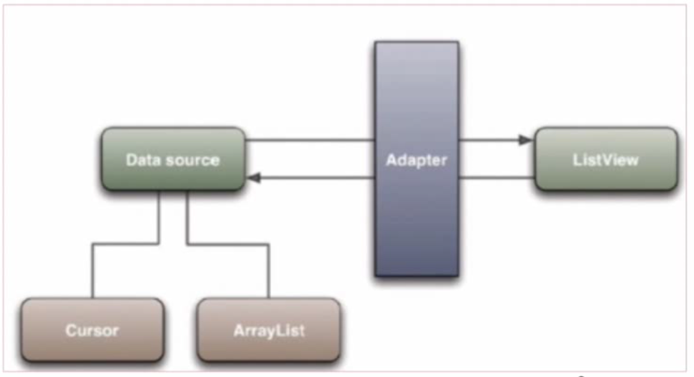
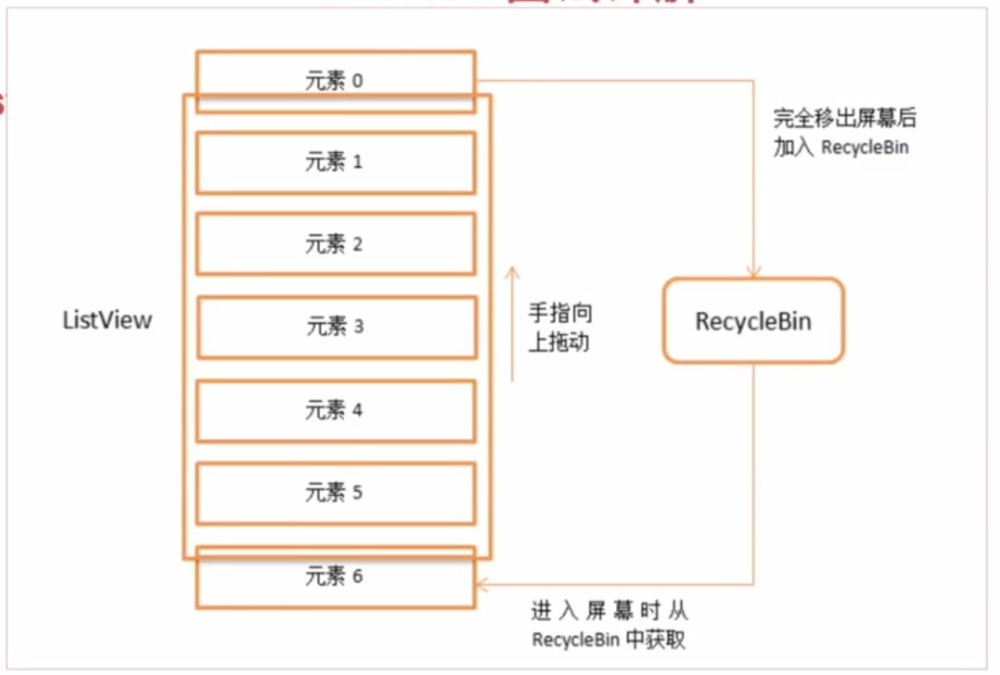

### 一、什么是ListView

Listview是一个能将数据集合以动态滚动的方式展示到用户界面上的View。

### 二、ListView适配器模式

Adapter是数据源和ListView的桥梁，Adapter负责为每个数据制作View，交给ListView来显示。ListView中的每个项的显示都会调用getView()方法。

### 三、ListView的RecycleBin机制

元素6滑入界面时，会复用元素0的Item。

### 四、ListView的优化

#### 使用converView复用和ViewHolder：
当有view移除界面的时候，其会变成convertView，因此，在调用getView()方法的时候，先判断convertView是否为空，为空的话使用加载新布局和ViewHolder，并用ViewHolder绑定布局中的控件，然后在convertView中保存ViewHolder；若convertView不为空，直接从convertView中取出已保存的ViewHolder，再进行其他的操作。ViewHolder是一个内部类，用来保存控件信息，以减少findViewById()的次数。

#### 使用三级缓存/设置滑动监听事件 ：
可以使用三级缓存加载图片；在getView()方法中做耗时操作会使ListView卡顿，非要做耗时操作可以给ListView设置监听事件，当ListView停止滑动时，再加载图片之类的。

#### 避免半透明元素/设置硬件加速 ：
在getView()中使用非透明元素的效率比透明元素要高；设置硬件加速可以提高图片的加载效率。
