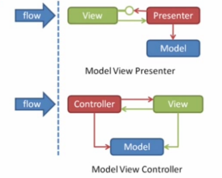

在MVC的设计模式中，Android中的View层对应的是xml布局问题，能做的事情很少；而Controller层所对应的Activity类，不仅要控制业务逻辑，同时也要处理操作UI的功能，导致Controller层过于冗余。为了改善这一点，引入了MVP的设计模式。

### 一、MVP定义

1.Model层：依然是业务逻辑和实体模型。

2.View层：对应Activity，负责View的绘制以及与用户交互。

3.Presenter层：负责完成View与Model层的交互。

在MVC设计模式中，Model层是可以直接和View层进行交互的；而MVP中，Model层和View层的交互只能通过Presenter层进行完成。

