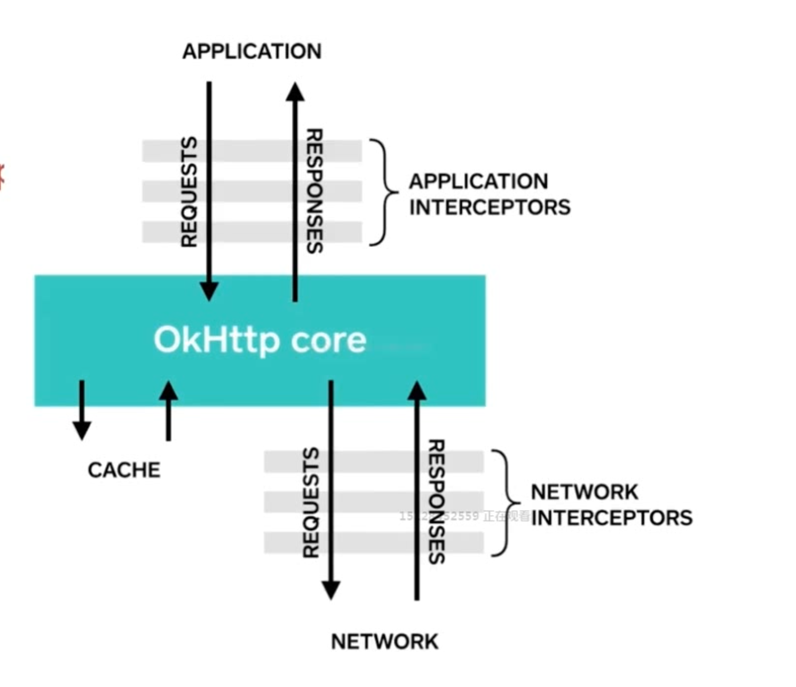
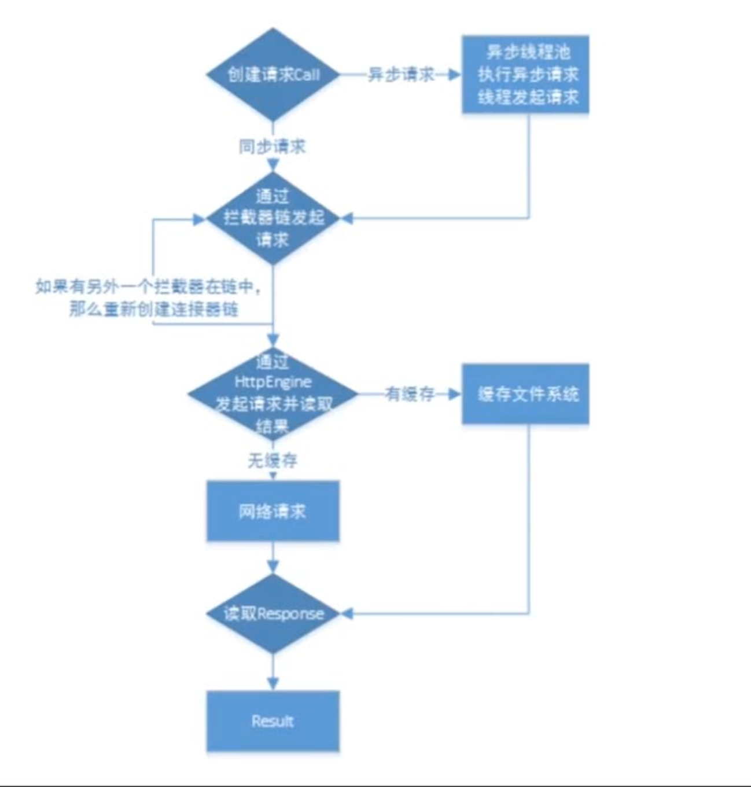

### 一、okhttp使用简介

1.创建一个OkHttpClient对象 全局实例

2.创建一个request对象，通过内部类Builder调用生成Request对象
  封装了请求信息(url、method、headers、requestBody、tag)，
  使用build模式创建，使显示和创建分离。
  

3.创建一个Call对象，调用execute(同步)/enqueue(异步)，链接request和response的桥梁，同步获取数据会阻塞当前线程去获取数据然后返回数据。enqueue异步不会阻塞当前线程，会开启一个子线程去强求网络数据，成功后调用onResponse方法，失败后调用onFailure()都是在工作线程中执行的。

4.返回Response对象，对Response对象进行处理，封装了响应信息（响应码，响应体，错误等）


应用程序会发出一个request对象--->okhttp核心层(拦截器拦截请求并且分发)进行处理--->返回响应数据

```
//第一步
    private final OkHttpClient client = new OkHttpClient();

    //第二步（build将一个复杂的对象构建与它的表示相分离，这样就可以使用同样的构建，创造出不同的表示）
    Request request = new Request.Builder()
            .url("http://www.baidu.com").build();

    //同步请求
    public void okHttpAsycGet() throws IOException {
        //第三步
        Response response = client.newCall(request).execute();

        if (!response.isSuccessful()) throw new IOException("Unexpected code " + response);
        System.out.println(response.body().string());
    }

    //异步请求
    public void okHttpSyncGet() throws IOException {
        //第三步
        client.newCall(request).enqueue(new Callback() {
            @Override
            public void onFailure(Call call, IOException e) {
                e.printStackTrace();
            }

            @Override
            public void onResponse(Call call, Response response) throws IOException {
                if (!response.isSuccessful()) throw new IOException("Unexpected code " + response);
                System.out.println(response.body().string());
            }
        });
    }
```

### 二、okhttp代码分析
#### 同步方法代码分析

在client.newCall(request).execute();代码中的newCall方法实现如下：

```
@Override 
public Call newCall(Request request) {
  return new RealCall(this, request, false /* for web socket */);
}
```
newCall()方法会返回一个RealCall对象，RealCall中的execute()方法实现如下：

```
@Override 
public Response execute() throws IOException {
    synchronized (this) { //方法检测，execute()只会执行一次
      if (executed) throw new IllegalStateException("Already Executed");
      executed = true;
    }
    captureCallStackTrace();
    try {
      client.dispatcher().executed(this); //将RealCall添加到Dispatcher中的同步请求队列中
      Response result = getResponseWithInterceptorChain(); //获取Response
      if (result == null) throw new IOException("Canceled");
      return result; //返回Response
    } finally {
      client.dispatcher().finished(this); //通知Dispatcher该RealCall已执行完
    }
  }
```
分层的设计思想，拦截器各执其职
其中的获取Response的关键方法getResponseWithInterceptorChain()实现如下：

```
Response getResponseWithInterceptorChain() throws IOException {
  // Build a full stack of interceptors.
  List<Interceptor> interceptors = new ArrayList<>(); //拦截器栈
  interceptors.addAll(client.interceptors()); //添加client中的所有拦截器
  interceptors.add(retryAndFollowUpInterceptor); //失败重试拦截器
  interceptors.add(new BridgeInterceptor(client.cookieJar())); //桥接拦截器
  interceptors.add(new CacheInterceptor(client.internalCache())); //缓存拦截器
  interceptors.add(new ConnectInterceptor(client)); //与服务器进行连接的拦截器
  if (!forWebSocket) {
    interceptors.addAll(client.networkInterceptors());  //网络拦截器
  }
  interceptors.add(new CallServerInterceptor(forWebSocket)); //网络服务端连接拦截器

  Interceptor.Chain chain = new RealInterceptorChain(
      interceptors, null, null, null, 0, originalRequest); //将拦截器栈连成链
  return chain.proceed(originalRequest);
}
```
#### 异步方法代码分析

newCall()方法会返回一个RealCall对象，RealCall中的enqueue()方法实现如下：

```
@Override 
public void enqueue(Callback responseCallback) {
  synchronized (this) {
    if (executed) throw new IllegalStateException("Already Executed");
    executed = true;
  }
  captureCallStackTrace();
  client.dispatcher().enqueue(new AsyncCall(responseCallback));
}
```
可以看到，方法的最后调用了Dispatcher的enqueue()方法，该方法的具体实现如下：

```
/** Ready async calls in the order they'll be run. */
private final Deque<AsyncCall> readyAsyncCalls = new ArrayDeque<>(); //准备中的异步队列

/** Running asynchronous calls. Includes canceled calls that haven't finished yet. */
private final Deque<AsyncCall> runningAsyncCalls = new ArrayDeque<>(); //运行中的异步队列

/** Running synchronous calls. Includes canceled calls that haven't finished yet. */
private final Deque<RealCall> runningSyncCalls = new ArrayDeque<>(); //运行中的同步队列
```
```
synchronized void enqueue(AsyncCall call) {
  if (runningAsyncCalls.size() < maxRequests && runningCallsForHost(call) < maxRequestsPerHost) { //若当前正在运行的异步队列可容纳新的任务
    runningAsyncCalls.add(call); //添加回调方法到正在运行中的异步队列
    executorService().execute(call); //使用线程池执行该回调方法
  } else {
    readyAsyncCalls.add(call); //添加回调方法到准备中的异步方法
  }
}
```
