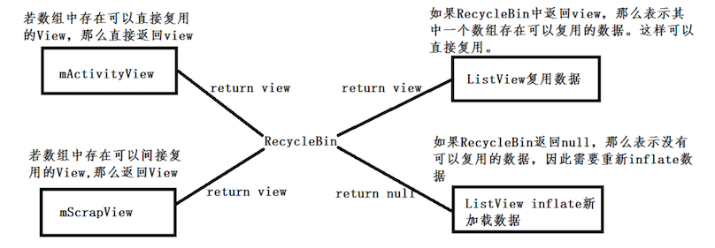

### RecyclerView，google进行的优化
在RecyclerView依赖的适配器中，无论是适配器还是ViewHolder，从源码我们可以看出，都存在RecyclerView的匿名内部类。相对于Listview，RecyclerView内置了多级缓存、RecyclerViewPool（从线程的角度，可以理解成类似线程池的东西，即多个RecyclerView可以公用一个view）、ViewHolder(已经实现了复用，相对于Listview的BaseAdapter中getView方法需要开发者自己引入复用问题方便很多)等等。

```
//负责视图加载并且内部完成复用
  public ViewHolder onCreateViewHolder(
               ViewGroup parent, int viewType)

//负责数据绑定并且内部完成一系列的缓存机制。这里满足了视图层与逻辑层的分离
  public void onBindViewHolder(ViewHolder holder, int position)

```

### RecyclerView的头部与尾部实现

```
public int getItemViewType(int position)

```
getItemViewType方法是在执行onCreateViewHolder(ViewGroup parent, int viewType)前回调用viewType，目的是为了根据viewType不同创建不同的视图。我们可以通过在onCreateViewHolder创建视图的时候，对viewType进行判断，如果添加了头部，在position = 0的时候回调头部的viewType给onCreateViewHolder，从而创建头部。尾部创建方法于此类同，直接看下代码，适配器的实现：

```
public class MyAdapter extends RecyclerView.Adapter<MyAdapter.MyHolder> {

    private RecyclerView mRecyclerView;

    private List<String> data = new ArrayList<>();
    private Context mContext;

    private View VIEW_FOOTER; //头部view
    private View VIEW_HEADER; //尾部view

    //Type
    private int TYPE_NORMAL = 1000;
    private int TYPE_HEADER = 1001;
    private int TYPE_FOOTER = 1002;

    public MyAdapter(List<String> data, Context mContext) {
        this.data = data;
        this.mContext = mContext;
    }

    @Override
    public MyAdapter.MyHolder onCreateViewHolder(ViewGroup parent, int viewType) {
        if (viewType == TYPE_FOOTER) { 
            return new MyHolder(VIEW_FOOTER);
        } else if (viewType == TYPE_HEADER) {//如果是头部 返回头部
            return new MyHolder(VIEW_HEADER);
        } else {
            return new MyHolder(getLayout(R.layout.item_list_layout));
        }
    }

    @Override
    public void onBindViewHolder(MyHolder holder, int position) {
        if (!isHeaderView(position) && !isFooterView(position)) {
            if (haveHeaderView()) position--;
            TextView content = (TextView) holder.itemView.findViewById(R.id.item_content);
            TextView time = (TextView) holder.itemView.findViewById(R.id.item_time);
            content.setText(data.get(position));
            time.setText("2016-1-1");
        }
    }

    @Override
    public int getItemCount() {
        int count = (data == null ? 0 : data.size());
        if (VIEW_FOOTER != null) {
            count++;  // count加一
        }

        if (VIEW_HEADER != null) {
            count++;  // count加一
        }
        return count;
    }

    @Override
    public int getItemViewType(int position) {
        if (isHeaderView(position)) {
            return TYPE_HEADER;  //判断type
        } else if (isFooterView(position)) {
            return TYPE_FOOTER;
        } else {
            return TYPE_NORMAL;
        }
    }

    @Override
    public void onAttachedToRecyclerView(RecyclerView recyclerView) {
        try {
            if (mRecyclerView == null && mRecyclerView != recyclerView) {
                mRecyclerView = recyclerView;
            }
            ifGridLayoutManager();
        } catch (Exception e) {
            e.printStackTrace();
        }
    }

    private View getLayout(int layoutId) {
        return LayoutInflater.from(mContext).inflate(layoutId, null);
    }

    public void addHeaderView(View headerView) {
        if (haveHeaderView()) {
            throw new IllegalStateException("hearview has already exists!");
        } else {
            //避免出现宽度自适应
            ViewGroup.LayoutParams params = new ViewGroup.LayoutParams(ViewGroup.LayoutParams.MATCH_PARENT, ViewGroup.LayoutParams.WRAP_CONTENT);
            headerView.setLayoutParams(params);
            VIEW_HEADER = headerView;
            ifGridLayoutManager();
            notifyItemInserted(0);
        }
    }

    public void addFooterView(View footerView) {
        if (haveFooterView()) {
            throw new IllegalStateException("footerView has already exists!");
        } else {
            ViewGroup.LayoutParams params = new ViewGroup.LayoutParams(ViewGroup.LayoutParams.MATCH_PARENT, ViewGroup.LayoutParams.WRAP_CONTENT);
            footerView.setLayoutParams(params);
            VIEW_FOOTER = footerView;
            ifGridLayoutManager();
            notifyItemInserted(getItemCount() - 1);
        }
    }

    private void ifGridLayoutManager() {
        if (mRecyclerView == null) return;
        final RecyclerView.LayoutManager layoutManager = mRecyclerView.getLayoutManager();
        if (layoutManager instanceof GridLayoutManager) {
            final GridLayoutManager.SpanSizeLookup originalSpanSizeLookup =
                    ((GridLayoutManager) layoutManager).getSpanSizeLookup();
            ((GridLayoutManager) layoutManager).setSpanSizeLookup(new GridLayoutManager.SpanSizeLookup() {
                @Override
                public int getSpanSize(int position) {
                    return (isHeaderView(position) || isFooterView(position)) ?
                            ((GridLayoutManager) layoutManager).getSpanCount() :
                            1;
                }
            });
        }
    }

    private boolean haveHeaderView() {
        return VIEW_HEADER != null;
    }

    public boolean haveFooterView() {
        return VIEW_FOOTER != null;
    }

    private boolean isHeaderView(int position) {
        return haveHeaderView() && position == 0;
    }

    private boolean isFooterView(int position) {
        return haveFooterView() && position == getItemCount() - 1;
    }


    public static class MyHolder extends RecyclerView.ViewHolder {

        public MyHolder(View itemView) {
            super(itemView);
        }
    }

}
```

```
private void initRecyc() {
//        mRecyclerView.setLayoutManager(new GridLayoutManager(this,2));
        mRecyclerView.setLayoutManager(new LinearLayoutManager(this));

        adapter = new MyAdapter(data, this);
        mRecyclerView.setAdapter(adapter);

        adapter.addFooterView(LayoutInflater.from(this).inflate(R.layout.item_footer_layout,null));
        adapter.addHeaderView(LayoutInflater.from(this).inflate(R.layout.item_header_layout,null));
    }
```

### ListView的复用机制
i.RecycleBin的基本原理

  首先需要说一下RecycleBin的基本原理，这个类也是实现复用的关键类。接着我们需要明确ActiveView的概念，ActivityView其实就是在UI屏幕上可见的视图(onScreenView)，也是与用户进行交互的View，那么这些View会通过RecycleBin直接存储到mActivityView数组当中，以便为了直接复用，那么当我们滑动ListView的时候，有些View被滑动到屏幕之外(offScreen) View，那么这些View就成为了ScrapView，也就是废弃的View，已经无法与用户进行交互了，这样在UI视图改变的时候就没有绘制这些无用视图的必要了。他将会被RecycleBin存储到mScrapView数组当中，但是没有被销毁掉，目的是为了二次复用，也就是间接复用。当新的View需要显示的时候，先判断mActivityView中是否存在，如果存在那么我们就可以从mActivityView数组当中直接取出复用，也就是直接复用，否则的话从mScrapView数组当中进行判断，如果存在，那么二次复用当前的视图，如果不存在，那么就需要inflate View了。
  

**覆写RecyclerView.Adapter的getItemViewType方法**<br>
**修改getItemCount()方法**<br>
**修改onBindViewHolder()方法创建不同的视图**<br>
getItemViewType也同样根据数据源中的标志或者其他信息，返回不同的type，这里需要根据服务器返回的数据具体操作，如果服务器返回的数据不足以完成分组的话，那么需要自己对数据进行封装

