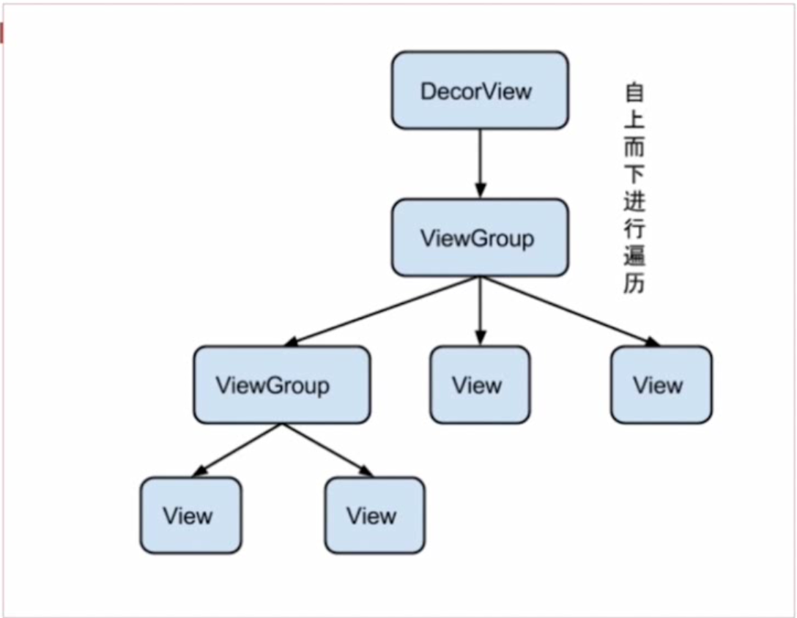

### 一、View树的绘制流程

measure-->layout-->draw

measure：是否重新计算视图大小。

layout：是否需要重新安置视图位置。

draw：是否需要重绘。

### 二、measure


#### 1.ViewGroup.LayoutParams ：用来指定视图高度和宽度的参数，不包括Padding。

#### 2.MeasureSpec ：表示测量规格。32位的Int值，高二位表示模式，后三十位表示测量规格的大小。

(1)UNSPECIFIED：不限定子视图尺寸大小。

(2)EXACTLY：父容器会为子视图确定一个尺寸大小，无论子视图要求多大，都要在父容器的限制内。

(2)AT_MOST：父容器会为子视图指定一个最大的尺寸，子视图所有的大小都必须在这个尺寸范围内。对应wrap_content。此时父容器无法获取子视图的大小，只能子视图自己根据需求设定。

**ViewGroup.LayoutParams最终会被封装成MeasureSpec**

**measure——重要方法**

measure会从父容器遍历子View的measure方法，会根据ViewGroup.MeasureSpec和子View的LayoutParams来决定子视图的测量规格，通过这个测量规格进一步获取到子View的宽高，一层一层向下传递，不断保存整个父容器的测量宽高。

#### 1.measure：该方法会调用onMeasure方法。

#### 2.onMeasure：该方法会调用setMeasuredDimension()方法。
```
protected void onMeasure(int widthMeasureSpec, int heightMeasureSpec) {
        setMeasuredDimension(getDefaultSize(getSuggestedMinimumWidth(), widthMeasureSpec),
                getDefaultSize(getSuggestedMinimumHeight(), heightMeasureSpec));
}
```
#### 3.setMeasuredDimension()：该方法完成整个的测量过程。
```
protected final void setMeasuredDimension(int measuredWidth, int measuredHeight) {
        boolean optical = isLayoutModeOptical(this);
        if (optical != isLayoutModeOptical(mParent)) {
            Insets insets = getOpticalInsets();
            int opticalWidth  = insets.left + insets.right;
            int opticalHeight = insets.top  + insets.bottom;

            measuredWidth  += optical ? opticalWidth  : -opticalWidth;
            measuredHeight += optical ? opticalHeight : -opticalHeight;
        }
        setMeasuredDimensionRaw(measuredWidth, measuredHeight);
}
```
### 三、layout

onLayout方法是用来设置与父容器的摆放关系的，自定义View需重写该方法。

View中的onLayout是个空方法。
```
protected void onLayout(boolean changed, int left, int top, int right, int bottom) {
}
```
LinearLaout中的onLayout如下：
```
@Override
protected void onLayout(boolean changed, int l, int t, int r, int b) {
    if (mOrientation == VERTICAL) {
        layoutVertical(l, t, r, b);
    } else {
        layoutHorizontal(l, t, r, b);
    }
}
```
### 四、draw

两个容易混淆的方法：

1.invalidate()：请求系统重绘，未发生变化时不会调用。

2.requestLayout()：当布局（方向、尺寸等）发生变化时，需手动调用，该方法会触发measure和layout的过程，而不会调用draw方法。

 


