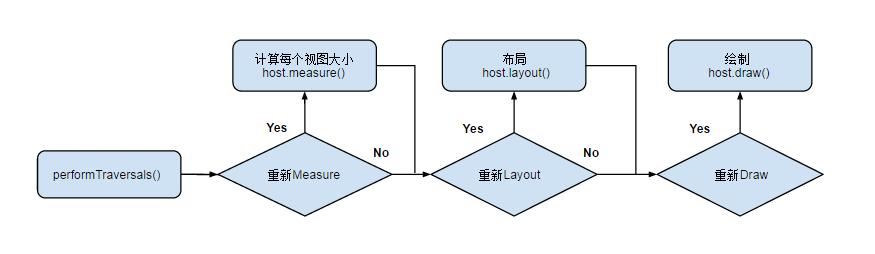
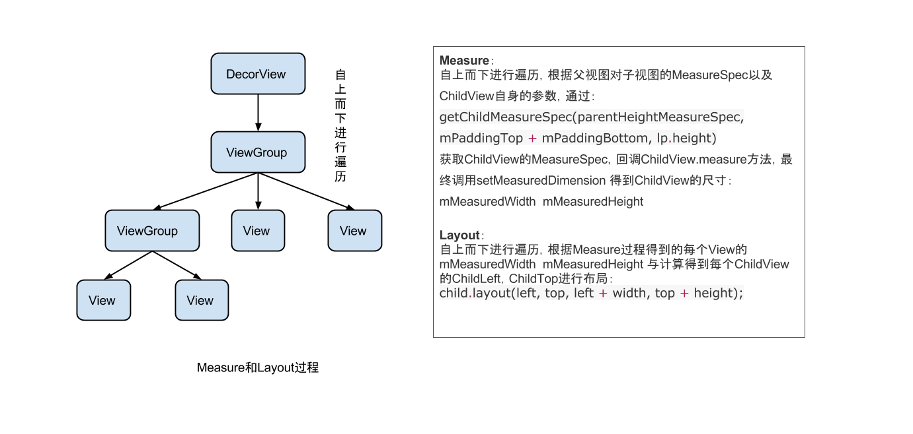

### View 树的绘图流程
http://blog.csdn.net/yanbober/article/details/46128379 
http://blog.csdn.net/yanbober/article/details/45970721 
http://blog.csdn.net/guolin_blog/article/details/12921889 
http://www.jianshu.com/p/060b5f68da79 
http://yongyu.itscoder.com/2016/09/11/view_measure/ 
当 Activity 接收到焦点的时候，它会被请求绘制布局,该请求由 Android framework 处理.绘制是从根节点开始，对布局树进行 measure 和 draw。整个 View 树的绘图流程在ViewRoot.java类的performTraversals()函数展开，该函数所做 的工作可简单概况为是否需要重新计算视图大小(measure)、是否需要重新安置视图的位置(layout)、以及是否需要重绘(draw)，流程图如下：

View 绘制流程函数调用链

需要说明的是，用户主动调用 request，只会出发 measure 和 layout 过程，而不会执行 draw 过程

### 概念
**measure 和 layout** 
从整体上来看 Measure 和 Layout 两个步骤的执行： 

树的遍历是有序的，由父视图到子视图，每一个 ViewGroup 负责测绘它所有的子视图，而最底层的 View 会负责测绘自身。

