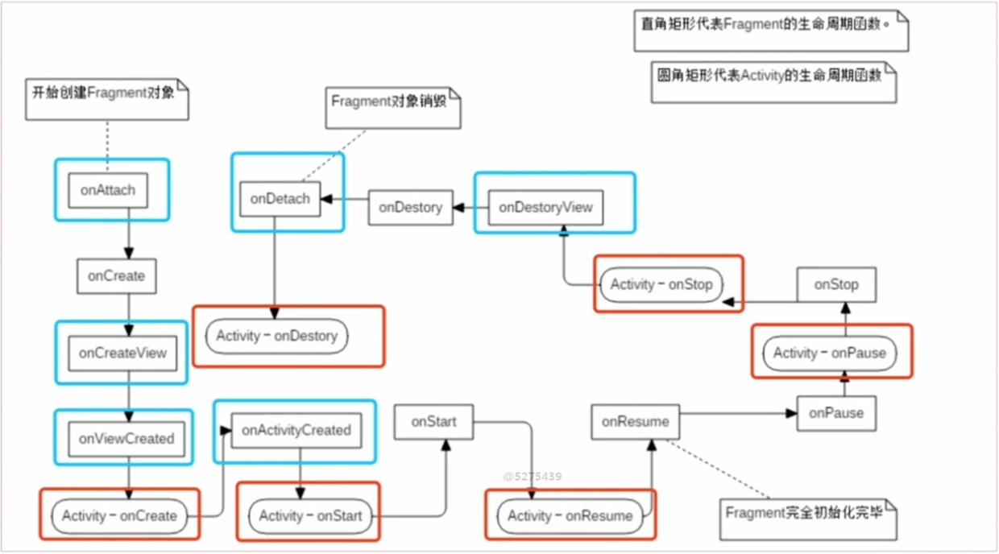

### 一.Fragment为什么会被称为第五大组件？

#### 1.Fragment为什么被称为第五大组件？

答：在使用频率上，Fragment是不输于其他四大组件的，它有自己的生命周期。同时，它可以动态、灵活地加载Activity的内容，所以是第五大组件。它虽然有自己的生命周期，但是它需要依附Activity，并加载到Activity当中。

#### 2.Fragment加载到Activity的两种方式。

1.静态加载，添加Fragment到Activity的布局文件当中。

2.动态加载，动态在Activity中添加Fragment。

第一步，创建FragmentManager对象，通过FragmentManager创建FragmentTransaction。
第二步，调用FragmentTransaction中的add()方法（第一个参数为Fragment要加载位置的id）添加Fragment，执行commit()方法后即可动态加载Fragment。

#### 3.FragmentPagerAdapter与FragmentStatePagerAdapter的区别。

答：FragmentPagerAdapter在destroyItem()的时候只是把UI分离，并没有回收内存，所以适合页面比较少的情况，对系统内存没有多大影响。由于FragmentStatePagerAdapter在每次ViewPage切换的时候是回收内存的，所以它适合页面比较多的情况，因为页面较多的情况会更耗内存，所以要回收内存。

### 二. Fragment生命周期
   
   
   Fragment与activity关联之后会调用 onAttach方法 
   
   初次创建fragment时              onCreate方法
   
   绘制fragment视图                onCreateView方法
   
   ui绘制完成                      onViewCreated方法
   **才开始调用activity的 onCreate方法**
   
   activity创建完成后 
   调用onActivityCreated方法
   
   **继续调用activity的onStart方法**
   
   调用fragment的onStart方法
   
   **继续调用activity的onResume方法  用户可交互**

   返回键：

   调用fragment的onPause方法---**activity的onPause方法**

   调用fragment的onStop方法---**activity的onStop方法**

   调用fragment的onDestoryView方法--->onDestory()-->onDetach方法

   **activity的onDestory方法**

### 三、Fragment通信

1.在Fragment中调用Activity的方法 ：使用getActivity()方法。

2.在Activity中调用Fragment的方法 ：使用接口回调。

3.在Fragment中调用Fragment中的方法 ：使用使用Activity中的getActivity()方法获取上下文，在上下文中调用findFragmentById()找到对应的Fragment即可。

### 四、FragmentManager的add、remove、replace方法

1.add方法 ：将Fragment的实例添加到Activity的最上层。

2.remove方法 ：将Fragment从Activity的Fragment队列中删除。

3.replace方法 ：把最上层的Fragment替换成别的Fragment。