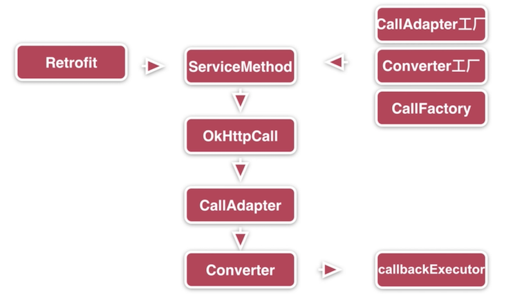
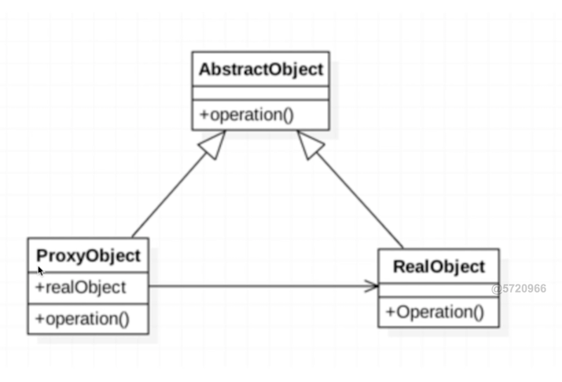

### 整体流程


概念：<br>
**封装了okhttp网络框架**<br>
实际上是使用retrofitj接口层封装请求参数，之后由http完成网络请求。在服务端返回数据之后，okhttp将结果交给retrofit，retrofit根据用户的需求将结果解析。

```
 public void github() {
        Retrofit retrofit = new Retrofit.Builder()
                .baseUrl("https://api.github.com/")
                .addConverterFactory(ScalarsConverterFactory.create()) //数据转换器
                .addCallAdapterFactory(RxJava2CallAdapterFactory.create()) //网络回调器
                .build();
        GithubService service = retrofit.create(GithubService.class);
        Call<String> call = service.listRepos("abc20899");
        call.enqueue(new Callback<String>() {
            @Override
            public void onResponse(Call<String> call, Response<String> response) {

            }

            @Override
            public void onFailure(Call<String> call, Throwable t) {

            }
        });
    }
```

**步骤**<br>
1.添加retrofit依赖，添加网络权限<br>
2.创建服务器返回的bean类<br>
3.用注解创建描述网络请求的接口<br>
4.创建retrofit实例<br>
5.创建网络接口的实例<br>
6.发送网络请求<br>
7.处理服务器返回的数据<br>

### 静态代理模式

目标类与代理类共同实现了一个抽象类<br>
代理类持有目标的引用<br>
**场景：**如果要修改一个类的方法，最好写一个代理类持有其引用，对其要修改的方法进行操作。

### 动态代理
特点：<br>
1. 无侵入式的修改代码，增强方法，只能为接口创建动态代理<br>
概念：<br>
代理类在程序运行时创建的代理方式，与静态代理相比不用频繁的去修改每一个代理函数。<br>
实现方式：<br>
1.jdk动态代理:客户端写辅助方法，利用反射机制<br>
2.CGLIB:修改字节码<br>

#### 实现动态代码的步骤
1. 定义一个目标类和一个公共接口
2. 定义一个类Proxy调用处理器类即实现了InvocationHanlerj接口，目的是在程序运行时将生成的代理类完成具体的任务
3. Proxy调用生成代理对象

#### Java 实现动态代理主要涉及以下几个类：
* java.lang.reflect.Proxy: 这是生成代理类的主类，通过 Proxy 类生成的代理类都继承了 Proxy 类，即 DynamicProxyClass extends Proxy。<br>

* java.lang.reflect.InvocationHandler: 这里称他为"调用处理器"，他是一个接口，我们动态生成的代理类需要完成的具体内容需要自己定义一个类，而这个类必须实现 InvocationHandler 接口。

Proxy 类主要方法为：

```
//创建代理对象  
static Object newProxyInstance(
        ClassLoader loader,  //类加载器
        Class<?>[] interfaces,
        InvocationHandler h
)
```
这个静态函数的第一个参数是类加载器对象（即哪个类加载器来加载这个代理类到 JVM 的方法区），第二个参数是接口（表明你这个代理类需要实现哪些接口），第三个参数是调用处理器类实例（指定代理类中具体要干什么）。这个函数是 JDK 为了程序员方便创建代理对象而封装的一个函数，因此你调用newProxyInstance()时直接创建了代理对象（略去了创建代理类的代码）。其实他主要完成了以下几个工作：

```
static Object newProxyInstance(
     ClassLoader loader,
     Class<?>[] interfaces,
     InvocationHandler handler
){
    //1. 根据类加载器和接口创建代理类
    Class clazz = Proxy.getProxyClass(loader, interfaces); 
    
    //2. 获得代理类的带参数的构造函数
    Constructor constructor = clazz.getConstructor(
        new Class[] { InvocationHandler.class});
    
    //3. 创建代理对象，并制定调用处理器实例为参数传入
    Interface Proxy = (Interface)constructor.newInstance(new Object[] {handler});
}
```
Proxy 类还有一些静态方法，比如：

* InvocationHandler getInvocationHandler(Object proxy): 获得代理对象对应的调用处理器对象。
* Class getProxyClass(ClassLoader loader, Class[] interfaces): 根据类加载器和实现的接口获得代理类。

**demo**

```
//代理接口
public interface Subject {
    void shopping();
}
```

```
//目标类
public class Woman implements Subject {
    @Override
    public void shopping() {
        System.out.println("xxx 购物ing");
    }
}
```

```
/**
 * 代理类的调用处理器
 */
public class ProxyHandler implements InvocationHandler {

    public Object target;

    public ProxyHandler(Object target) {
        this.target = target;
    }

    /**
     * 第一个参数是代理对象（表示哪个代理对象调用了method方法），
     * 第二个参数是 Method 对象（表示哪个方法被调用了），
     * 第三个参数是指定调用方法的参数。
     */
    @Override
    public Object invoke(Object o, Method method, Object[] objects) throws Throwable {
        //定义预处理的工作，当然你也可以根据 method 的不同进行不同的预处理工作
        System.out.println("before method");
        method.invoke(target, objects); //
        System.out.println("after method");
        return null;
    }
}
```

```
public static void main(String[] args) {
        Woman woman = new Woman();//创建委托对象
        ProxyHandler handler = new ProxyHandler(woman);//创建代理处理器

        Subject subject = (Subject) Proxy.newProxyInstance(
                Woman.class.getClassLoader(),
                Woman.class.getInterfaces(), handler);//3.动态生成代理对象
        subject.shopping();//4.通过代理对象调用方法
    }
```


总结：<br>
1.运行期间生成代码<br>
2.实现InvocationHander接口，使用Proxy调用<br>
3.动态代理与静态代理的最大不同就是动态生成代码，动态代理。


源码分析：

```
public final class Retrofit {
//ServiceMethod 通过注解解析后的对象
  private final Map<Method, ServiceMethod<?, ?>> serviceMethodCache = new ConcurrentHashMap<>();

  final okhttp3.Call.Factory callFactory; //okhttp工厂
  final HttpUrl baseUrl; //基地址
  final List<Converter.Factory> converterFactories; //数转换器
  final List<CallAdapter.Factory> adapterFactories;//放置网络请求适配
  final @Nullable Executor callbackExecutor;//执行回调 主线程cutor
  final boolean validateEagerly; //是否需要立即解析
```


