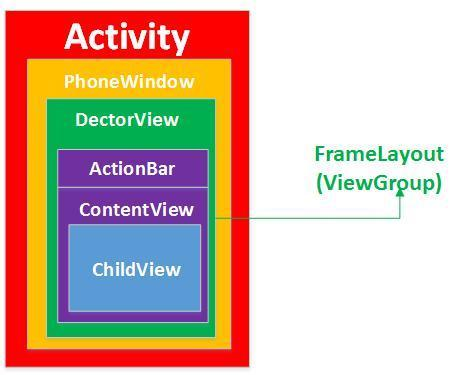
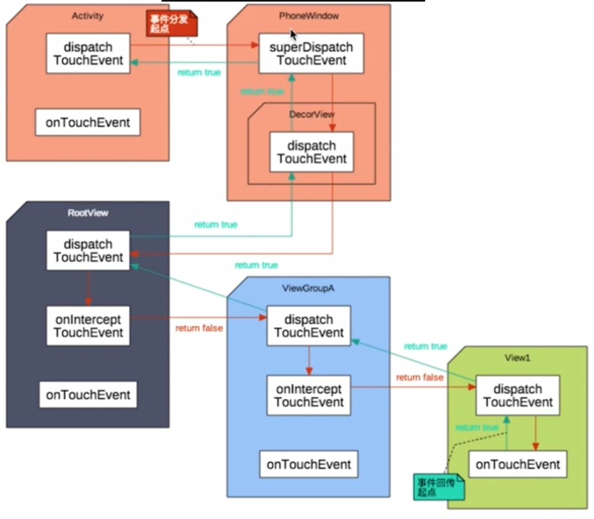

### 一、为什么会有事件分发机制<br>
android应用界面的布局如下图所示，一般我们在展示一个界面时会使用一个Activity表示；而Activity时通过Window展示的，android的Window实现类叫PhoneWindow；PhoneWindow类有个mDecor的DectorView全局变量，用来对界面的View元素进行修饰；DectorView用来修饰ActionBar、ContentView(Activity.setContentView)；ContentView里面包含了用户自定义的一些子Layout。



android的视图分为两种：ViewGroup视图和View视图，其中View视图时一个单独的视图，不能存在孩子节点，例如TextView；其中ViewGroup视图用来存放一组View或ViewGroup;DectorView继承自FrameLayout，FrameLayout就是一个ViewGroup，可以有多个子ViewGroup和子View。

安卓上面的View是树形结构的，View可能会重叠在一起，当点击的地方有多个View可以响应的时候，这个点击事件应该给谁呢？为了解决这个问题，就有了事件分发机制。

PhoneWindow：是抽象类Window的实现类，抽象类Window是所有视图最顶层的容器，包括View视图的外观和行为都归Window管。

DecorView：PhoneWindow的内部类，通过DecorView传递信息给下面的View，下面的View也通过DecorView返回消息给PhoneWindow。

### 二、三个重要的事件分发的方法

**android touch事件自上而下传递，经过Activity—>PhoneWindow—>DectorView—>ContentView—>ViewGroup—>ChildView，其中最主要的就是Activity、ViewGroup和View的处理。事件传递主要依赖如下方法：**


1.dispatchTouchEvent ：处在链首，用于分发事件，该方法决定是由当前View自己的onTouchEvent来处理，还是分发给子View，让子View递归调用其自身的dispatchTouchEvent来处理。

2.onInterceptTouchEvent ：是用来拦截事件的，当父控件下发事件给子控件进行拦截处理的时候，如果子控件需要对事件进行处理，就要在onInterceptTouchEvent方法中进行拦截，然后到子控件的onTouchEvent方法中进行事件的监听以及逻辑的判断。

3.onTouchEvent ：用于处理传递到View的手势事件。

可以看到Activity有事件分发和处理方法，没有事件拦截；ViewGroup三个方法都有；View则没有事件拦截方法，因为它没有子节点,，而View的dispatchTouchEvent其实就是调用onTcouchEvent，View本身没有事件分发。

### 三、事件分发流程

Activity——>PhoneWindow——>DecorView——>ViewGroup——>...——>View

事件分发机制使用的是责任链设计模式，从Activity如果传到最下层的View都没有组件处理该事件，该事件会依次回传到Activity。

当用户触发一个touch事件的时候，事件首先被分发到Activity的dispatchTouchEvent，Activity的dispatchTouchEvent方法实现如下：


activity首先会将事件分发给Window处理，调用Window的superDispatchTouchEvent；PhoneWindow又会调用DectorView的superDispatchTouchEvent方法；DectorView会调用父类FrameLayout也就是ViewGroup的dispatchTouchEvent方法进行事件分发；接着就会分发到用户调用setContentView传入的ViewGroup的dispatchTouchEvent中。ViewGroup的dispatchTouchEvent方法可以简化如下：

从代码流程可以看出，ViewGroup的dispatchTouchEvent事件分发时，会先调用onInterceptTouchEvent判断是否拦截事件(默认不拦截)，如果拦截了，则mFirstTouchTarget为null；如果不拦截，就会查找对应的child进行事件处理(将事件分发给child进一步处理)；不论是否找到child，都会调用dispatchTransformedTouchEvent，dispatchTransformedTouchEvent的伪代码如下：


**1、当child为null<br>**
事件被该ViewGroup拦截了或者没有找到对应的child来处理事件；于是就调用ViewGroup的父类View.dispatchTouchEvent，**而View本身是不可以有子节点的，没有分发事件的功能，View的dispatchTouchEvent其实就会调用到View的onTouchEvent进行事件消费。**如果onTouchEvent返回true说明ViewGroup消费了事件，ViewGroup.dispatchTouchEvent返回true；反之返回false。

**2、当child不为null时<br>**
child不为空说明找到touch事件的下一个处理者，注意此时child可能为ViewGroup或View，接着就调用child.dispatchTouchEvent将事件分发给child处理，同样child可以自己处理、分发到child的子孩子处理(child本身为ViewGrop的时候)或者不处理。最终都会调用到View的onTouchEvent或者ViewGroup的onTouchEvent。

**3、handled处理结果<br>**
如果handled为true，说明touch事件在当前的ViewGroup节点或者某个child得到了处理；如果handled为false，说明touch事件在当前ViewGroup及其child没有得到处理，就将touch事件交给当前ViewGroup的父视图，此时父视图的mFirstTouchTarget为null，因为没有调用不到addTouchTarget方法设置父视图的mFirstTouchTarget变量；而如果mFirstTouchTarget为null，就会调用onTouchEvent函数进行处理，如果onTouchEvent返回false，那就接着向上传，如果没一层都不处理，最后就到了Activity的dispatchTouchEvent中。


### 总结
**View即普通的控件**：没有子布局的，如Button、TextView. ViewGroup继承自View；<br>
**ViewGroup控件**：view容器有子控件，如Linearlayout、Listview等。<br>
而事件即MotionEvent，最重要的有3个:<br>
(1)MotionEvent.ACTION_DOWN 按下View，是所有事件的开始<br>
(2)MotionEvent.ACTION_MOVE 滑动事件<br>
(3)MotionEvent.ACTION_UP   事件的结束与ACTION_DOWN 对应<br>

**（一）两类控件的主要事件函数<br>**
**1.对应View类控件事件主要相关函数有两个：<br>**
public boolean dispatchTouchEvent(MotionEvent ev)  这个方法用来分发TouchEvent<br>
public boolean onTouchEvent(MotionEvent ev) 这个方法用来处理TouchEvent

**2.对应的ViewGroup类控件主要相关函数有三个：<br>**
public boolean dispatchTouchEvent(MotionEvent ev)  这个方法用来分发TouchEvent<br>
public boolean onInterceptTouchEvent(MotionEvent ev) 这个方法用来拦截TouchEvent<br>
public boolean onTouchEvent(MotionEvent ev) 这个方法用来处理TouchEvent
因此，由此可知View控件比groupView类的控件少了一个onInterceptTouchEvent(MotionEvent ev)的拦截方法，这是因为View类没有子控件，没有拦截向子类传递的事件的说法，而ViewGroup有子类，可判断是否拦截向子类传递的事件。

**MotionEvent：**<br>
参数MotionEvent为手机屏幕触摸事件封装类的对象，其中封装了该事件的所有信息，例如触摸的位置、触摸的类型以及触摸的时间等。该对象会在用户触摸手机屏幕时被创建。

**三个事件说明:**<br>
**onTouchEvent**

```
public boolean onTouchEvent(MotionEvent event) {
   return super.onTouchEvent(event);
}
```
返回值：该方法的返回值与键盘响应事件的相同，同样是当已经完整地处理了该事件且不希望其他回调方法再次处理时返回true，否则返回false

**onInterceptTouchEvent**

```
public boolean onInterceptTouchEvent(MotionEvent ev) {
     return super.onInterceptTouchEvent(ev);
}
```
onInterceptTouchEvent()用于处理事件并改变事件的传递方向，而决定传递方向的是返回值。<br>
返回为false时事件会传递给子控件的dispatchTouchEvent(),再由子类的dispatchTouchEvent()对事件进行分发<br>
返回为true时事件会传递给当前控件的onTouchEvent()，而不在传递给子控件，这就是所谓的Intercept(截断)。而且一旦拦截了事件，此方法不会被当前view（即ViewGroup）再次调用。

**dispatchTouchEvent**

```
public boolean dispatchTouchEvent(MotionEvent ev) {
   return super.dispatchTouchEvent(ev);
}
```
dispatchTouchEvent()主要负责对onTouchEvent事件进行分发，本身不处理onTouchEvent事件。而分发的方式由其返回值决定。<br>
返回值为true时，则将事件交给当前view本身的onTouchEvent处理。<br>
返回值为false时，则将事件交给当前view本身的onInterceptTouchEvent()处理，再由其决定事件传递的方向<br>


**总体概况一下就是：**<br>
当TouchEvent发生时，首先Activity将TouchEvent通过getWindow().superDispatchTouchEvent(event)把事件分发到当前活动窗口(PhoneWindow)，之后是顶级窗口的DecorView，调用了DecorView的dispatchTouchEvent，DecorView继承自ViewGroup，所以这里实际上就进入了ViewGroup层面的dispatchTouchEvent，然后由dispatchTouchEvent 方法进行分发，如果dispatchTouchEvent返回true ，则交给当前这个view的onTouchEvent处理，如果dispatchTouchEvent返回false则交给当前这个view(ViewGroup)的interceptTouchEvent方法来决定是否要拦截这个事件，如果 interceptTouchEvent返回true，也就是拦截掉了，则交给当前这个view的onTouchEvent来处理，如果interceptTouchEvent返回false ，那么就继续传递给子view ，由子view的dispatchTouchEvent再来开始这个事件的分发。如果事件传递到某一层的子view的onTouchEvent上了，这个方法返回了false ，那么这个事件会从这个view往上传递，而且都是onTouchEvent来接收。而如果传递到最上面的 onTouchEvent也返回false的话，这个事件就会“消失”， 而且接收不到下一次事件。（这指的是 down 到 up 之间的一系列事件）。Touchevent 中，返回值是 true ，则说明消耗掉了这个事件。<br>
**这样说可能还有点抽象，这里我们来换种思路：**<br>
假如点击事件是一个难题，这个难题最终被上级领导分给了一个工程师主管去处理（事件分发），然而主管很忙不想处理（interceptTouchEvent返回false不拦截），主管把任务分给工程师，结果工程师没有搞定（onTouchEvent返回了false），那么只能交给工程师-主管处理（上级的onTouchEvent被调用），如果主管也没搞定，那么只能交给再往上的上级去解决，就这样一层层往上抛。所以事件传递处理大概也是这样的流程。


1、Android 事件传递是层级传递的；

2、dispatchTouchEvent从底层向上层传递(activity--->view)，而onTouchEvent刚好相反；

3、onInterceptTouchEvent返回为 true 时，将执行同层级的onTouchEvent，而dispatchTouchEvent和onTouchEvent返回 true 时，将终止事件的传递。

4.如果事件在view最终都未被消费（所谓的消费是指view未处理该事件）的话，那么将交给activity处理


**Android事件传递流程：**

1.事件都是从Activity.dispatchTouchEvent()开始传递

2.事件由父View传递给子View，ViewGroup可以通过onInterceptTouchEvent()方法对事件拦截，停止其向子view传递

3.如果事件从上往下传递过程中一直没有被停止，且最底层子View没有消费事件，事件会反向往上传递，这时父View(ViewGroup)可以进行消费，如果还是没有被消费的话，最后会到Activity的onTouchEvent()函数。

4.如果View没有对ACTION_DOWN进行消费，之后的其他事件不会传递过来，也就是说ACTION_DOWN必须返回true，之后的事件才会传递进来 
5.OnTouchListener优先于onTouchEvent()对事件进行消费

**View没有消费事件**


**View事件拦截**


**View处理事件**


<br>


Activity没有onInterceptTouchEvent的方法，只能将事件传递给下一层Viewgroup1进行分发，如果Viewgroup1拦截事件，就交给onTouchEvent处理，如果onTouchEvent返回true，就消费事件，事件消失，如果onTouchEvent返回false，事件传递给父View；如果Viewgroup1不拦截事件，再交给一下层Viewgroup2进行分发，如果拦截事件，交给onTouchEvent处理，而简单View没有onInterceptTouchEvent拦截事件的方法。如此层层下去，子又生孙，孙又生子。如果没有任何一个消费事件，那么事件会依次层层往上传递。
