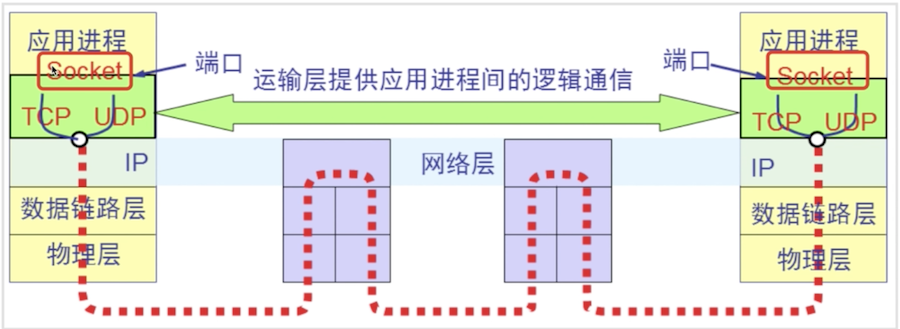
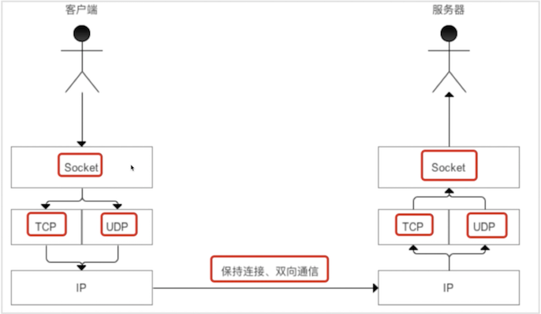
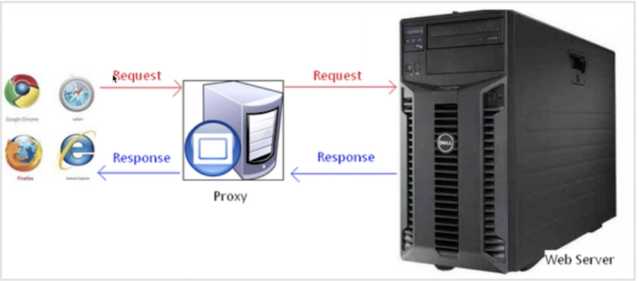

### android网络基础编程(socket、httpclient、httpurlconnection)

#### socket
1.什么是socket：
  
  传输层、api<br>
  是一个对TCP/IP协议进行封装的编程调用接口 <br>
  成对出现，一对套接字：包括ip地址和端口号<br>
2.socket通信模型：<br>
    
  TCP:字节流方式传输，提供可靠<br>
  UDP:数据报文的形式打包发送服务<br>
3.socket与http对比 两种通信方式<br>
  http通信:请求响应方式，属于应用层，客户端有需要时进行请求，代理服务器<br>
  
  socket通信:tcp/ip协议,属于传输层，服务器主动发送数据的方式，双方建立连接后可以直接进行通信<br>
4.socket如何实现<br>  
  C/S架构<br>
  demo:<br>
  
  ```
  //客户端的实现
    public void tcpSendMessage(String msg) {
        Socket socket = null;
        OutputStream outputStream = null;
        InputStream inputStream = null;
        try {
            socket = new Socket("192.168.199.121", 8888);
            outputStream = socket.getOutputStream(); //socket获取输出流不需要关闭
            outputStream.write(msg.getBytes());
            socket.shutdownOutput(); //关闭输出流
            inputStream = socket.getInputStream();
            byte[] bytes = new byte[1024];
            int len = -1;
            final StringBuffer stringBuffer = new StringBuffer();
            while ((len = inputStream.read(bytes)) != -1) {
                stringBuffer.append(new String(bytes, 0, len, Charset.forName("gbk")));
            }
            //todo 在子线程中更新ui
        } catch (Exception e) {
            e.printStackTrace();
        } finally {
            try {
                if (socket != null) {
                    socket.close();
                }
            } catch (Exception e) {
                e.printStackTrace();
            }
        }
    }

    //创建服务端
    public void receiveMessage() {
        ServerSocket serverSocket = null;
        Socket socket = null;
        try {
            serverSocket = new ServerSocket(8888);
            while (true) {
                socket = serverSocket.accept();
                Log.d("receiveMessage---", socket.getInetAddress().getHostName());
                Log.d("receiveMessage---", socket.getInetAddress().getHostAddress());
                InputStream inputStream = socket.getInputStream();
                BufferedInputStream bis = new BufferedInputStream(inputStream);
                byte[] b = new byte[1024];
                int len = -1;
                while ((len = bis.read(b)) != -1) {
                    Log.d("receiveMessage---", new String(b,0,len,"utf-8"));
                }
                socket.shutdownInput();
                OutputStream outputStream = socket.getOutputStream();
                outputStream.write("ok,我已经收到了".getBytes());
                bis.close();
                socket.close();
                socket = null;
            }
        } catch (Exception e) {
            e.printStackTrace();
        }
    }
  ```
  