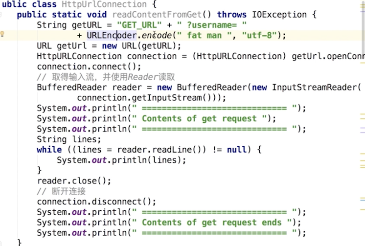
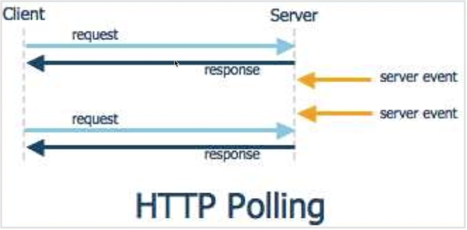
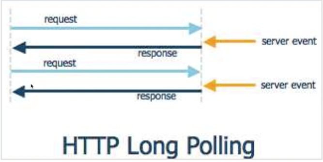
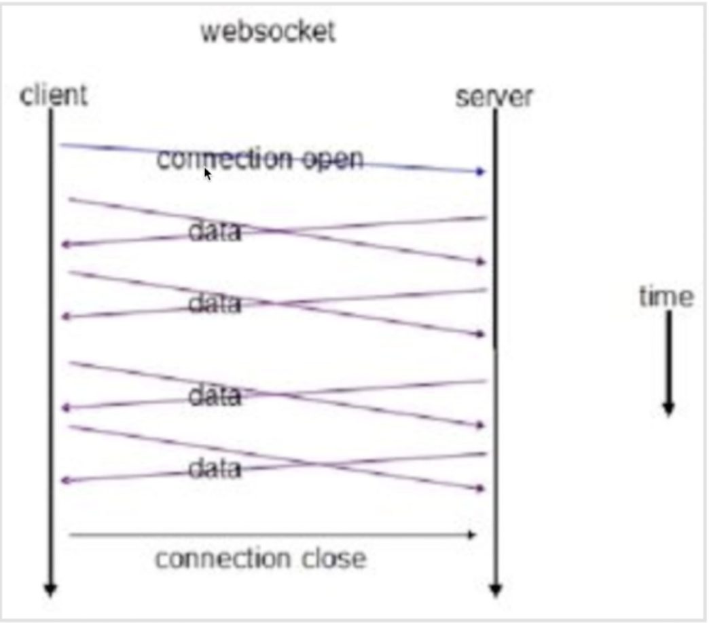
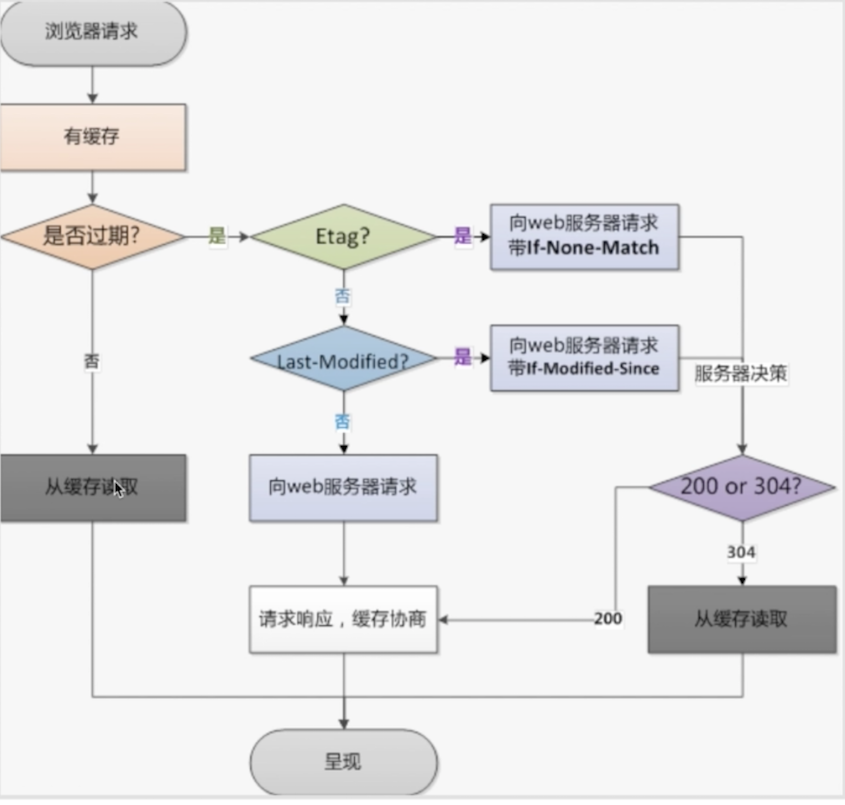

### HttpClient和HttpURLConnection

重复造轮子是对轮子最大的不尊重<br>
6.0之后被移除<br>
httpConnection用法


### webSocket
推送技术:轮询，特定时间请求服务器

1.短轮询<br>

缺点：在某个时间段，server并没有更新数据，但client端仍然每隔一段时间发送请求，所以这段时间的询问是无效的。<br>
2.长轮询<br>


无论长短轮询都会造成带宽，消耗资源。

websocket：

**与http同等协议，建立连接以后，可以进行双向通信**<br>
**http是客户端发送请求，服务端做出响应**<br>

**socket并不是协议，应用传输层<br>**
**websocket是同等http协议，是基于tcp的协议<br>**
向服务器发起一个HTTP请求/"Upgrade:WebSocket"头<br>
服务器端解析这些附加的头信息就可以双向通信。

### okhttp使用websocket

```
public void websocketDemo() {
        OkHttpClient client = new OkHttpClient();
        Request request = new Request.Builder()
                .url("www.websocket.com")
                .build();


        client.newWebSocket(request, listener);

        //关闭线程池
        client.dispatcher().executorService().shutdown();
    }

    private final WebSocketListener listener = new WebSocketListener() {
        @Override
        public void onOpen(WebSocket webSocket, Response response) {
            super.onOpen(webSocket, response);
        }

        @Override
        public void onMessage(WebSocket webSocket, String text) {
            super.onMessage(webSocket, text);
        }

        @Override
        public void onMessage(WebSocket webSocket, ByteString bytes) {
            super.onMessage(webSocket, bytes);
        }

        @Override
        public void onClosing(WebSocket webSocket, int code, String reason) {
            super.onClosing(webSocket, code, reason);
        }

        @Override
        public void onClosed(WebSocket webSocket, int code, String reason) {
            super.onClosed(webSocket, code, reason);
        }

        @Override
        public void onFailure(WebSocket webSocket, Throwable t, Response response) {
            super.onFailure(webSocket, t, response);
        }
    };
```

### http缓存

1.强制缓存<br>
  * Expires的值为服务端返回的到期时间：如果下一次请求的时间小于服务器给的到期时间则直接使用缓存数据。http1.0使用的暂时忽略<br> 
  * Cache-control是由服务器返回的response中添加的头信息，告诉客户端是从本地去缓存还是从服务器重新请求。<br>
  eg:<br>
  Cache-Control:max-age=315360000<br>
  缓存内容在315360000秒后失效。<br>
  private:客户端可以取缓存<br>
  public:客户端和代理服务器都可以缓存<br>
  max-age:时间段后失效<br>
  no-cache:不可以使用强制缓存<br>
  no-store:所有内容都可以缓存<br>
  

2.对比缓存<br>
  首先进行判断是否可以缓存<br>
  服务器会将缓存标识与数据一起返回给客户端<br>
  
  
  再次请求数据时首先会判断是否有缓存是否过期，否从缓存取。<br>
  如果过期判断Etag值<br>
  是：向web服务器请求带if-None-Match<br>
  否：对Last-Modified进行判断<br>
  是：向web服务器请求带if-Modified-Sine<br>
  否：向web服务器请求<br>
  
  Etag:服务器响应请求时，告诉浏览器当前资源在服务器的唯一标识。服务端生成的唯一标识。<br>
  if-None-Match:再次请求服务器时，通过此字段通知服务器客户端缓存数据的唯一标识。<br>
  Last-Modified:服务器在响应请求时，告诉客户端资源修改的最后时间<br>
  if-Modified-Sine:再次请求服务器时，通过此字段通知服务器上次请求时，服务器返回的资源最后修改时间<br>
  
