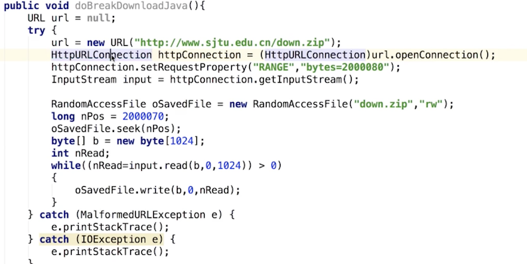
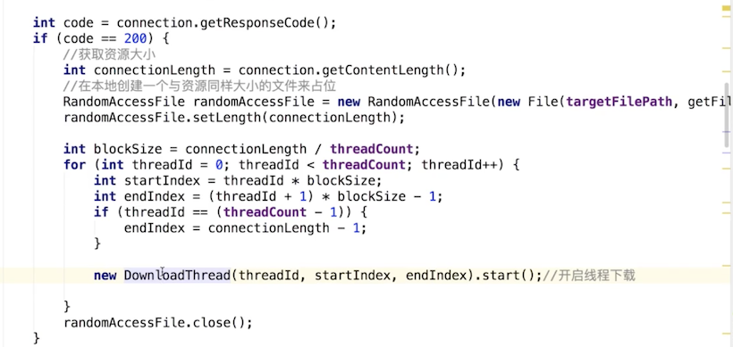
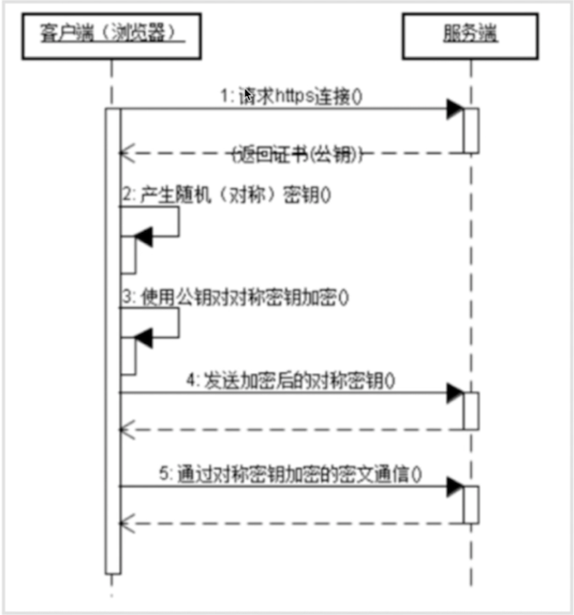

### 断点续传
断点续传：从文件已经下载的地方开始继续下载。<br>
从服务器的响应头部字段读取：RANGE:bytes=200080-<br>


```
public void downFileokhttp() {
        InputStream is = null;
        RandomAccessFile saveFile = null;
        //记录已经下载的文件长度
        long downloadLength = 0;
        String downUrl = "http://xxx.xxx/111.txt";
        String fileName = downUrl.substring(downUrl.lastIndexOf("/"));
        String dir = Environment.getExternalStoragePublicDirectory(Environment.DIRECTORY_DOWNLOADS).getAbsolutePath();
        File file = new File(dir + fileName);
        if (file.exists()) {
            downloadLength = file.length();
        }
//        long contentLength = getContentLehgth(downUrl);
        OkHttpClient client = new OkHttpClient();
        Request request = new Request.Builder()
                .addHeader("RANGE", "bytes=" + downloadLength + "-")
                .url(downUrl)
                .build();
        try {
            Response response = client.newCall(request).execute();
            if (response != null) {
                is = response.body().byteStream();
                saveFile = new RandomAccessFile(file, "rw");
                saveFile.seek(downloadLength);//跳过已经下载的字节
                byte[] b = new byte[1024];
                int total = 0;
                int len;
                while ((len = is.read(b)) != -1) {
                    total += len;
                    saveFile.write(b, 0, len);
//                    int progress = (int) ((total + downloadLength) * 100 / contentLength);
                }
                response.body().close();
            }
        } catch (IOException e) {
            e.printStackTrace();
        } finally {
            try {
                if (is != null) {
                    is.close();
                }
                if (saveFile != null) {
                    saveFile.close();
                }
            } catch (Exception e) {
                e.printStackTrace();
            }
        }
    }
```

### 多线程下载
多线程下载：每个线程只负责下载文件的一部分<br>



### 文件上传
* http之contentType
* Content-Type属性指定请求和响应的http内容类型

Content-Type:multipart/form-data;boundary=-----dsfefw3rwewegwgweg

MutipartBody

### https
基于SSL/TLS<br>
http所有传输内容都是明文<br>
https所传输内容都加密(对称+不对称)<br>
对称加密是指加密和解密使用的秘钥是同一个秘钥，可以互相推算<br>
不对称加密是指加密和解密使用的秘钥不是同一个，有公钥和私钥之分<br>
对称加密数据传输，不对称加密握手过程中。<br>
对称加密所使用的秘钥我们可以通过非对称加密的方式发出去。<br>

1.客户端发送一个https请求到服务器，请求包含不对称加密算法规则和hash算法，服务器进行处理返回证书(公钥)<br>
2.客户端生成随机数(对称加密)秘钥，最后会发送给服务端<br>
3.客户端使用服务端的公钥对客户端对称加密的秘钥进行加密<br>
4.客户端发送加密后的对称秘钥给服务端<br>
5.通过对称秘钥加密的密文通信<br>

不对称加密：在握手过程中，秘钥key不同<br>
对称加密：数据传输中，对真正传输的数据进行加密<br>
hash：对数据进行完整性校验<br>