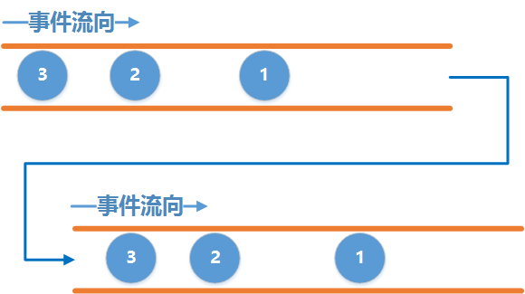

### 什么是响应式编程
响应式编程是一种基于异步数据流概念的编程模式。数据流就像一条河：它可以被观测，被过滤，被操作，或者为新的消费者与另外一条流合并为一条新的流。响应式编程的一个关键概念是事件。事件可以被等待，可以触发过程，也可以触发其它事件



上游为被观察者Observable用来发送事件，下游Observer用来接收事件，它们之间通过subscribe()方法建立连接。发送事件的顺序为1、2、3，接收事件的顺序为1、2、3.
<!--more-->
#### 简单用法

```
 //创建被观察者 (上游)
        Observable observable = Observable.create(new ObservableOnSubscribe() {
            @Override
            public void subscribe(ObservableEmitter e) throws Exception {
                //发送数据1、2、3
                e.onNext(1);
                e.onNext(2);
                e.onNext(3);
                e.onComplete();
            }
        });

        //创建观察者（下游）
        Observer observer = new Observer() {
            @Override
            public void onSubscribe(Disposable d) {
            }

            @Override
            public void onNext(Object o) {
                System.out.println("接收到数据：" + o);
            }

            @Override
            public void onError(Throwable e) {
            }

            @Override
            public void onComplete() {
                System.out.println("数据接收完成");
            }
        };

        //建立连接 订阅
        observable.subscribe(observer);
```
**注意:** 只有当上游和下游建立连接之后, 上游才会开始发送事件. 也就是调用了subscribe() 方法之后才开始发送事件.

**ObservableEmitter：**用来发出事件的，它可以发出三种类型的事件，通过调用emitter的onNext(T value)、onComplete()和onError(Throwable error)就可以分别发出next事件、complete事件和error事件。

事件发送规则：

1. 上游可以发送无限个onNext事件，下游也可以接收无限个onNext事件。
2. 上游发送了onComplete事件后，onComplete之后的事件会继续发送，下游不再继续接收complete之后的事件。
3. 上游发送了onError事件后，onError之后的事件会继续发送，下游不再继续接收onError之后的事件。
4. 上游可以不发送onComplete或onError.
5. onComplete和onError必须唯一并且互斥, 即不能发多个onComplete, 也不能发多个onError, 也不能先发一个onComplete, 然后再发一个onError, 反之亦然

**Disposable：**用来切断事件的接收，调用dispose()方法，当切断接收事件时，上游还可以继续发送事件。

```
  Observable.create(new ObservableOnSubscribe<Integer>() {
            @Override
            public void subscribe(ObservableEmitter<Integer> e) throws Exception {
                System.out.println("发送数据 1");
                e.onNext(1);
                System.out.println("发送数据 2");
                e.onNext(2);
                System.out.println("发送数据 3");
                e.onNext(3);
                System.out.println("发送数据 4");
                e.onNext(4);
                e.onComplete();
                System.out.println("发送数据完成");
            }
        }).subscribe(new Observer<Integer>() {
            Disposable mDisposable;
            Integer count;

            @Override
            public void onSubscribe(Disposable d) {
                System.out.println("onSubscribe()");
                mDisposable = d;
            }

            @Override
            public void onNext(Integer integer) {
                count = integer;
                System.out.println("接收到数据:" + count);
                if (count == 2) {
                    System.out.println("dispose()切断:");
                    mDisposable.dispose();  //切断接收数据
                    System.out.println("is dispose:" + mDisposable.isDisposed());
                }
            }

            @Override
            public void onError(Throwable e) {
            }

            @Override
            public void onComplete() {
            }
        });
onSubscribe()         
发送数据 1
接收到数据:1
发送数据 2
接收到数据:2
dispose()切断:
is dispose:true
发送数据 3
发送数据 4
发送数据完成
```
onSubscribe()方法最先调用。

subscribe()重载的方法:

```
//没有下游接收事件
public final Disposable subscribe() {} 
//Consumer只接受onNext事件类型
public final Disposable subscribe(Consumer<? super T> onNext) {}
public final Disposable subscribe(Consumer<? super T> onNext, Consumer<? super Throwable> onError) {} 
public final Disposable subscribe(Consumer<? super T> onNext, Consumer<? super Throwable> onError, Action onComplete) {}
public final Disposable subscribe(Consumer<? super T> onNext, Consumer<? super Throwable> onError, Action onComplete, Consumer<? super Disposable> onSubscribe) {}
public final void subscribe(Observer<? super T> observer) {}
```

#### 线程切换
上游、下游默认是在同一个线程中工作的。

```
 Observable observable = Observable.create(new ObservableOnSubscribe<Integer>() {
            @Override
            public void subscribe(ObservableEmitter<Integer> e) throws Exception {
                System.out.println("上游所在线程：" + Thread.currentThread());
                e.onNext(1);
                e.onComplete();
            }
        });

        Consumer consumer = new Consumer() {
            @Override
            public void accept(Object o) throws Exception {
                System.out.println("下游所在线程：" + Thread.currentThread());
            }
        };
        observable.subscribe(consumer);
        
上游所在线程：Thread[main,5,main]
下游所在线程：Thread[main,5,main]
```
**切换**

```
 Observable observable = Observable.create(new ObservableOnSubscribe<Integer>() {
            @Override
            public void subscribe(ObservableEmitter<Integer> e) throws Exception {
                System.out.println("上游所在线程：" + Thread.currentThread());
                e.onNext(1);
                e.onComplete();
            }
        });

        Consumer consumer = new Consumer() {
            @Override
            public void accept(Object o) throws Exception {
                System.out.println("下游所在线程：" + Thread.currentThread());
            }
        };
        observable.subscribeOn(Schedulers.newThread())     //指定上游线程
                .observeOn(AndroidSchedulers.mainThread())  //指定下游线程
                .subscribe(consumer);
        //上游所在线程：Thread[RxNewThreadScheduler-1,5,main]
        //下游所在线程：Thread[main,5,main]
```
**subscribeOn指定上游所在线程,多次调用subscribeOn只有第一次有效**<br>
**observeOn指定下游所在线程，多次调用多次切换**

```
 Observable observable = Observable.create(new ObservableOnSubscribe<Integer>() {
            @Override
            public void subscribe(ObservableEmitter<Integer> e) throws Exception {
                e.onNext(1);
                System.out.println("上游所在线程：" + Thread.currentThread());
            }
        });

        Consumer consumer = new Consumer() {
            @Override
            public void accept(Object o) throws Exception {
            }
        };

        observable.subscribeOn(Schedulers.newThread()) //上游线程切换第一次
                .subscribeOn(Schedulers.io())  //上游线程切换第二次
                .observeOn(AndroidSchedulers.mainThread()) //下游第一次切换线程 mian
                .observeOn(Schedulers.io())//下游第二次切换线程 io
                .doOnNext(new Consumer() {
                    @Override
                    public void accept(Object o) throws Exception {
                        System.out.println("下游所在线程：" + Thread.currentThread());
                    }
                }).observeOn(AndroidSchedulers.mainThread())  //下游第三次切换线程 mian
                .doOnNext(new Consumer() {
                    @Override
                    public void accept(Object o) throws Exception {
                        System.out.println("下游所在线程：" + Thread.currentThread());
                    }
                }).subscribe(consumer);
        /**
         上游所在线程：Thread[RxNewThreadScheduler-1,5,main]
         下游所在线程：Thread[RxCachedThreadScheduler-2,5,main]
         下游所在线程：Thread[main,5,main]
         * */
```

**RxJava中内置线程**

* Schedulers.io() 代表io操作的线程, 通常用于网络,读写文件等io密集型的操作
* Schedulers.computation() 代表CPU计算密集型的操作, 例如需要大量计算的操作
* Schedulers.newThread() 代表一个常规的新线程
* AndroidSchedulers.mainThread() 代表Android的主线程

#### 应用
**网络请求**

```
public interface Api {
    @GET
    Observable<LoginResponse> login(@Body LoginRequest request);

    @GET
    Observable<RegisterResponse> register(@Body RegisterRequest request);
}

Api api = retrofit.create(Api.class);
        api.login(request)
             .subscribeOn(Schedulers.io())               //在IO线程进行网络请求
             .observeOn(AndroidSchedulers.mainThread())  //回到主线程去处理请求结果
            .subscribe(new Observer<LoginResponse>() {
                @Override
                public void onSubscribe(Disposable d) {}

                @Override
                public void onNext(LoginResponse value) {}

                @Override
                public void onError(Throwable e) {
                    Toast.makeText(mContext, "登录失败", Toast.LENGTH_SHORT).show();
                }

                @Override
                public void onComplete() {
                    Toast.makeText(mContext, "登录成功", Toast.LENGTH_SHORT).show();
                }
            });

```

如果在请求的过程中Activity已经退出了, 这个时候如果回到主线程去更新UI, 那么APP肯定就崩溃了.<br> 
RxJava中已经内置了一个容器CompositeDisposable, 每当我们得到一个Disposable时就调用CompositeDisposable.add()将它添加到容器中, 在退出的时候, 调用CompositeDisposable.clear() 即可切断所有的水管.

**查询操作**

```
 Observable.create<MutableList<FileItem>> { e ->
            var data = manager?.allPhoto
            e.onNext(data!!)
        }.subscribeOn(Schedulers.io())  //io线程查询
                .observeOn(AndroidSchedulers.mainThread()) //主线程显示
                .subscribe { data ->
                    data.forEach { fileItem ->
                        Log.d("queryData---", "fileItem: " + fileItem.getmFilePath())
                    }
                }
```
