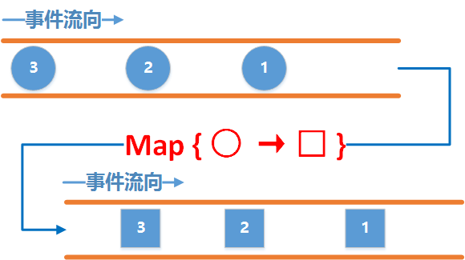

**场景：注册成功后自动登录**

#### MAP
作用就是对上游发送的每一个事件应用一个函数, 使得每一个事件都按照指定的函数去变化,通过Map, 可以将上游发来的事件转换为任意的类型, 可以是一个Object, 也可以是一个集合。**转换数据类型**



```
  Observable.create((ObservableOnSubscribe<Integer>) emitter -> {
            emitter.onNext(1);
            emitter.onNext(2);
            emitter.onNext(3);
        }).map(integer ->
                integer + "s"
        ).subscribe(
                s -> {
                    System.out.println("转换后：" + s);
                }
        );
```
```
public final <R> Observable<R> map(Function<? super T, ? extends R> mapper) 

public interface Function<T, R> {
    /**
     * Apply some calculation to the input value and return some other value.
     * @param t the input value
     * @return the output value
     * @throws Exception on error
     */
    @NonNull
    R apply(@NonNull T t) throws Exception;
}
```

#### FlatMap  concatMap
FlatMap将一个发送事件的上游Observable变换为多个发送事件的Observables，然后将它们发射的事件合并后放进一个单独的Observable里.
**转换发射源， flatMap并不保证事件的顺序**

```
Observable.create((ObservableOnSubscribe<Integer>) emitter -> {
            emitter.onNext(1);
            emitter.onNext(2);
            emitter.onNext(3);
        }).flatMap(new Function<Integer, ObservableSource<String>>() {
            @Override
            public ObservableSource<String> apply(Integer integer) throws Exception {
                //新的发射源
                return Observable.just(integer + "sss");
            }
        }).subscribe(new Consumer<String>() {
            @Override
            public void accept(String s) throws Exception {
                System.out.println("flatmap转换后：" + s);
            }
        });
```

```
api.register(new RegisterRequest())            //发起注册请求
                .subscribeOn(Schedulers.io())               //在IO线程进行网络请求
                .observeOn(AndroidSchedulers.mainThread())  //回到主线程去处理请求注册结果
                .doOnNext(new Consumer<RegisterResponse>() {
                    @Override
                    public void accept(RegisterResponse registerResponse) throws Exception {
                        //先根据注册的响应结果去做一些操作
                    }
                })
                .observeOn(Schedulers.io())                 //回到IO线程去发起登录请求
                .flatMap(new Function<RegisterResponse, ObservableSource<LoginResponse>>() {
                    @Override
                    public ObservableSource<LoginResponse> apply(RegisterResponse registerResponse) throws Exception {
                        return api.login(new LoginRequest());
                    }
                })
                .observeOn(AndroidSchedulers.mainThread())  //回到主线程去处理请求登录的结果
                .subscribe(new Consumer<LoginResponse>() {
                    @Override
                    public void accept(LoginResponse loginResponse) throws Exception {
                        Toast.makeText(MainActivity.this, "登录成功", Toast.LENGTH_SHORT).show();
                    }
                }, new Consumer<Throwable>() {
                    @Override
                    public void accept(Throwable throwable) throws Exception {
                        Toast.makeText(MainActivity.this, "登录失败", Toast.LENGTH_SHORT).show();
                    }
                });

```

#### zip
Zip通过一个函数将多个Observable发送的事件结合到一起，然后发送这些组合到一起的事件. 它按照严格的顺序应用这个函数。它只发射与发射数据项最少的那个Observable一样多的数据

observable1 在新的线程中发送1、2、3、4 四个数据<br>
observable2 在新的线程中发送A、B、C  三个数据<br>
最终合并结果为 1A 、 2B 、 3C

```
Observable.zip(observable1, observable2, new BiFunction<Integer, String, String>() {                  
    @Override                                                                                         
    public String apply(Integer integer, String s) throws Exception {                                 
        return integer + s;                                                                           
    }                                                                                                 
})
```

**场景：合并2个请求**

```
public interface Api {
    @GET
    Observable<UserBaseInfoResponse> getUserBaseInfo(@Body UserBaseInfoRequest request);

    @GET
    Observable<UserExtraInfoResponse> getUserExtraInfo(@Body UserExtraInfoRequest request);

}
```

```
 Observable observable1 = Observable.create(new ObservableOnSubscribe<Integer>() {
            @Override
            public void subscribe(ObservableEmitter<Integer> emitter) throws Exception {
                emitter.onNext(1);
                emitter.onNext(2);
                emitter.onNext(3);
                emitter.onNext(4);
            }
        }).subscribeOn(Schedulers.io());

        Observable observable2 = Observable.create(new ObservableOnSubscribe<String>() {
            @Override
            public void subscribe(ObservableEmitter<String> emitter) throws Exception {
                emitter.onNext("A");
                emitter.onNext("B");
                emitter.onNext("C");
            }
        }).subscribeOn(Schedulers.io());

        Observable.zip(observable1, observable2, new BiFunction<Integer, String, String>() {
            @Override
            public String apply(Integer integer, String s) throws Exception {
                return integer + s;
            }
        }).subscribe(new Consumer<String>() {
            @Override
            public void accept(String s) throws Exception {
                System.out.println("zip合并后：" + s);
            }
        });
```

#### 背压
[背压](https://www.jianshu.com/p/0f2d6c2387c9)

当上下游工作在同一个线程中时, 这时候是一个同步的订阅关系, 也就是说上游每发送一个事件必须等到下游接收处理完了以后才能接着发送下一个事件.

当上下游工作在不同的线程中时, 这时候是一个异步的订阅关系, 这个时候上游发送数据不需要等待下游接收, 为什么呢, 因为两个线程并不能直接进行通信, 因此上游发送的事件并不能直接到下游里去, 这个时候就需要一个田螺姑娘来帮助它们俩, 这个田螺姑娘就是我们刚才说的水缸 ! 上游把事件发送到水缸里去, 下游从水缸里取出事件来处理, 因此, 当上游发事件的速度太快, 下游取事件的速度太慢, 水缸就会迅速装满, 然后溢出来, 最后就OOM了.

##### 同步

```
Observable.create(new ObservableOnSubscribe<Integer>() {                         
    @Override                                                                    
    public void subscribe(ObservableEmitter<Integer> emitter) throws Exception { 
        for (int i = 0; ; i++) {   //无限循环发事件                                              
            emitter.onNext(i);                                                   
        }                                                                        
    }                                                                            
}).subscribe(new Consumer<Integer>() {                                           
    @Override                                                                    
    public void accept(Integer integer) throws Exception {                       
        Thread.sleep(2000);                                                      
        Log.d(TAG, "" + integer);                                                
    }                                                                            
});
```

##### 异步

```
Observable.create(new ObservableOnSubscribe<Integer>() {                            
    @Override                                                                       
    public void subscribe(ObservableEmitter<Integer> emitter) throws Exception {    
        for (int i = 0; ; i++) {    //无限循环发事件                                                     
            emitter.onNext(i);                                                      
        }                                                                           
    }                                                                               
}).subscribeOn(Schedulers.io())                                                    
        .observeOn(AndroidSchedulers.mainThread())                                  
        .subscribe(new Consumer<Integer>() {                                        
            @Override                                                               
            public void accept(Integer integer) throws Exception {                  
                Thread.sleep(2000);                                                 
                Log.d(TAG, "" + integer);                                           
            }                                                                       
        });

```


