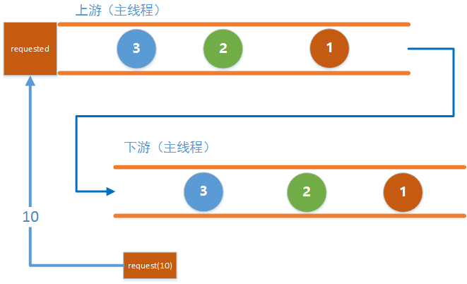
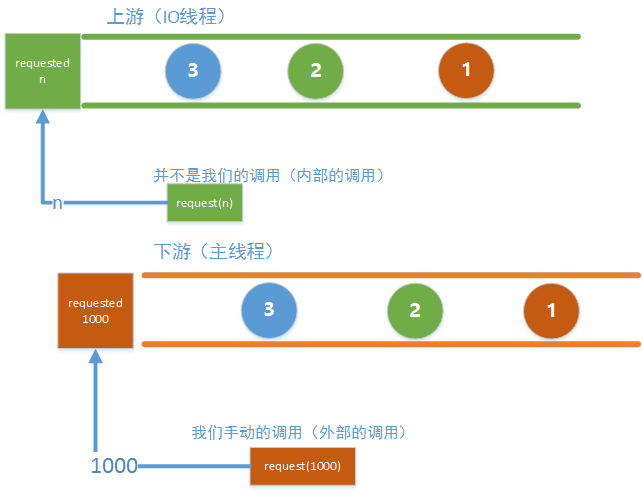

### Flowable策略

#### BackpressureStrategy.BUFFER  缓存策略

```
Flowable.create(new FlowableOnSubscribe<Integer>() {
            @Override
            public void subscribe(FlowableEmitter<Integer> emitter) throws Exception {
                for (int i = 0; i < 1000; i++) {
                    Log.d(TAG, "emit " + i);
                    emitter.onNext(i);
                }
            }
        }, BackpressureStrategy.BUFFER).subscribeOn(Schedulers.io())
                .observeOn(AndroidSchedulers.mainThread())
                .subscribe(new Subscriber<Integer>() {

                    @Override
                    public void onSubscribe(Subscription s) {
                        Log.d(TAG, "onSubscribe");
                        mSubscription = s;
                    }

                    @Override
                    public void onNext(Integer integer) {
                        Log.d(TAG, "onNext: " + integer);
                    }

                    @Override
                    public void onError(Throwable t) {
                        Log.w(TAG, "onError: ", t);
                    }

                    @Override
                    public void onComplete() {
                        Log.d(TAG, "onComplete");
                    }
                });
```
#### BackpressureStrategy.DROP 丢弃存不下的事件

```
public static void request() {
        mSubscription.request(128);
    }

public static void demo3() {
        Flowable.create(new FlowableOnSubscribe<Integer>() {
            @Override
            public void subscribe(FlowableEmitter<Integer> emitter) throws Exception {
                for (int i = 0; ; i++) {
                    emitter.onNext(i);
                }
            }
        }, BackpressureStrategy.DROP).subscribeOn(Schedulers.io())
                .observeOn(AndroidSchedulers.mainThread())
                .subscribe(new Subscriber<Integer>() {

                    @Override
                    public void onSubscribe(Subscription s) {
                        Log.d(TAG, "onSubscribe");
                        mSubscription = s;
                    }

                    @Override
                    public void onNext(Integer integer) {
                        Log.d(TAG, "onNext: " + integer);
                    }

                    @Override
                    public void onError(Throwable t) {
                        Log.w(TAG, "onError: ", t);
                    }

                    @Override
                    public void onComplete() {
                        Log.d(TAG, "onComplete");
                    }
                });
    }
```

#### BackpressureStrategy.LATEST 只保留最新的事件

```
Flowable.create(new FlowableOnSubscribe<Integer>() {
            @Override
            public void subscribe(FlowableEmitter<Integer> emitter) throws Exception {
                for (int i = 0; ; i++) {
                    emitter.onNext(i);
                }
            }
        }, BackpressureStrategy.LATEST).subscribeOn(Schedulers.io())
                .observeOn(AndroidSchedulers.mainThread())
                .subscribe(new Subscriber<Integer>() {

                    @Override
                    public void onSubscribe(Subscription s) {
                        Log.d(TAG, "onSubscribe");
                        mSubscription = s;
                    }

                    @Override
                    public void onNext(Integer integer) {
                        Log.d(TAG, "onNext: " + integer);
                    }

                    @Override
                    public void onError(Throwable t) {
                        Log.w(TAG, "onError: ", t);
                    }

                    @Override
                    public void onComplete() {
                        Log.d(TAG, "onComplete");
                    }
                });
    }
```

### interval操作符

```
Flowable.interval(1, TimeUnit.MICROSECONDS)
                .onBackpressureDrop()  //加上背压策略
                .observeOn(AndroidSchedulers.mainThread())
                .subscribe(new Subscriber<Long>() {
                    @Override
                    public void onSubscribe(Subscription s) {
                        Log.d(TAG, "onSubscribe");
                        mSubscription = s;
                        s.request(Long.MAX_VALUE);
                    }

                    @Override
                    public void onNext(Long aLong) {
                        Log.d(TAG, "onNext: " + aLong);
                        try {
                            Thread.sleep(1000);
                        } catch (InterruptedException e) {
                            e.printStackTrace();
                        }
                    }

                    @Override
                    public void onError(Throwable t) {
                        Log.w(TAG, "onError: ", t);
                    }

                    @Override
                    public void onComplete() {
                        Log.d(TAG, "onComplete");
                    }
                });
```

[参考](https://www.jianshu.com/p/36e0f7f43a51)

### FlowableEmitter源码

```
public interface FlowableEmitter<T> extends Emitter<T> {

    void setDisposable(@Nullable Disposable s);

    void setCancellable(@Nullable Cancellable c);

    /**
     * The current outstanding request amount.
     * <p>This method is thread-safe.
     * @return the current outstanding request amount
     */
    long requested(); //

    boolean isCancelled();

    @NonNull
    FlowableEmitter<T> serialize();
}
```

FlowableEmitter是个接口，继承Emitter，Emitter里面就是我们的onNext(),onComplete()和onError()三个方法。我们看到FlowableEmitter中有这么一个方法：<br>
long requested();
方法注释的意思就是当前外部请求的数量

#### 同步情况

```
public static void demo1() {
        Flowable
                .create(new FlowableOnSubscribe<Integer>() {
                    @Override
                    public void subscribe(FlowableEmitter<Integer> emitter) throws Exception {
                        Log.d(TAG, "current requested: " + emitter.requested());
                    }
                }, BackpressureStrategy.ERROR)
                .subscribe(new Subscriber<Integer>() {

                    @Override
                    public void onSubscribe(Subscription s) {
                        Log.d(TAG, "onSubscribe");
                        mSubscription = s;
                        s.request(10);  //current requested: 10
                        s.request(100); //current requested: 100
                    }

                    @Override
                    public void onNext(Integer integer) {
                        Log.d(TAG, "onNext: " + integer);
                    }

                    @Override
                    public void onError(Throwable t) {
                        Log.w(TAG, "onError: ", t);
                    }

                    @Override
                    public void onComplete() {
                        Log.d(TAG, "onComplete");
                    }
                });
    }
```
**上游的requested的确是根据下游的请求来决定的**
**多次调用s.request(n)，上游会做加法** 

下游调用request(n) 告诉上游它的处理能力，上游每发送一个next事件之后，requested就减一，注意是next事件，complete和error事件不会消耗requested，当减到0时，则代表下游没有处理能力了，这个时候你如果继续发送事件，会发生issingBackpressureException异常。<br>


当上下游在同一个线程中的时候，在下游调用request(n)就会直接改变上游中的requested的值，多次调用便会叠加这个值，而上游每发送一个事件之后便会去减少这个值，当这个值减少至0的时候，继续发送事件便会抛异常了。

#### 异步情况

```
public static void demo3() {
        Flowable
                .create(new FlowableOnSubscribe<Integer>() {
                    @Override
                    public void subscribe(FlowableEmitter<Integer> emitter) throws Exception {
                        Log.d(TAG, "current requested: " + emitter.requested());
                    }
                }, BackpressureStrategy.ERROR)
                .subscribeOn(Schedulers.io())
                .observeOn(AndroidSchedulers.mainThread())
                .subscribe(new Subscriber<Integer>() {

                    @Override
                    public void onSubscribe(Subscription s) {
                        Log.d(TAG, "onSubscribe");
                        mSubscription = s;
                    }

                    @Override
                    public void onNext(Integer integer) {
                        Log.d(TAG, "onNext: " + integer);
                    }

                    @Override
                    public void onError(Throwable t) {
                        Log.w(TAG, "onError: ", t);
                    }

                    @Override
                    public void onComplete() {
                        Log.d(TAG, "onComplete");
                    }
                });
    }
```
上游啥也不做，下游也啥也不做

```
D/TAG: onSubscribe
D/TAG: current requested: 128
```

在下游调用了request（1000）告诉上游要处理1000个事件

```
Flowable
                .create(new FlowableOnSubscribe<Integer>() {
                    @Override
                    public void subscribe(FlowableEmitter<Integer> emitter) throws Exception {
                        Log.d(TAG, "current requested: " + emitter.requested());
                    }
                }, BackpressureStrategy.ERROR)
                .subscribeOn(Schedulers.io())
                .observeOn(AndroidSchedulers.mainThread())
                .subscribe(new Subscriber<Integer>() {

                    @Override
                    public void onSubscribe(Subscription s) {
                        Log.d(TAG, "onSubscribe");
                        mSubscription = s;
                        s.request(1000); //我要打1000个！！
                    }

                    @Override
                    public void onNext(Integer integer) {
                        Log.d(TAG, "onNext: " + integer);
                    }

                    @Override
                    public void onError(Throwable t) {
                        Log.w(TAG, "onError: ", t);
                    }

                    @Override
                    public void onComplete() {
                        Log.d(TAG, "onComplete");
                    }
                });

```

```
D/TAG: onSubscribe
D/TAG: current requested: 128
```



当上下游工作在不同的线程里时，每一个线程里都有一个requested，而我们调用request（1000）时，实际上改变的是下游主线程中的requested，而上游中的requested的值是由RxJava内部调用request(n)去设置的，这个调用会在合适的时候自动触发。<br>
因为下游在一开始就在内部调用了request(128)去设置了上游中的值，因此即使下游没有调用request()，上游也能发送128个事件

```
public static void request() {
        mSubscription.request(96); //请求96个事件
    }

public static void demo4() {
        Flowable
                .create(new FlowableOnSubscribe<Integer>() {
                    @Override
                    public void subscribe(FlowableEmitter<Integer> emitter) throws Exception {
                        Log.d(TAG, "First requested = " + emitter.requested());
                        boolean flag;
                        for (int i = 0; ; i++) {
                            flag = false;
                            while (emitter.requested() == 0) {
                                if (!flag) {
                                    Log.d(TAG, "Oh no! I can't emit value!");
                                    flag = true;
                                }
                            }
                            emitter.onNext(i);
                            Log.d(TAG, "emit " + i + " , requested = " + emitter.requested());
                        }
                    }
                }, BackpressureStrategy.ERROR)
                .subscribeOn(Schedulers.io())
                .observeOn(AndroidSchedulers.mainThread())
                .subscribe(new Subscriber<Integer>() {

                    @Override
                    public void onSubscribe(Subscription s) {
                        Log.d(TAG, "onSubscribe");
                        mSubscription = s;
                    }

                    @Override
                    public void onNext(Integer integer) {
                        Log.d(TAG, "onNext: " + integer);
                    }

                    @Override
                    public void onError(Throwable t) {
                        Log.w(TAG, "onError: ", t);
                    }

                    @Override
                    public void onComplete() {
                        Log.d(TAG, "onComplete");
                    }
                });
    }
```

当下游每消费96个事件便会自动触发内部的request()去设置上游的requested的值

#### 实践
这个例子是读取一个文本文件，需要一行一行读取，然后处理并输出，如果文本文件很大的时候，比如几十M的时候，全部先读入内存肯定不是明智的做法，因此我们可以一边读取一边处理，实现的代码如下：

```
public static void main(String[] args) {
        practice1();
        try {
            Thread.sleep(10000000);
        } catch (InterruptedException e) {
            e.printStackTrace();
        }
    }

    public static void practice1() {
        Flowable
                .create(new FlowableOnSubscribe<String>() {
                    @Override
                    public void subscribe(FlowableEmitter<String> emitter) throws Exception {
                        try {
                            FileReader reader = new FileReader("test.txt");
                            BufferedReader br = new BufferedReader(reader);

                            String str;

                            while ((str = br.readLine()) != null && !emitter.isCancelled()) {
                                while (emitter.requested() == 0) {
                                    if (emitter.isCancelled()) {
                                        break;
                                    }
                                }
                                emitter.onNext(str);
                            }

                            br.close();
                            reader.close();

                            emitter.onComplete();
                        } catch (Exception e) {
                            emitter.onError(e);
                        }
                    }
                }, BackpressureStrategy.ERROR)
                .subscribeOn(Schedulers.io())
                .observeOn(Schedulers.newThread())
                .subscribe(new Subscriber<String>() {

                    @Override
                    public void onSubscribe(Subscription s) {
                        mSubscription = s;
                        s.request(1);
                    }

                    @Override
                    public void onNext(String string) {
                        System.out.println(string);
                        try {
                            Thread.sleep(2000);
                            mSubscription.request(1);
                        } catch (InterruptedException e) {
                            e.printStackTrace();
                        }
                    }

                    @Override
                    public void onError(Throwable t) {
                        System.out.println(t);
                    }

                    @Override
                    public void onComplete() {
                    }
                });
    }
```


