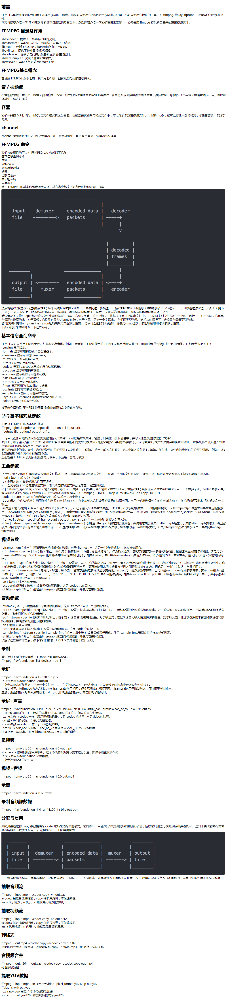

### 常用命令
  基本信息查询  
  录制  
  分解/复用  
  处理原始数据  
  裁剪与合并  
  图片/视频互转  
  直播相关  
  各种滤镜
  
  1. 基本信息查询 <br>
  
  ```
      -version
    -demuxers     显示可用的demuxers 解封装的格式
    -muxers       显示可用的muxers   (复用器)封装格式
    -devices      显示可用的设备 采集设备
    -codecs       显示所有的编解码器
    -decoders     可用的解码器
    -encoders     编码器
    -bsfs         支持的比特流filter
    -formats      可用的格式
    -protocols    可用的协议 文件、网络
    -filters      可用的过滤器
    -pix_fmts     可用的像素格式
    -sample_fmts  可用的采样格式
    -layouts      可用的channel名称
    -colors       显示识别的颜色名称
	    Version:
	    ffmpeg version N-93022-g260f1960e7 Copyright (c) 2000-2019 the FFmpeg developers
		built with Apple LLVM version 10.0.0 (clang-1000.11.45.2)
		configuration: --prefix=/Users/junzhao/ffmpeg/ffmpegInstall --enable-gpl --enable-nonfree --enable-libfdk-aac --enable-libmp3lame --enable-libspeex --enable-libx264 --enable-libx265 --enable-libxvid --enable-libzimg --enable-libzmq --enable-libzvbi --enable-version3 --enable-ffplay --enable-filter=delogo --enable-debug --disable-optimizations --enable-videotoolbox --enable-shared --enable-hardcoded-tables --enable-pthreads --cc=clang
		libavutil      56. 26.100 / 56. 26.100
		libavcodec     58. 44.100 / 58. 44.100
		libavformat    58. 26.100 / 58. 26.100
		libavdevice    58.  6.101 / 58.  6.101
		libavfilter     7. 48.100 /  7. 48.100
		libswscale      5.  4.100 /  5.  4.100
		libswresample   3.  4.100 /  3.  4.100
		libpostproc    55.  4.100 / 55.  4.100

        ffmpeg -codecs | grep 264 查询264编码
        ffmpeg -formats | grep mp3         
		Codecs:
		 D..... = Decoding supported      解码器
		 .E.... = Encoding supported      编码器
		 ..V... = Video codec             视频
		 ..A... = Audio codec             音频
		 ..S... = Subtitle codec          字幕
		 ...I.. = Intra frame-only codec  帧内编码 帧内：对一张图片进行处理  帧间编码：对一组图片进行编码
		 ....L. = Lossy compression       有损压缩
		 .....S = Lossless compression    无损压缩 
  ```


  2. 录制 <br>
  
  ```
    录屏
	    ffmpeg -f avfoundation -i 1 -r 30 out.yuv    
	    -f:指定使用avfoundation(mac下库)采集数据
	    -i:指定从哪儿采集数据，它是一个文件索引号 1是屏幕 
	    -r:指定帧率  30/s
	    out.yuv 输出文件 保存成yuv数据 没有压缩
    播放 
	    ffplay out.yuv    
	    Picture size 0x0 is invalid out.yuv: Invalid argument   size参数
	    ffplay -s 2880x1800 -pix_fmt uyvy422 out.yuv     指定录制时的size和像素格式
	查看支持的设备 mac下
	    ffmpeg -f avfoundation -list_devices true -i ""    
	    [AVFoundation input device @ 0x7fb50bc0fe00] AVFoundation video devices:
		[AVFoundation input device @ 0x7fb50bc0fe00] [0] FaceTime HD Camera  摄像头
		[AVFoundation input device @ 0x7fb50bc0fe00] [1] Capture screen 0    屏幕
		[AVFoundation input device @ 0x7fb50bc0fe00] AVFoundation audio devices:
		[AVFoundation input device @ 0x7fb50bc0fe00] [0] MacBook Pro麦克风    内置麦克风
		ffmpeg -f avfoundation -i 1:0 -r 30 out.yuv 
		:0 代表音频设备  冒号前是视频设备
		ffmpeg -f avfoundation -i :0 out.wav  录制声音
  ```

3. 分解/复用 <br>

  ```
    文件格式的转换、音视频抽取
    输入文件--->解复用--->复用--->输出文件
    
    ffmpeg -i input.mp4 -vcodec copy -acodec copy out.flv
    -i:输入文件
    -vcodec:视频格式处理方式 copy原始数据拷贝不处理
    -acodec:音频格式处理方式 copy原始数据拷贝不处理
    out.flv输出文件格式
    ffmpeg -i haizeiwang.mp4 -vcodec copy -acodec copy out.flv
    
    抽取视频流
    ffmpeg -i haizeiwang.mp4 -an -vcodec copy out.h264 
    -an:不要音频流
    ffplay out.h264
    抽取音频流
    ffmpeg -i haizeiwang.mp4 -vn -acodec copy out.aac
    -vn:不要视频流
  ```

4. 处理原始数据 <br>

  ```
    原始数据：ffmpeg解码后的数据  音频=pcm数据  视频=yuv数据
    
    提取yuv数据：
      ffmpeg -i input.mp4 -an -c:v rawvideo -pix_fmt yuv420p out.yuv
      -i:   输入文件
      -an:  不要音频数据
      -c:v  对视频格式编码  rawvideo原始数据
      -pix_fmt: 像素格式 4:2:0  422  444
      
      ffmpeg -i haizeiwang.mp4 -an -c:v rawvideo -pix_fmt yuv420p out.yuv
      ffplay -s 1024x576 out.yuv

      ffmpeg -i input.mp4 -vn -ar 44100 -ac 2 -f s16le out.pcm
      -i:   输入文件
      -vn:  不要视频数据
      -ar:  采样率
      -ac2: 声道 2三个以上
      -f:   pcm数据存储格式  s有符号 16每位十六位表示 le
      ffmpeg -i haizeiwang.mp4 -vn -ar 44100 -ac 2 -f s16le out.pcm
      
      ffplay out.pcm  out.pcm: Invalid data found when processing input
      ffplay -ar 44100 -ac 2 -f s16le out.pcm  播放音频
  ```

5. 裁剪与合并 <br>
  
  ```
    ffmpeg -i in.mov -ss 00:00:00 -t 10 out.ts
    -ss:起始时间
    -t:时长 单位秒

    ffmpeg -i haizeiwang.mp4 -ss 00:00:00 -t 10 01.ts
    ffmpeg -i haizeiwang.mp4 -ss 00:00:10 -t 10 02.ts
    ffplay 01.ts
    ffplay 02.ts

    ffmpeg -f concat -i input.txt out2.flv
    in.txt:文件列表 file 'filename'格式
  ```

6. 图片/视频互转  智能学习 图片视频识别<br>
  
  ```
    视频转图片
    ffmpeg -i in.mp4 -r 1 -f image2 image-%3d.jpeg
    -r:指定帧率  每秒一张
    -f:转成的格式
    image-%3d.jpeg: 输出结果

    ffmpeg -i haizeiwang.mp4 -r 1 -f image2 image-%3d.jpeg

    图片转视频
    ffmpeg -i image/image-%3d.jpeg image.mp4

  ```

7. 直播相关 <br>
  
  ```
    推流
    ffmpeg -re -i in.mp4 -c copy -f flv rtmp://server/live/streamName
    -re:减慢 帧率同步
    -f:格式
    ffmpeg -re -i in.mp4 -c copy -f flv rtmp://server/live/streamName

    拉流 存储的格式要与拉取的格式一样
    ffmpeg -i rtmp://server/live/streamName -c copy dump.flv
    http://ivi.bupt.edu.cn/
    ffplay http://ivi.bupt.edu.cn/hls/cctv15.m3u8
    ffplay http://ivi.bupt.edu.cn/hls/chchd.m3u8
    ffmpeg -i http://ivi.bupt.edu.cn/hls/chchd.m3u8 -c copy liyuanjiangjun.m3u8
    ffmpeg -i http://ivi.bupt.edu.cn/hls/cctv15.m3u8 -c copy yang15.m3u8
  ```

8. 各种滤镜<br>
  
  ```
      输入文件--->解封装--->解码(原始数据)滤镜处理-->对过滤后的数据进行编码--->输出
    ffmpeg -i in.mov -vf crop=in_w-200:in_h-200 -c:v libx264 -c:a copy outcorp.mp4
    -vf:视频滤镜
    crop:滤镜名字
    in_w:本身视频宽
    in_h:本身视频高
    -c:v:视频编码器
    -c:a:音频编码器
    ffmpeg -i haizeiwang.mp4 -vf crop=in_w-400:in_h-200 -c:v libx264 -c:a copy outcorp.mp4
    ffplay outcorp.mp4

  ffmpeg处理音视频流程：
	  输入文件(demuxer)--->
	  编码数据包(压缩后的数据)--->
	  解码后数据帧(decoder)接近原始数据,高度还原,分辨率等处理--->
	  编码数据包(encoder)对处理后的数据进行封装--->
	  输出文件(muxer)
  如果格式转换不需要对原始数据进行处理直接换马甲进行换封装	  
  如果对分辨率声音处理，需要对解码后的数据进行处理
  ```
  
  