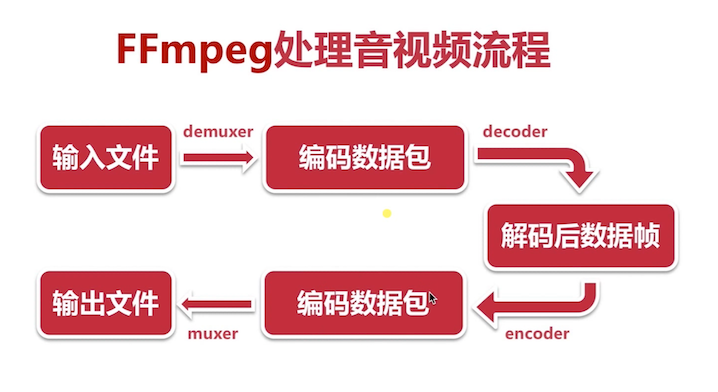

ffmpeg 日志的使用及目录操作 <br>
ffmpeg基本概念及常用结构体 <br>
对复用/解复用及流操作的各种实战 <br>

代码结构 <br> 
libavcodec    提供了一系列编解码器的实现   <br>
libavformat   实现流协议，容器格式及基本io访问 <br>
libavutil     包括了hash器，解码器和各种工具函数 <br>
libavfilter   提供了各种音视频过滤器 <br>
libavdevice   提供了访问捕获设备和回放设备的接口 <br>
libswresample 实现了混音和重采样 <br>
libswscale    实现了色彩转换和缩放功能<br>


### 日志系统

```
#include<libavutil/log.h>
av_log_set_level(AV_LOG_DEBUG)  级别
av_log(NULL,AV_LOG_INFO,"..%s\n",op)
常用日志级别
AV_LOG_ERROR
AV_LOG_WARNING
AV_LOG_INFO
AV_LOG_DEBUG

vi ffmpeg_log.c:
	#include<stdio.h>
	#include<libavutil/log.h>
	int main(int argc,char* argv[]){
	   av_log_set_level(AV_LOG_DEBUG);
	   av_log(NULL,AV_LOG_INFO,"Hello World! %s\n","aaa");
	   return 0;
	}
编译运行
clang -g -o ffmpeg_log ffmpeg_log.c -lavutil
./ffmpeg_log
```

### 文件的删除与重命名

```
  avpriv_io_delete(path)
  avpriv_io_move(src,dest)

	vi ffmpeg_file.c
	#include<stdio.h>  
	#include<libavformat/avformat.h>
	int main(int agrc,char* agrv[]){
		//删除一个文件
		int ret = avpriv_io_delete("1.txt");
		if(ret <0){
	      av_log(NULL,AV_LOG_ERROR,"Failed to delete file");
	      return -1;
		}
		return 0;
	}

  编译
	clang -g -o ffmpeg_file ffmpeg_file.c `pkg-config --libs libavformat`
	
  vi ffmpeg_filemove.c
  #include<stdio.h>  
  #include<libavformat/avformat.h>
  int main(int agrc,char* agrv[]){
		//删除一个文件
		int ret = avpriv_io_move("1.txt","2.txt");
		if(ret <0){
	      av_log(NULL,AV_LOG_ERROR,"Failed to move file");
	      return -1;
		}
		return 0;
  }
 编译
  clang -g -o ffmpeg_filemove ffmpeg_filemove.c `pkg-config --libs libavformat`
```


### 操作目录重要函数

```
avio_open_dir()
   avio_read_dir()
   avio_close_dir()

   AVIODirContext 操作目录的上下文
   AVIODirEntry   目录项，用于存放文件名，文件大小等信息

   简单的ls命令
   
   vi ffmpeg_list.c :
   #include<stdio.h>
   #include<libavutil/log.h>
   #include<libavformat/avformat.h>
   int main(int argc,char* argv[]){
      AVIODirContext *ctx = NULL;
      AVIODirEntry *entry = NULL;
      int ret;
      av_log_set_level(AV_LOG_INFO);
      ret = avio_open_dir(&ctx,"./",NULL); 
      if(ret < 0){
        av_log(NULL,AV_LOG_ERROR,"Cant open dir %s \n",av_err2str(ret));
        return -1;
      }
      while(1){
        ret = avio_read_dir(ctx,&entry); //读取目录
        if(ret < 0){
          av_log(NULL,AV_LOG_ERROR,"Cant read dir %s \n",av_err2str(ret));
           //避免内存泄漏 跳转标签
          goto __fail;
        }
        if(!entry) { //最后一项
            break;
        }
        av_log(NULL,AV_LOG_INFO,"%12"PRId64" %s \n",entry->size,entry->name);
        avio_free_directory_entry(&entry); //释放entry
      }
  __fail:
      avio_close_dir(&ctx);
      return 0;
   }

 编译
   clang -g -o ffmpeg_list ffmpeg_list.c `pkg-config --libs libavformat libavutil`
```

多媒体文件的基本概念 <br>
  多媒体文件其实是个容器 <br>
  在容器里有很多流（Stream/Track） <br>
  每种流是由不同的编码器编码的  音频流、视频流 <br>
  从流中读出的数据成为包 <br>
  在一个包中包含着一个或多个帧 <br>
结构体 <br>
  AVFormatContext 格式上下文 <br>
  AVStream  流上下文<br>
  AVPacket  包<br>
操作流数据的基本步骤<br>
  解复用-->获取流-->读取数据包--->释放资源<br>


### 打印音视频mate信息    

```
av_register_all() //注册协议、编码解码库 必须api
avformat_open_input()/avformat_close_input()  打开/关闭多媒体文件  输出AVFormatContext结构体
av_dump_format() //打印mate信息

vi media_info.c :

#include<stdio.h>
#include<libavutil/log.h>
#include<libavformat/avformat.h>
int main(int argc,char* argv[]){
     AVFormatContext *fmt_ctx = NULL;

     int ret;

	 av_log_set_level(AV_LOG_INFO);

	 //av_register_all(); //在ffmpeg 4.0及更高版本中省略此函数调用

     ret = avformat_open_input(&fmt_ctx,"./test.mp4",NULL,NULL);
     if(ret < 0){
       av_log(NULL,AV_LOG_ERROR,"cant open file: %s\n",av_err2str(ret));
       return -1;//内存泄漏
     }
     av_dump_format(fmt_ctx,0,"./test.mp4",0); //0输入 1输出

     avformat_close_input(&fmt_ctx);
	 
	 return 0;
}

clang -g -o media_info media_info.c `pkg-config --libs libavformat libavutil`

./media_info

Input #0, mov,mp4,m4a,3gp,3g2,mj2, from './test.mp4':
  Metadata:
    major_brand     : isom
    minor_version   : 512
    compatible_brands: isomiso2avc1mp41
    encoder         : Lavf58.26.100
  Duration: 00:23:44.31, bitrate: N/A
    Stream #0:0(und): Video: h264 (avc1 / 0x31637661), none, 624x376, 308 kb/s, SAR 1:1 DAR 78:47, 23.98 fps, 23.98 tbr, 24k tbn (default)
    Metadata:
      handler_name    : Video Media Handler
    Stream #0:1(und): Audio: aac (mp4a / 0x6134706D), 44100 Hz, 2 channels, 125 kb/s (default)
    Metadata:
      handler_name    : GPAC ISO Audio Handler
```

### 抽取音频数据
  
  ```
  av_init_packet()  初始化数据包结构体
  av_find_best_stream()
  av_read_frame()/ av_packet_unref() 引用计算

  vi media_audio.c

  #include<stdio.h>
  #include<libavutil/log.h>
  #include<libavformat/avformat.h>
  int main(int argc,char* argv[]){ //argc 参数个数，argv具体参数
    
    AVPacket pkt;
    AVFormatContext *fmt_ctx = NULL;
    
    int ret;
    int len;
    int audio_index;
    char* src = NULL;
    char* dst = NULL;

	av_log_set_level(AV_LOG_INFO);    

    //1.从控制台读取2个参数
    if(argc < 3){
      av_log(NULL,AV_LOG_ERROR,"请输入参数");
      return -1;
    }
    src = argv[1];
    dst = argv[2];
    if(!src || !dst){
      av_log(NULL,AV_LOG_ERROR,"参数错误");
      return -1;
    }

	ret = avformat_open_input(&fmt_ctx,src,NULL,NULL);
    if(ret < 0){
       av_log(NULL,AV_LOG_ERROR,"cant open file: %s\n",av_err2str(ret));
       return -1;//内存泄漏
    }
    FILE* dst_fd = fopen(dst,"wb");
    if(!dst_fd){
      av_log(NULL,AV_LOG_ERROR,"不能打开输出文件");
      avformat_close_input(&fmt_ctx);
      return -1;
    }
    av_dump_format(fmt_ctx,0,src,0); //0输入 1输出

    //2、获取输入流
    ret = av_find_best_stream(fmt_ctx,AVMEDIA_TYPE_AUDIO,-1,-1,NULL,0);
    if(ret < 0){
      av_log(NULL,AV_LOG_ERROR,"读取流失败");
      avformat_close_input(&fmt_ctx);
      fclose(dst_fd);
      return -1;
    }
    audio_index = ret;
    av_init_packet(&pkt); //初始化包
    while(av_read_frame(fmt_ctx,&pkt) >= 0){
        if(pkt.stream_index == audio_index){
           char adts_header_buf[7];
           adts_header(adts_header_buf,pkt.size); //生成头
           fwrite(adts_header_buf,1,7,dst_fd); //将头信息写入文件
           //3、写流
           len = fwrite(pkt.data,1,pkt.size,dst_fd);
           if(len != pkt.size){
             av_log(NULL,AV_LOG_ERROR,"写流出错");
           }
        }
        av_packet_unref(&pkt); // 释放
    }
    avformat_close_input(&fmt_ctx);
    if(dst_fd){
      fclose(dst_fd);
    }
    return 0;	
  }

clang -g -o media_audio media_audio.c `pkg-config --libs libavformat libavutil`
clang -g -o extr_audio extr_audio.c `pkg-config --libs libavformat libavutil`

./extr_audio test.mp4 test.aac


void adts_header(char *szAdtsHeader, int dataLen){

    int audio_object_type = 2;
    int sampling_frequency_index = 7;
    int channel_config = 2;

    int adtsLen = dataLen + 7;

    szAdtsHeader[0] = 0xff;         //syncword:0xfff                          高8bits
    szAdtsHeader[1] = 0xf0;         //syncword:0xfff                          低4bits
    szAdtsHeader[1] |= (0 << 3);    //MPEG Version:0 for MPEG-4,1 for MPEG-2  1bit
    szAdtsHeader[1] |= (0 << 1);    //Layer:0                                 2bits 
    szAdtsHeader[1] |= 1;           //protection absent:1                     1bit

    szAdtsHeader[2] = (audio_object_type - 1)<<6;            //profile:audio_object_type - 1                      2bits
    szAdtsHeader[2] |= (sampling_frequency_index & 0x0f)<<2; //sampling frequency index:sampling_frequency_index  4bits 
    szAdtsHeader[2] |= (0 << 1);                             //private bit:0                                      1bit
    szAdtsHeader[2] |= (channel_config & 0x04)>>2;           //channel configuration:channel_config               高1bit

    szAdtsHeader[3] = (channel_config & 0x03)<<6;     //channel configuration:channel_config      低2bits
    szAdtsHeader[3] |= (0 << 5);                      //original：0                               1bit
    szAdtsHeader[3] |= (0 << 4);                      //home：0                                   1bit
    szAdtsHeader[3] |= (0 << 3);                      //copyright id bit：0                       1bit  
    szAdtsHeader[3] |= (0 << 2);                      //copyright id start：0                     1bit
    szAdtsHeader[3] |= ((adtsLen & 0x1800) >> 11);           //frame length：value   高2bits

    szAdtsHeader[4] = (uint8_t)((adtsLen & 0x7f8) >> 3);     //frame length:value    中间8bits
    szAdtsHeader[5] = (uint8_t)((adtsLen & 0x7) << 5);       //frame length:value    低3bits
    szAdtsHeader[5] |= 0x1f;                                 //buffer fullness:0x7ff 高5bits
    szAdtsHeader[6] = 0xfc;
}
  
  ```
  

 


