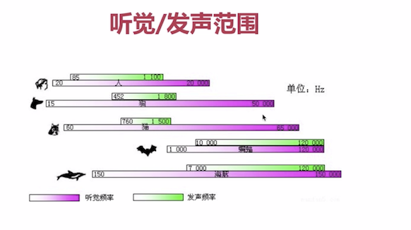
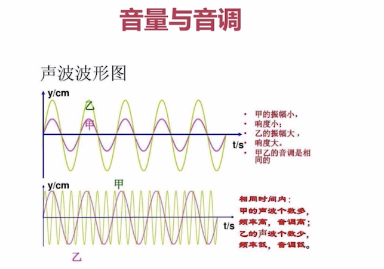
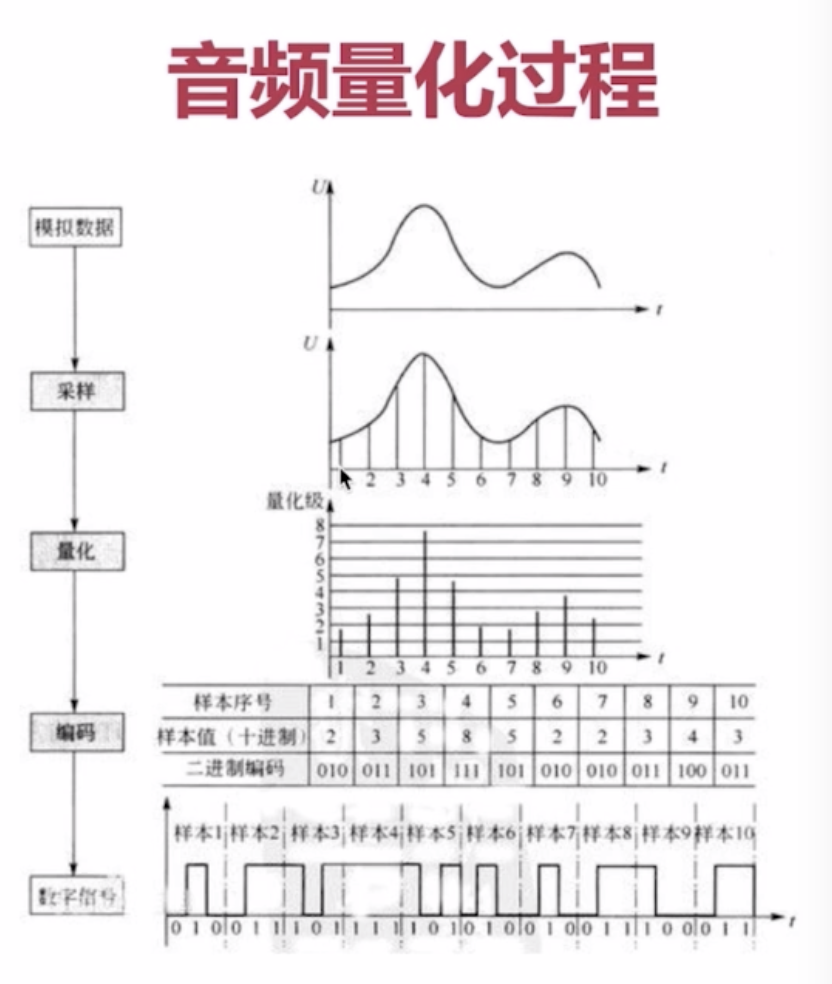
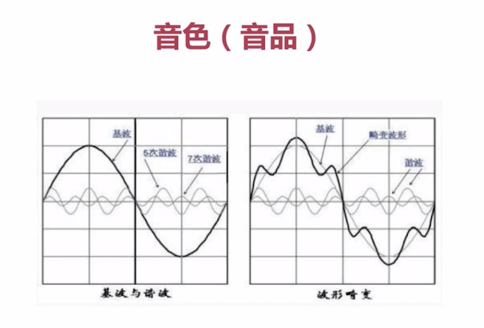

  声音三要素  
  音调: 就是音频，男生< 女生 < 儿童  倍速播放  
  音量: 声音震动的幅度  幅度大小与音量大小成正比  
  音色: 它与材质有很大关系，本质是谐波 
  
  次声波：小于20Hz   
  人类可听声波：20Hz----20kHz   
  超声波：20kHz以上 
  声音压缩时小于 20Hz大于20kHz的去掉 

  采样大小：一个采样用多少bit存放，常用的是16bit  
  采样率：采样频率8k、16k、32k、44.1k、48k 
  声道数：单声道、双声道、多声道 
  码率计算： 
    采样率*采样大小*声道数  

  音频压缩技术： 
    消除冗余数据    
    哈夫曼无损编码 
  音频编解码器： 
    OPUS > AAC > Vorbis   
    AAC目的是取代MP3 
    AAC LC 128k \ AAC HE V1 \ AAC HE V2 
    libfdk_Aac 

 数字音频  
	采样：在时间抽上对信号进行数字化  
	量化：在幅度轴上对信号进行处理 
	编码：按照一定的格式记录采样和量化后的数字数据 
	
   人耳朵能听到的频率范围是20到20kHz  
	采样率高2倍一般为44.1kHz，即1秒会采样44100次 
	量化一般为2个字节即16bit表示 

	
CD的音质为例：量化格式为16bit采样率为44.1kHz，声道数为2，比特率来表示声音的大小，即一秒内的比特数目。 
	16*44100*2 = 1378.125kbps  
	比特率=采样率*量化单位*声道 
	一分钟的大小为 
	1378.125*60/8/1024= 10.09MB  

存储的二进制数据即表示将模拟信号转换为数字信号，就可以对二进制数据进行存储、播放、复制、等操作 
	图像的数值表示  
	ARGB  
	8bit表示一个子像素 
	Android中  
	ARGB_8888 表示32个bit 也就是4个字节  
	RGB_565 表示16个bit 也就是2个字节大小 
	一张1280*720的ARGB_8888的图片占内存为： 
	1280*720*4 = 3.516MB 

视频基础知识  
  H264  
  I帧：关键帧，采用帧内压缩技术    
  P帧：向前参考帧，压缩时只参考前一帧，属于帧间压缩技术  依赖前一帧 
  B帧：双向参考帧，压缩时既参考前一阵也参考后一帧，帧间压缩技术 不适合实时互动 

  音频编码器  
  x264直播/x265点播  
  openH264  

  
  
  
  
  

