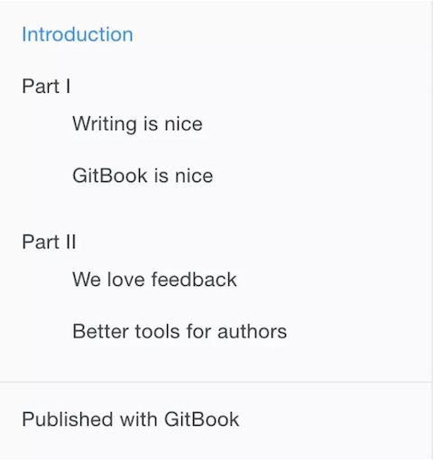
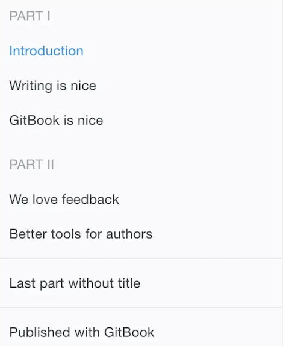

### GitBook 准备工作
1、安装 Node.js <br>
2、安装 GitBook<br>

```
npm install gitbook-cli -g
gitbook -V
```
3、安装 GitBook 编辑器

```
brew cask install gitbook-editor
```

### 开始使用
1、cd写书的目录

```
gitbook init
//SUMMARY.md 书的章节目

//http://localhost:4000  预览书籍
gitbook serve

//生成网页，不开启服务器
gitbook build
```

2、目录结构

```
.
├── book.json 
├── README.md
├── SUMMARY.md
├── chapter-1/
|   ├── README.md
|   └── something.md
└── chapter-2/
    ├── README.md
    └── something.md
```
```
//book.json 存放配置信息
{
    "title": "Blankj's Glory",
    "author": "Blankj",
    "description": "select * from learn",
    "language": "zh-hans",
    "gitbook": "3.2.3",
    "styles": {
        "website": "./styles/website.css"
    },
    "structure": {
        "readme": "README.md"
    },
    "links": {
        "sidebar": {
            "我的狗窝": "https://blankj.com"
        }
    },
    "plugins": [
        "-sharing",
        "splitter",
        "expandable-chapters-small",
        "anchors",

        "github",
        "github-buttons",
        "donate",
        "sharing-plus",
        "anchor-navigation-ex",
        "favicon"
    ],
    "pluginsConfig": {
        "github": {
            "url": "https://github.com/Blankj"
        },
        "github-buttons": {
            "buttons": [{
                "user": "Blankj",
                "repo": "glory",
                "type": "star",
                "size": "small",
                "count": true
                }
            ]
        },
        "donate": {
            "alipay": "./source/images/donate.png",
            "title": "",
            "button": "赞赏",
            "alipayText": " "
        },
        "sharing": {
            "douban": false,
            "facebook": false,
            "google": false,
            "hatenaBookmark": false,
            "instapaper": false,
            "line": false,
            "linkedin": false,
            "messenger": false,
            "pocket": false,
            "qq": false,
            "qzone": false,
            "stumbleupon": false,
            "twitter": false,
            "viber": false,
            "vk": false,
            "weibo": false,
            "whatsapp": false,
            "all": [
                "google", "facebook", "weibo", "twitter",
                "qq", "qzone", "linkedin", "pocket"
            ]
        },
        "anchor-navigation-ex": {
            "showLevel": false
        },
        "favicon":{
            "shortcut": "./source/images/favicon.jpg",
            "bookmark": "./source/images/favicon.jpg",
            "appleTouch": "./source/images/apple-touch-icon.jpg",
            "appleTouchMore": {
                "120x120": "./source/images/apple-touch-icon.jpg",
                "180x180": "./source/images/apple-touch-icon.jpg"
            }
        }
    }
}
links
在左侧导航栏添加链接信息

plugins
配置使用的插件

pluginsConfig
配置插件的属性
```

```
//SUMMARY.md GitBook 的章节目录 通过 Markdown 中的列表语法来表示文件的父子关系
# Summary

* [Introduction](README.md)
* [Part I](part1/README.md)
    * [Writing is nice](part1/writing.md)
    * [GitBook is nice](part1/gitbook.md)
* [Part II](part2/README.md)
    * [We love feedback](part2/feedback_please.md)
    * [Better tools for authors](part2/better_tools.md)
```
. 如下图


```
//通过使用 标题 或者 水平分割线 将 GitBook 分为几个不同的部分
### Part I

* [Introduction](README.md)
* [Writing is nice](part1/writing.md)
* [GitBook is nice](part1/gitbook.md)

### Part II

* [We love feedback](part2/feedback_please.md)
* [Better tools for authors](part2/better_tools.md)

---

* [Last part without title](part3/title.md)
```
. 如下图


3、插件
GitBook 有 插件官网，默认带有 5 个插件，highlight、search、sharing、font-settings、livereload，如果要去除自带的插件， 可以在插件名称前面加 -

```
//添加插件
{
    "plugins": [ "github" ],
    "pluginsConfig": {
        "github": {
            "url": "https://github.com/your/repo"
        }
    }
}
//plugin@0.3.1 指定插件版本
gitbook install ./
```

