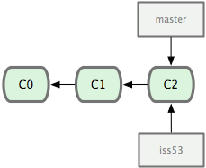

### Git 基础
https://0532.gitbooks.io/progit/content/index.html
##### 直接记录快照，而非差异比较

Git 并不保存这些前后变化的差异数据。实际上，Git 更像是把变化的文件作快照后，记录在一个微型的文件系统中。每次提交更新时，它会纵览一遍所有文件的指纹信息并对文件作一快照，然后保存一个指向这次快照的索引。为提高性能，若文件没有变化，Git 不会再次保存，而只对上次保存的快照作一链接。
##### 近乎所有操作都是本地执行
在 Git 中的绝大多数操作都只需要访问本地文件和资源，不用连网。举个例子，如果要浏览项目的历史更新摘要，Git 不用跑到外面的服务器上去取数据回来，而直接从本地数据库读取后展示给你看。所以任何时候你都可以马上翻阅，无需等待。如果想要看当前版本的文件和一个月前的版本之间有何差异，Git 会取出一个月前的快照和当前文件作一次差异运算，而不用请求远程服务器来做这件事，或是把老版本的文件拉到本地来作比较。
##### 时刻保持数据完整性
在保存到 Git 之前，所有数据都要进行内容的校验和（checksum）计算，并将此结果作为数据的唯一标识和索引。换句话说，不可能在你修改了文件或目录之后，Git 一无所知。这项特性作为 Git 的设计哲学，建在整体架构的最底层。所以如果文件在传输时变得不完整，或者磁盘损坏导致文件数据缺失，Git 都能立即察觉。
Git 使用 SHA-1 算法计算数据的校验和，通过对文件的内容或目录的结构计算出一个 SHA-1 哈希值，作为指纹字符串。该字串由 40 个十六进制字符（0-9 及 a-f）组成，看起来就像是：
```
24b9da6552252987aa493b52f8696cd6d3b00373
```
Git 的工作完全依赖于这类指纹字串，所以你会经常看到这样的哈希值。实际上，所有保存在 Git 数据库中的东西都是用此哈希值来作索引的，而不是靠文件名。
##### 多数操作仅添加数据
常用的 Git 操作大多仅仅是把数据添加到数据库。因为任何一种不可逆的操作，比如删除数据，都会使回退或重现历史版本变得困难重重。在 Git 里，一旦提交快照之后就完全不用担心丢失数据，特别是养成定期推送到其他仓库的习惯的话。
##### 文件的三种状态
对于任何一个文件，在 Git 内都只有三种状态：已提交（committed），已修改（modified）和已暂存（staged）。已提交表示该文件已经被安全地保存在本地数据库中了；已修改表示修改了某个文件，但还没有提交保存；已暂存表示把已修改的文件放在下次提交时要保存的清单中。
由此我们看到 Git 管理项目时，文件流转的三个工作区域：Git 的工作目录，暂存区域，以及本地仓库。

每个项目都有一个 Git 目录（如果 git clone 出来的话，就是其中 .git 的目录；如果 git clone --bare 的话，新建的目录本身就是 Git 目录。），它是 Git 用来保存元数据和对象数据库的地方。该目录非常重要，每次克隆镜像仓库的时候，实际拷贝的就是这个目录里面的数据。
从项目中取出某个版本的所有文件和目录，用以开始后续工作的叫做工作目录。这些文件实际上都是从 Git 目录中的压缩对象数据库中提取出来的，接下来就可以在工作目录中对这些文件进行编辑。
所谓的暂存区域只不过是个简单的文件，一般都放在 Git 目录中。有时候人们会把这个文件叫做索引文件，不过标准说法还是叫暂存区域。
基本的 Git 工作流程如下：
1.在工作目录中修改某些文件。
2.对修改后的文件进行快照，然后保存到暂存区域。
3.提交更新，将保存在暂存区域的文件快照永久转储到 Git 目录中。
所以，我们可以从文件所处的位置来判断状态：如果是 Git 目录中保存着的特定版本文件，就属于已提交状态；如果作了修改并已放入暂存区域，就属于已暂存状态；如果自上次取出后，作了修改但还没有放到暂存区域，就是已修改状态.
### 安装git
下载地址: 
http://git-scm.com/download
https://github.com/git/git/
https://www.kernel.org/pub/software/scm/git/
源码安装：
```
$ tar -zxf git-2.9.3.tar.gz  
$ cd git-2.9.3
$ make prefix=/usr/local all
$ sudo make prefix=/usr/local install
```
GUI:
https://www.sourcetreeapp.com/
### 初次运行 Git 前的配置
Git 提供了一个叫做 git config 的工具
专门用来配置或读取相应的工作环境变量。而正是由这些环境变量，决定了 Git 在各个环节的具体工作方式和行为。这些变量可以存放在以下三个不同的地方：
* /etc/gitconfig 文件：系统中对所有用户都普遍适用的配置。若使用 git config 时用 --system 选项，读写的就是这个文件。
* ~/.gitconfig 文件：用户目录下的配置文件只适用于该用户。若使用 git config 时用 --global 选项，读写的就是这个文件。
* 当前项目的 git 目录中的配置文件（也就是工作目录中的 .git/config 文件）：这里的配置仅仅针对当前项目有效。每一个级别的配置都会覆盖上层的相同配置，所以 .git/config 里的配置会覆盖 /etc/gitconfig 中的同名变量。
```
git config --list  //列出当前配置
git config --global --list //列出全局配置
git config --system --list //列出系统配置
git config --global user.name "[firstname lastname]" //设置用户名
git config --global user.email “[valid-email]”  //设置用户邮箱
git config --global core.editor vi  //设置git使用的文本编辑器
```
#### 配置文件
Repository配置对应的配置文件路径[--local]：
'repo'/.git/config
用户全局配置对应的配置文件路径[--global]：
~/.gitconfig
系统配置对应的配置文件路径[--local]：
/etc/gitconfig

### 获取帮助
想了解 Git 的各式工具该怎么用，可以阅读它们的使用帮助，方法有三：
```
$ git help <verb>
$ git <verb> --help
$ man git-<verb>
```
比如，要学习 config 命令可以怎么用，运行：
```
git help config
man git config
```

### 创建项目
有两种取得 Git 项目仓库的方法。第一种是在现存的目录下，通过导入所有文件来创建新的 Git 仓库。第二种是从已有的 Git 仓库克隆出一个新的镜像仓库来。

1.要对现有的某个项目开始用 Git 管理，只需到此项目所在的目录执行:
```
git init
```
初始化后，在当前目录下会出现一个名为 .git 的目录，所有 Git 需要的数据和资源都存放在这个目录中。
用 git add 命令告诉 Git 开始对这些文件进行跟踪
```
$ git add *.java
$ git add README
$ git commit -m 'initial project version'
```
e.g:
```
cd ~/work
mkdir LearnGit 
cd LearnGit
git init
//需要提交到远程仓库的执行下面几句命令
git remote -v  //显示项目目前的远程仓库，因为是新建项目，所以结果为空。
git remote add origin https://git.oschina.net/killqq/learngit.git  
/**
添加远程仓库会在 .git目录的config文件中添加
[remote "origin"]
  url = https://git.oschina.net/killqq/learngit.git
*/	
git pull origin master --allow-unrelated-histories //2.9.2 强行提交所有文件

touch gitBasic.md  //创建gitBasic.md文件
vi gitBasic.md     //编辑gitBasic.md文件 添加内容
git status       //查看状态 会显示有gitBasic.md文件 需要添加  被标记为红色(待添加状态)
git add gitBasic.md  //添加gitBasic.md文件 
git status  //再次查看状态 标记为绿色(已经添加)
git commit -m "add gitBasic file"  //提交到git 并加入注释信息
git push origin master   //提交到远程仓库
```

2.从现有仓库克隆:
克隆仓库的命令格式为 git clone [url]
```
$ git clone git://github.com/schacon/grit.git
$ git clone git://github.com/schacon/grit.git mygrit  //重新命名clone的本地目录
//通过 SSH
$ git clone ssh://user@domain.com/repo.git
//通过 HTTP
$ git clone http://domain.com/user/repo.git
```
Git 支持许多数据传输协议。例子使用的是 git:// 协议，不过你也可以用 http(s):// 或者 user@server:/path.git 表示的 SSH 传输协议。

### 文件状态
工作目录下面的所有文件都不外乎这两种状态：已跟踪或未跟踪。已跟踪的文件是指本来就被纳入版本控制管理的文件，在上次快照中有它们的记录，工作一段时间后，它们的状态可能是未更新，已修改或者已放入暂存区。而所有其他文件都属于未跟踪文件。它们既没有上次更新时的快照，也不在当前的暂存区域。初次克隆某个仓库时，工作目录中的所有文件都属于已跟踪文件，且状态为未修改。
在编辑过某些文件之后，Git 将这些文件标为已修改。我们逐步把这些修改过的文件放到暂存区域，直到最后一次性提交所有这些暂存起来的文件，如此重复。使用 Git 时的文件状态变化周期图：


#### 检查当前文件状态
```
$ git status
On branch master
nothing to commit, working directory clean
```
说明现在工作目录的master分支相当干净，所有已跟踪文件在上次提交后都未被更改过。此外，上面的信息还表明，当前目录下没有出现任何处于未跟踪的新文件
```
$ vim README  //编辑README文件
$ git status
On branch master
Untracked files:
  (use "git add <file>..." to include in what will be committed)
        README
nothing added to commit but untracked files present (use "git add" to track)
```
在状态报告中可以看到新建的README文件出现在“Untracked files”下面。未跟踪的文件意味着Git在之前的快照（提交）中没有这些文件；Git 不会自动将之纳入跟踪范围
#### 跟踪新文件
```
$ git add README
```
```
$ git status
On branch master
Changes to be committed:
  (use "git reset HEAD <file>..." to unstage)
        new file:   README
```
只要在 “Changes to be committed” 这行下面的，就说明是已暂存状态。如果此时提交，那么该文件此时此刻的版本将被留存在历史记录中。你可能会想起之前我们使用 git init 后就运行了 git add 命令，开始跟踪当前目录下的文件。在 git add 后面可以指明要跟踪的文件或目录路径。如果是目录的话，就说明要递归跟踪该目录下的所有文件。（其实 git add 的潜台词就是把目标文件快照放入暂存区域，也就是 add file into staged area，同时未曾跟踪过的文件标记为需要跟踪。这样就好理解后续 add 操作的实际意义了。）

#### 修改已经暂存的文件
加入Helloworld.java 已经在暂存区中(已经git add)，对其进行修改，执行 git status
```
$ git status
On branch master
Changes to be committed:
  (use "git reset HEAD <file>..." to unstage)
        new file:   README
Changes not staged for commit:
  (use "git add <file>..." to update what will be committed)
  (use "git checkout -- <file>..." to discard changes in working directory)
        modified:   Helloworld.java
```
文件 Helloworld.java 出现在 “Changes not staged for commit” 这行下面，说明已跟踪文件的内容发生了变化，但还没有放到暂存区。要暂存这次更新，需要运行 git add 命令
```
$ git add Helloworld.java
$ git status
On branch master
Changes to be committed:
  (use "git reset HEAD <file>..." to unstage)
        new file:   README
        modified:   Helloworld.java
```
现在两个文件都已暂存，下次提交时就会一并记录到仓库。如果再次修改Helloworld.java文件，执行git status
```
$ vi Helloworld.java
$ git status
On branch master
Changes to be committed:
  (use "git reset HEAD <file>..." to unstage)
        new file:   README
        modified:   Helloworld.java
Changes not staged for commit:
  (use "git add <file>..." to update what will be committed)
  (use "git checkout -- <file>..." to discard changes in working directory)
        modified:   Helloworld.java
```
此时需要重新运行 git add 把Helloworld.java最新版本重新暂存起来，才能提交最新的修改

#### 忽略某些文件
一般我们总会有些文件无需纳入 Git 的管理，也不希望它们总出现在未跟踪文件列表。通常都是些自动生成的文件，比如日志文件，或者编译过程中创建的临时文件等。我们可以创建一个名为 .gitignore 的文件，列出要忽略的文件模式。来看一个实际的例子：
```
touch .gitignore
vi .gitignore  //编辑 添加忽略规则
cat .gitignore
*.[oa]
*~
```
第一行告诉 Git 忽略所有以 .o 或 .a 结尾的文件。
第二行告诉 Git 忽略所有以波浪符（~）结尾的文件
文件 .gitignore 的格式规范如下：
1.所有空行或者以注释符号 ＃ 开头的行都会被 Git 忽略。
2.可以使用标准的 glob 模式匹配。（shell 所使用的简化了的正则表达式）
3.匹配模式最后跟反斜杠（/）说明要忽略的是目录。
4.要忽略指定模式以外的文件或目录，可以在模式前加上惊叹号（!）取反。
再看一个 .gitignore 文件的例子：
```
<!--
# 此为注释 – 将被 Git 忽略
# 忽略所有 .a 结尾的文件
*.a
# 但 lib.a 除外
!lib.a
# 仅仅忽略项目根目录下的 TODO 文件，不包括 subdir/TODO
/TODO
# 忽略 build/ 目录下的所有文件
build/
# 会忽略 doc/notes.txt 但不包括 doc/server/arch.txt
doc/*.txt
# ignore all .txt files in the doc/ directory
doc/**/*.txt
-->
```

#### 查看已暂存文件和未暂存文件的修改
如果要查看文件具体修改了什么地方，可以用 git diff 看暂存前后的变化
git diff --cached 查看已经暂存起来的文件和上次提交时的快照之间的差异

#### 提交更新
在此之前，请一定要确认还有什么修改过的或新建的文件还没有 git add 过，否则提交的时候不会记录这些还没暂存起来的变化。所以，每次准备提交前，先用 git status 看下，是不是都已暂存起来了，然后再运行提交命令 git commit。
```
//这种方式会启动文本编辑器以便输入本次提交的说明。
$ git commit
//不会启动编辑器
$ git commit -m "commit message"
```
#### 跳过使用暂存区域
Git 提供了一个跳过使用暂存区域的方式，只要在提交的时候，给 git commit 加上 -a 选项，Git 就会自动把所有已经跟踪过的文件暂存起来一并提交，从而跳过 git add 步骤
```
git commit -a -m 'add a new file'
```

#### 移除文件
确切地说，是从暂存区域移除
```
git rm Helloworld.java
```
最后提交的时候，Helloworld.java文件就不再纳入版本管理了。如果删除之前修改过并且已经放到暂存区域的话，则必须要用强制删除选项 -f
此操作连带从工作目录中删除指定的文件。
如果不想从工作目录中删除 只从跟踪目录中删除 执行:
```
git rm --cached readme.txt
```

#### 移动文件(重命名文件)
Git 并不跟踪文件移动操作。如果在 Git 中重命名了某个文件，仓库中存储的元数据并不会体现出这是一次改名操作。
```
$ git mv file_from file_to
```
其实，运行 git mv 就相当于运行了下面三条命令：
```
$ mv README.txt README
$ git rm README.txt
$ git add README
```

### 查看提交历史
git log
```
$ git log
commit 338886fd78c45df23c8643d2d6ca379d5dc7f2fb
Author: abc20899 <abc20899@163.com>
Date:   Wed May 17 22:12:22 2017 +0800

    ignore

commit f4671573eb1bb51ef4e1735e5a636bf0a84b7085
Author: abc20899 <abc20899@163.com>
Date:   Wed May 17 20:56:06 2017 +0800

    add gitBasic file

commit f30efb8ba272852496c94255be016268601381b8
Author: junechiu <abc20899@163.com>
Date:   Wed May 17 20:45:24 2017 +0800

    Initial commit
```
默认不用任何参数的话，git log 会按提交时间列出所有的更新，最近的更新排在最上面。看到了吗，每次更新都有一个 SHA-1 校验和、作者的名字和电子邮件地址、提交时间，最后缩进一个段落显示提交说明。

```
git log -p -2 //用 -p 选项展开显示每次提交的内容差异，用 -2 则仅显示最近的两次更新
git log --stat //仅显示简要的增改行数统计
git log --pretty=format:"%h - %an, %ar : %s" //定制要显示的记录格式
git log --pretty=oneline  //单行格式
$ git log --pretty=oneline --max-count=2
$ git log --pretty=oneline --since='5 minutes ago'
$ git log --pretty=oneline --until='5 minutes ago'
$ git log --pretty=oneline --author=<your name>
$ git log --pretty=oneline --all
git log --pretty=format:'%h %ad | %s%d [%an]' --graph --date=short' //终极日志格式
```
常用的格式占位符写法及其代表的意义:
%H	提交对象（commit）的完整哈希字串
%h	提交对象的简短哈希字串
%T	树对象（tree）的完整哈希字串
%t	树对象的简短哈希字串
%P	父对象（parent）的完整哈希字串
%p	父对象的简短哈希字串
%an	作者（author）的名字
%ae	作者的电子邮件地址
%ad	作者修订日期（可以用 -date= 选项定制格式）
%ar	作者修订日期，按多久以前的方式显示
%cn	提交者(committer)的名字
%ce	提交者的电子邮件地址
%cd	提交日期
%cr	提交日期，按多久以前的方式显示
%s	提交说明

git log 命令支持的选项:
-p	按补丁格式显示每个更新之间的差异。
--word-diff	按 word diff 格式显示差异。
--stat	显示每次更新的文件修改统计信息。
--shortstat	只显示 --stat 中最后的行数修改添加移除统计。
--name-only	仅在提交信息后显示已修改的文件清单。
--name-status	显示新增、修改、删除的文件清单。
--abbrev-commit	仅显示 SHA-1 的前几个字符，而非所有的 40 个字符。
--relative-date	使用较短的相对时间显示（比如，“2 weeks ago”）。
--graph	显示 ASCII 图形表示的分支合并历史。
--pretty	使用其他格式显示历史提交信息。可用的选项包括 oneline，short，full，fuller 和 format（后跟指定格式）。
--oneline	--pretty=oneline --abbrev-commit 的简化用法。

#### 限制输出长度
```
git log --since=2.weeks  //列出所有最近两周内的提交
```
#### 使用图形化工具查阅提交历史
在项目工作目录中输入 gitk 命令

### 撤消操作
需要撤消刚才所做的某些操作，有些撤销操作是不可逆的，所以请务必谨慎小心，一旦失误，就有可能丢失部分工作成果。
#### 修改最后一次提交
有时候我们提交完了才发现漏掉了几个文件没有加，或者提交信息写错了。想要撤消刚才的提交操作，可以使用 --amend 选项重新提交：
```
$ git commit --amend  //会打开vi编辑器 输入提交信息  wq保存退出  会到上一次快照
```
#### 取消已经暂存的文件
git reset HEAD <file>... 的方式取消暂存。
```
git reset HEAD Helloworld.java
```
#### 取消对文件的修改
```
git checkout -- Helloworld.java
```
这条命令有些危险，所有对文件的修改都没有了

### 远程仓库的使用
管理远程仓库的工作，包括添加远程库，移除废弃的远程库，管理各式远程库分支，定义是否跟踪这些分支
#### 查看当前的远程库
```
$ git remote
origin
$ git remote -v
origin	https://git.oschina.net/killqq/learngit.git (fetch)
origin	https://git.oschina.net/killqq/learngit.git (push)
```
#### 添加远程仓库
```
git remote add learn2 https://git.oschina.net/killqq/learngit2.git
```
#### 从远程仓库抓取数据
```
$ git fetch [remote-name]
git fetch learn2
```
此命令会到远程仓库中拉取所有你本地仓库中还没有的数据。运行完成后，你就可以在本地访问该远程仓库中的所有分支，将其中某个分支合并到本地，或者只是取出某个分支
如果是克隆了一个仓库，此命令会自动将远程仓库归于 origin 名下。所以，git fetch origin 会抓取从你上次克隆以来别人上传到此远程仓库中的所有更新（或是上次 fetch 以来别人提交的更新）。需要记住，fetch 命令只是将远端的数据拉到本地仓库，并不自动合并到当前工作分支,经常使用 git pull

#### 推送数据到远程仓库
```
git push [remote-name] [branch-name]
git push origin master
```
#### 查看远程仓库信息
```
git remote show [remote-name]
git remote show origin
$ git remote show origin
* remote origin
  Fetch URL: https://git.oschina.net/killqq/learngit.git
  Push  URL: https://git.oschina.net/killqq/learngit.git
  HEAD branch: master
  Remote branch:
    master tracked
  Local ref configured for 'git push':
    master pushes to master (local out of date)
```
#### 远程仓库的删除和重命名
用 git remote rename 命令修改某个远程仓库在本地的简称
比如想把 old 改成 new，可以这么运行：
```
$ git remote rename old new
$ git remote
origin
new
```
注意，对远程仓库的重命名，也会使对应的分支名称发生变化，原来的 old/master 分支现在成了 new/master。

### 打标签
Git 也可以对某一时间点上的版本打上标签
#### 列出已有的标签
```
$ git tag
v0.1
v1.3
//列出某个特定标签
$ git tag -l 'v1.4.2.*'
v1.4.2.1
v1.4.2.2
v1.4.2.3
v1.4.2.4
```
#### 新建标签
```
//含附注的标签
$ git tag -a v1.0 -m 'my version 1.0'
$ git tag
v1.0
//git show 命令查看相应标签的版本信息
git show v1.0

```
### Git 命令别名
```
$ git config --global alias.co checkout
$ git config --global alias.br branch
$ git config --global alias.ci commit
$ git config --global alias.st status
```
使用这种技术还可以创造出新的命令，比方说取消暂存文件时的输入比较繁琐，可以自己设置一下：
$ git config --global alias.unstage 'reset HEAD --'
这样一来，下面的两条命令完全等同：
$ git unstage fileA
$ git reset HEAD fileA
显然，使用别名的方式看起来更清楚。另外，我们还经常设置 last 命令：
$ git config --global alias.last 'log -1 HEAD'

### git 分支
#### 分支概念
当使用 git commit 新建一个提交对象前，Git 会先计算每一个子目录的校验和，然后在 Git 仓库中将这些目录保存为树（tree）对象。之后 Git 创建的提交对象，除了包含相关提交信息以外，还包含着指向这个树对象的指针，如此它就可以在将来需要的时候，重现此次快照的内容了。

#### 分支的新建与合并
创建一个新的分支指针。比如新建一个 testing 分支，可以使用 git branch 命令：
```
$ git branch testing //仅仅是建立了一个新的分支 并没有切换
$ git checkout testing //切换到 testing分支 这样HEAD就指向了testing 分支
```
git保存着一个名为 HEAD 的特别指针,是一个指向你正在工作中的本地分支的指针。
切换分支HEAD指针也会移动

情景：
首先，我们假设你正在项目中愉快地工作，并且已经提交了几次更新

现在，你决定要修补问题#53,这里为了说明要解决的问题，才把新建的分支取名为 iss53。要新建并切换到该分支，运行 git checkout 并加上 -b 参数：
```
$ git checkout -b iss53     
Switched to a new branch 'iss53'       
/**
相当于
$ git branch iss53
$ git checkout iss53
*/
```
指针指向图:

接着开始在新的分支上修复问题，提交了若干次更新后，iss53 分支的指针也会随着向前推进，因为它就是当前分支（换句话说，当前的 HEAD 指针正指向 iss53）
```
$ vi hello.java
$ git commit -a -m 'fix bug [issue 53]'
```

iss53分支完成后，切换回master分支，不过在此之前，留心你的暂存区或者工作目录里，那些还没有提交的修改，它会和你即将检出的分支产生冲突从而阻止 Git 为你切换分支。切换分支的时候最好保持一个清洁的工作区域。
```
$ git checkout master
Switched to branch 'master'
```
此时工作目录中的内容和你在解决问题 #53 之前一模一样，你可以集中精力进行紧急修补。这一点值得牢记：Git 会把工作目录的内容恢复为检出某分支时它所指向的那个提交对象的快照。它会自动添加、删除和修改文件以确保目录的内容和你当时提交时完全一样。
此时有一个紧急问题需要修复，则需要创建一个hotfix分支
```
$ git checkout -b hotfix
Switched to a new branch 'hotfix'
$ vim index.html
$ git commit -a -m 'fixed the broken email address'
[hotfix 3a0874c] fixed the broken email address
 1 files changed, 1 deletion(-)
```
指针指向图：hotfix 分支是从 master 分支所在点分化出来的

然后回到 master 分支并把hotfix分支合并进来
```
$ git checkout master
$ git merge hotfix
Updating f42c576..3a0874c
Fast-forward
 README | 1 -
 1 file changed, 1 deletion(-)
```
合并时出现了“Fast forward”的提示。由于当前 master 分支所在的提交对象是要并入的 hotfix 分支的直接上游，Git 只需把 master 分支指针直接右移。所以这种合并过程可以称为快进.
指针指向： master 分支和 hotfix 分支指向同一位置。

由于当前 hotfix 分支和 master 都指向相同的提交对象，所以 hotfix 已经完成了历史使命，可以删掉了。使用 git branch 的 -d 选项执行删除操作：
```
$ git branch -d hotfix
Deleted branch hotfix (was 3a0874c).
```
继续回到之前未完成的 #53 问题修复分支上继续工作
```
$ git checkout iss53
Switched to branch 'iss53'
$ vim index.html
$ git commit -a -m 'finished the new footer [issue 53]'
[iss53 ad82d7a] finished the new footer [issue 53]
 1 file changed, 1 insertion(+)
```
指针指向：iss53 分支可以不受影响继续推进。

值得注意的是之前 hotfix 分支的修改内容尚未包含到 iss53 中来。如果需要纳入此次修补，可以用 git merge master 把 master 分支合并到 iss53；或者等 iss53 完成之后，再将 iss53 分支中的更新并入 master。
#### 分支的合并
在问题 #53 相关的工作完成之后，可以合并回 master 分支
```
$ git checkout master
$ git merge iss53
Auto-merging README
Merge made by the 'recursive' strategy.
 README | 1 +
 1 file changed, 1 insertion(+)
```
这次合并操作的底层实现，并不同于之前 hotfix 的并入方式。因为这次你的开发历史是从更早的地方开始分叉的。由于当前 master 分支所指向的提交对象（C4）并不是 iss53 分支的直接祖先，Git 不得不进行一些额外处理。就此例而言，Git 会用两个分支的末端（C4 和 C5）以及它们的共同祖先（C2）进行一次简单的三方合并计算。
如图：

这次，Git 没有简单地把分支指针右移，而是对三方合并后的结果重新做一个新的快照，并自动创建一个指向它的提交对象（C6）


#### 遇到冲突时的分支合并
有时候合并操作并不会如此顺利。如果在不同的分支中都修改了同一个文件的同一部分，Git 就无法干净地把两者合到一起
```
$ git merge iss53
Auto-merging index.html
CONFLICT (content): Merge conflict in index.html
Automatic merge failed; fix conflicts and then commit the result.
```
Git 作了合并，但没有提交，它会停下来等你解决冲突。要看看哪些文件在合并时发生冲突，可以用 git status 查阅：
```
$ git status
On branch master
You have unmerged paths.
  (fix conflicts and run "git commit")

Unmerged paths:
  (use "git add <file>..." to mark resolution)

        both modified:      index.html

no changes added to commit (use "git add" and/or "git commit -a")
```
任何包含未解决冲突的文件都会以未合并（unmerged）的状态列出。Git 会在有冲突的文件里加入标准的冲突解决标记，可以通过它们来手工定位并解决这些冲突。可以看到此文件包含类似下面这样的部分：
```
<!--
<<<<<<< HEAD
<div id="footer">contact : email.support@github.com</div>
=======
<div id="footer">
  please contact us at support@github.com
</div>
>>>>>>> iss53
-->
```
可以看到 ======= 隔开的上半部分，是 HEAD（即 master 分支，在运行 merge 命令时所切换到的分支）中的内容，下半部分是在 iss53 分支中的内容。解决冲突的办法无非是二者选其一或者由你亲自整合到一起。
如果你想用一个有图形界面的工具来解决这些问题，不妨运行 git mergetool，它会调用一个可视化的合并工具并引导你解决所有冲突：

#### 分支的管理
```
git branch   //列出本地分支
  master
* testing    // * 所在分支
git branch -a //列出所有分支包括远程分支
git branch -v //若要查看各个分支最后一个提交对象的信息
git branch --merged //查看哪些分支已被并入当前分支
git branch --no-merged //查看尚未合并的工作
git checkout experiment  //切换分支 本地
```
#### 利用分支进行开发的工作流程
许多使用 Git 的开发者都喜欢用这种方式来开展工作，比如仅在 master 分支中保留完全稳定的代码，即已经发布或即将发布的代码。与此同时，他们还有一个名为 develop 或 next 的平行分支，专门用于后续的开发，或仅用于稳定性测试 — 当然并不是说一定要绝对稳定，不过一旦进入某种稳定状态，便可以把它合并到 master 里。

#### 远程分支
用 (远程仓库名)/(分支名) 这样的形式表示远程分支,比如：origin/master
一次 Git 克隆会建立你自己的本地分支 master 和远程分支 origin/master，并且将它们都指向 origin 上的 master 分支。
图：

如果你在本地 master 分支做了改动，与此同时，其他人向 git.ourcompany.com 推送了他们的更新，那么服务器上的 master 分支就会向前推进，于此同时，你在本地的提交历史正朝向不同方向发展。不过只要你不和服务器通讯，你的 origin/master 指针仍然保持原位不会移动

运行 git fetch origin 来同步远程服务器上的数据到本地。该命令首先找到 origin 是哪个服务器，从上面获取你尚未拥有的数据，更新你本地的数据库，然后把 origin/master 的指针移到它最新的位置上
git pull：相当于是从远程获取最新版本并merge到本地
git fetch：相当于是从远程获取最新版本到本地，不会自动merge

#### 推送本地分支
运行 git push (远程仓库名) (分支名)
git push origin serverfix:serverfix  //上传我本地的 serverfix 分支到远程仓库中去
可以在远程分支的基础上分化出一个新的分支来：
git checkout -b [分支名] [远程名]/[分支名]
git checkout -b serverfix origin/serverfix  //检出远程分支并在本地建立serverfix分支
#### 删除远程分支
如果想在服务器上删除 serverfix 分支
git push [远程名] :[分支名]
git push origin :serverfix


### 一张图展示 Git 常用命令


