## javaScript_对象模型的细节

JavaScript 是一种基于原型的面向对象语言，而不是基于类的。正是由于这一根本的区别，其如何创建对象的层级结构以及对象的属性与属性值是如何继承的并不是那么清晰。

#### 基于类 vs 基于原型的语言
* 类（class）：定义了所有用于具有某一组特征对象的属性（可以将 Java 中的方法和变量以及 C++ 中的成员都视作属性）。类是抽象的事物，而不是其所描述的全部对象中的任何特定的个体。例如 Employee 类可以用来表示所有雇员的集合。
* 实例（instance）：类的实例化体现；或者说，是类的一个成员。例如， Victoria 可以是 Employee 类的一个实例，表示一个特定的雇员个体。实例具有和其父类完全一致的属性。

基于原型的语言（如 JavaScript）并不存在这种区别：它只有对象。基于原型的语言具有所谓原型对象（prototypical object）的概念。原型对象可以作为一个模板，新对象可以从中获得原始的属性。任何对象都可以指定其自身的属性，既可以是创建时也可以在运行时创建。而且，任何对象都可以作为另一个对象的原型（prototype），从而允许后者共享前者的属性。

#### 定义类
在基于类的语言中，需要专门的类定义符（class definition）定义类。在定义类时，允许定义特殊的方法，称为构造器（constructor），来创建该类的实例。在构造器方法中，可以指定实例的属性的初始值以及一些其他的操作。您可以通过将new 操作符和构造器方法结合来创建类的实例。

JavaScript 也遵循类似的模型，但却不同于基于类的语言。在 JavaScript 中你只需要定义构造函数来创建具有一组特定的初始属性和属性值的对象。任何 JavaScript 函数都可以用作构造器。 也可以使用 new 操作符和构造函数来创建一个新对象。

#### 子类和继承
基于类的语言是通过对类的定义中构建类的层级结构的。在类定义中，可以指定新的类是一个现存的类的子类。子类将继承父类的全部属性，并可以添加新的属性或者修改继承的属性。例如，假设 Employee 类只有 name 和 dept 属性，而 Manager 是 Employee 的子类并添加了 reports 属性。这时，Manager 类的实例将具有所有三个属性：name，dept 和 reports。

JavaScript 通过将构造器函数与原型对象相关联的方式来实现继承。这样，您可以创建完全一样的 Employee — Manager 示例，不过需要使用略微不同的术语。首先，定义 Employee 构造器函数，指定 name 和 dept 属性；然后，定义 Manager 构造器函数，指定 reports 属性。最后，将一个新的 Employee 对象赋值给 Manager 构造器函数的 prototype 属性。这样，当创建一个新的 Manager 对象时，它将从 Employee 对象中继承 name and dept 属性。

#### 添加和移除属性
在基于类的语言中，通常在编译时创建类，然后在编译时或者运行时对类的实例进行实例化。一旦定义了类，无法对类的属性进行更改。然而，在 JavaScript 中，允许运行时添加或者移除任何对象的属性。如果您为一个对象中添加了一个属性，而这个对象又作为其它对象的原型，则以该对象作为原型的所有其它对象也将获得该属性。

#### 区别摘要
基于类（Java）和基于原型（JavaScript）的对象系统的比较

基于类的（Java）	 | 基于原型的（JavaScript）
------------ | ------------- 
类和实例是不同的事物。	 | 所有对象均为实例。
通过类定义来定义类；通过构造器方法来实例化类。 | 通过构造器函数来定义和创建一组对象。
通过 new 操作符创建单个对象。	 | 相同。
通过类定义来定义现存类的子类，从而构建对象的层级结构。	| 指定一个对象作为原型并且与构造函数一起构建对象的层级结构
遵循类链继承属性。|遵循原型链继承属性。
类定义指定类的所有实例的所有属性。无法在运行时动态添加属性。	| 构造器函数或原型指定初始的属性集。允许动态地向单个的对象或者整个对象集中添加或移除属性。

#### Employee 示例
一个简单的对象层级
 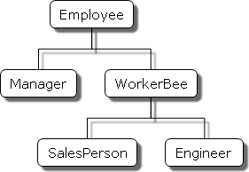
 
 例子中会使用以下对象：
* Employee 具有 name 属性（默认值为空的字符串）和 dept 属性（默认值为 "general"）。
* Manager 是 Employee的子类。它添加了 reports 属性（默认值为空的数组，以 Employee 对象数组作为它的值）。
* WorkerBee 是 Employee的子类。它添加了 projects 属性（默认值为空的数组，以字符串数组作为它的值）。
* SalesPerson 是 WorkerBee的子类。它添加了 quota 属性（其值默认为 100）。它还重载了 dept 属性值为 "sales"，表明所有的销售人员都属于同一部门。
* Engineer 基于 WorkerBee。它添加了 machine 属性（其值默认为空的字符串）同时重载了 dept 属性值为 "engineering"。

#### 创建层级结构

  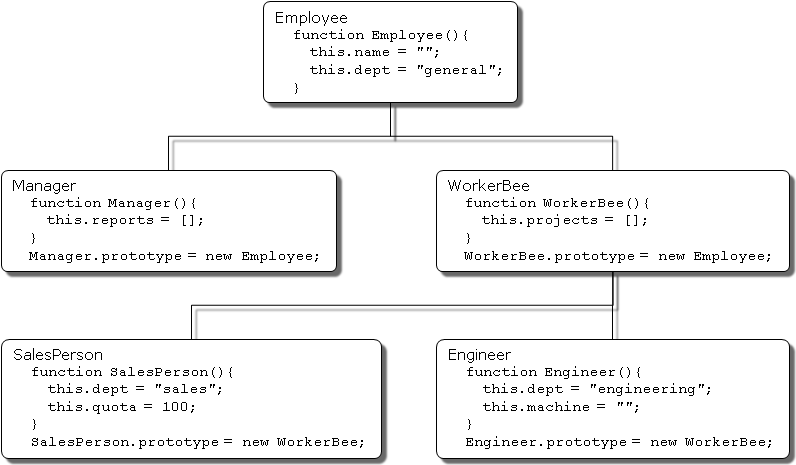
 下面关于 Employee 的 Java 和 JavaScript 的定义是非常类似的。唯一的不同是在 Java 中需要指定每个属性的类型，而在 JavaScript 中则不需要，同时 Java 的类必须创建一个显式的构造器方法。
  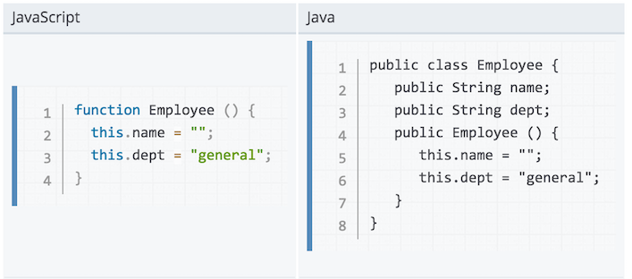
 Manager 和 WorkerBee 的定义表示在如何指定继承链中上一层对象时，两者存在不同点。在 JavaScript 中，您会添加一个原型实例作为构造器函数prototype 属性的值，而这一动作可以在构造器函数定义后的任意时刻执行。而在 Java 中，则需要在类定义中指定父类，且不能在类定义之外改变父类。
   
  在对Engineer 和 SalesPerson 定义时，创建了继承自 WorkerBee 的对象，该对象会进而继承自Employee。这些对象会具有在这个链之上的所有对象的属性。另外，它们在定义时，又重载了继承的 dept 属性值，赋予新的属性值。
    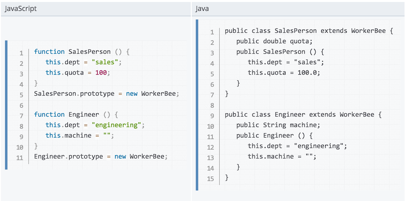
  Note: 术语 实例（instance）在基于类的语言中具有特定的技术含义。在这些语言中，实例是指类的个体成员，与类有着根本性的不同。在 JavaScript 中，“实例”并不具有这种技术含义，因为 JavaScript 中不存在类和实例之间的这种差异。然而，在谈论 JavaScript 时，“实例”可以非正式地用于表示用特定的构造器函数创建的对象。所以，在这个例子中，你可以非正式地称jane 是 Engineer 的一个实例。与之类似，尽管术语父（parent），子（child），祖先（ancestor），和后代（descendant）在 JavaScript 中并没有正式的含义，您可以非正式地使用这些术语用于指代原型链中处于更高层次或者更低层次的对象。
     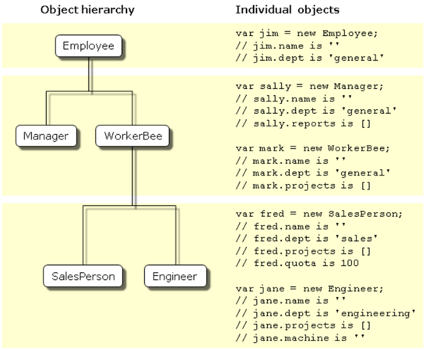
  
### 对象的属性
本节将讨论对象如何从原型链中的其它对象中继承属性，以及在运行时添加属性的相关细节。
#### 继承属性
假设您通过如下语句创建一个 mark 对象作为 WorkerBee 的实例

```
var mark = new WorkerBee;
```
当 JavaScript 发现 new 操作符时，它会创建一个通用(generic)对象，并将其作为关键字 this 的值传递给 WorkerBee 的构造器函数。该构造器函数显式地设置 projects 属性的值，然后隐式地将其内部的 __proto__ 属性设置为 WorkerBee.prototype 的值（属性的名称前后均有两个下划线）。__proto__ 属性决定了用于返回属性值的原型链。一旦这些属性设置完成，JavaScript 返回新创建的对象，然后赋值语句会将变量 mark 的值指向该对象。

这个过程不会显式的将 mark所继承的原型链中的属性值作为本地变量存放在 mark 对象中。当请求属性的值时，JavaScript 将首先检查对象自身中是否存在属性的值，如果有，则返回该值。如果不存在，JavaScript会通过 __proto__对原型链进行检查。如果原型链中的某个对象包含该属性的值，则返回这个值。如果没有找到该属性，JavaScript 则认为对象中不存在该属性。这样，mark 对象中将具有如下的属性和对应的值：

```
mark.name = "";
mark.dept = "general";
mark.projects = [];
```
mark 对象从 mark.__proto__ 中保存的原型对象中继承了 name 和 dept 属性的值。并由 WorkerBee 构造器函数为 projects 属性设置了本地值。 这就是 JavaScript 中的属性和属性值的继承。这个过程的一些微妙之处将在 再谈属性继承 中进一步讨论。

由于这些构造器不支持为实例设置特定的值，所以这些属性值仅仅是创建自 WorkerBee 的所有对象所共享的默认值。当然这些属性的值是可以修改的，所以您可以为 mark指定特定的信息，如下所示：

```
mark.name = "Doe, Mark";
mark.dept = "admin";
mark.projects = ["navigator"];
```
#### 添加属性
在 JavaScript 中，您可以在运行时为任何对象添加属性，而不必受限于构造器函数提供的属性。添加特定于某个对象的属性，只需要为该对象指定一个属性值，如下所示：

```
mark.bonus = 3000;
```
这样 mark 对象就有了 bonus 属性，而其它 WorkerBee 则没有该属性。

如果您向某个构造器函数的原型对象中添加新的属性，那么该属性将添加到从这个原型中继承属性的所有对象的中。例如，可以通过如下的语句向所有雇员中添加 specialty 属性：

```
Employee.prototype.specialty = "none";
```
只要 JavaScript 执行了该语句，则 mark 对象也将具有 specialty 属性，其值为 "none"。下图则表示了在 Employee 原型中添加该属性，然后在 Engineer 的原型中重载该属性的效果。
    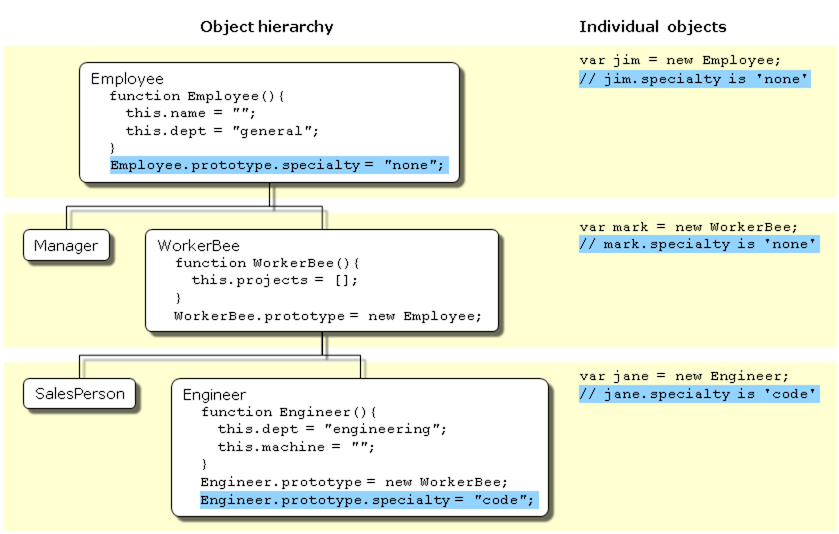

#### 更灵活的构造器
截至到现在，构造器函数都不允许在创建新的实例时指定属性值。其实我们也可以像Java一样，为构造器提供参数以初始化实例的属性值。下图即实现方式之一。
    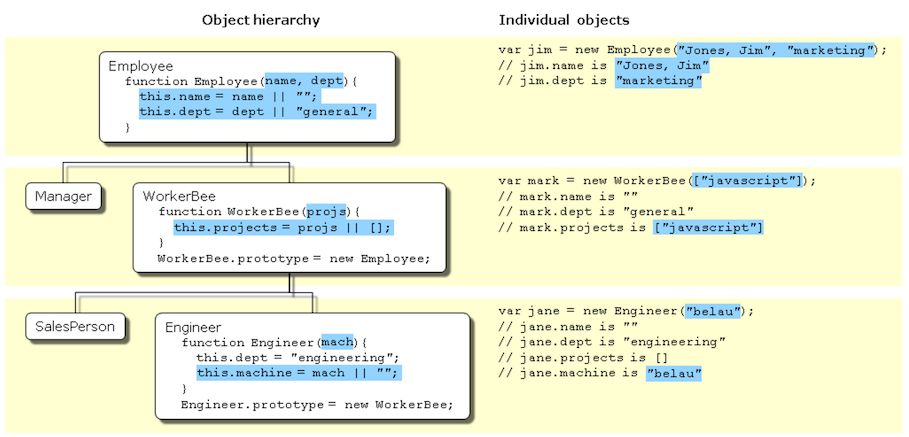
下面的表格中罗列了这些对象在 Java 和 JavaScript 中的定义。
     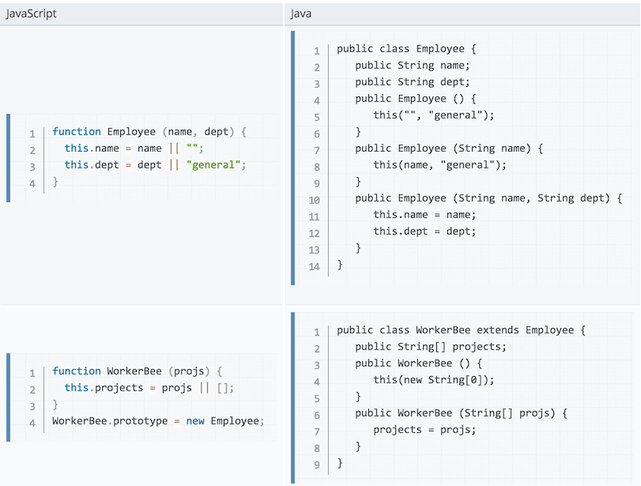   
      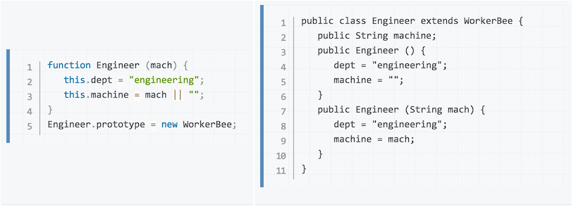              

上面使用 JavaScript 定义过程使用了一种设置默认值的特殊惯用法：

```
this.name = name || "";
```
JavaScript 的逻辑或操作符（||）会对第一个参数进行判断。如果该参数值运算后结果为真，则操作符返回该值。否则，操作符返回第二个参数的值。因此，这行代码首先检查 name 是否是对name 属性有效的值。如果是，则设置其为 this.name 的值。否则，设置 this.name 的值为空的字符串。尽管这种用法乍看起来有些费解，为了简洁起见，本章将使用这种习惯用法。
注意：如果调用构造器函数时，指定了可以转换为 false 的参数（比如 0 （零）和空字符串（""）），结果可能出乎调用者意料。此时，将使用默认值（译者注：而不是指定的参数值 0 和 ""）。
由上面的定义，当创建对象的实例时，您可以为本地定义的属性指定值。

```
var jane = new Engineer("belau");
```
此时，Jane 的属性如下所示：

```
jane.name == "";
jane.dept == "engineering";
jane.projects == [];
jane.machine == "belau"
```
注意，由上面对类的定义，您无法为诸如 name 这样的继承属性指定初始值。如果想在JavaScript中为继承的属性指定初始值，您需要在构造器函数中添加更多的代码。

到目前为止，构造器函数已经能够创建一个普通对象，然后为新对象指定本地的属性和属性值。您还可以通过直接调用原型链上的更高层次对象的构造器函数，让构造器添加更多的属性。下图即实现了这一功能。
          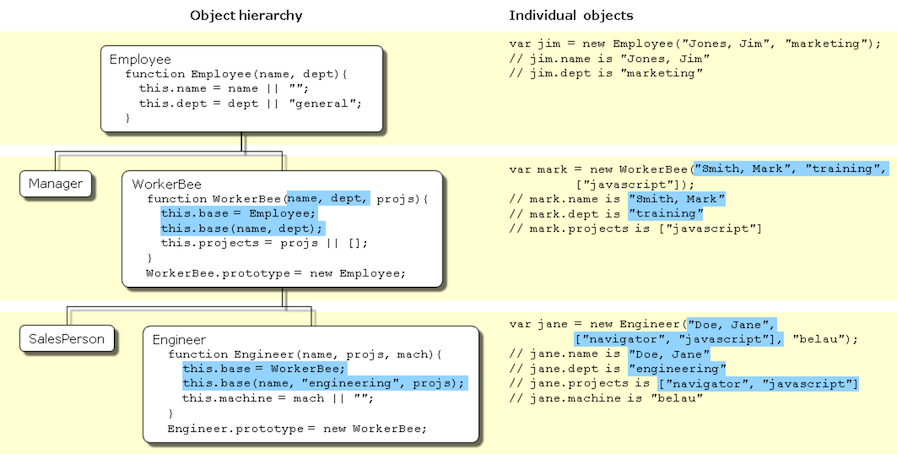     
下面是 Engineer 构造器的定义：

```
function Engineer (name, projs, mach) {
  this.base = WorkerBee;
  this.base(name, "engineering", projs);
  this.machine = mach || "";
}
```
假设您创建了一个新的 Engineer 对象，如下所示：

```
var jane = new Engineer("Doe, Jane", ["navigator", "javascript"], "belau");
```
执行时，JavaScript 会有以下步骤：

new 操作符创建了一个新的通用对象，并将其 __proto__ 属性设置为 Engineer.prototype。
new 操作符将该新对象作为 this 的值传递给 Engineer 构造器。
构造器为该新对象创建了一个名为 base 的新属性，并指向 WorkerBee 的构造器。这使得 WorkerBee 构造器成为 Engineer 对象的一个方法。base 属性的名称并没有什么特殊性，我们可以使用任何其他合法的名称来代替；base 仅仅是为了贴近它的用意。
构造器调用 base 方法，将传递给该构造器的参数中的两个，作为参数传递给 base 方法，同时还传递一个字符串参数  "engineering"。显式地在构造器中使用 "engineering" 表明所有 Engineer 对象继承的 dept 属性具有相同的值，且该值重载了继承自 Employee 的值。

因为 base 是 Engineer 的一个方法，在调用 base 时，JavaScript 将在步骤 1 中创建的对象绑定给 this 关键字。这样，WorkerBee 函数接着将 "Doe, Jane" 和 "engineering" 参数传递给 Employee 构造器函数。当从 Employee 构造器函数返回时，WorkerBee 函数用剩下的参数设置 projects 属性。

当从 base 方法返回后，Engineer 构造器将对象的 machine 属性初始化为 "belau"。
当从构造器返回时，JavaScript 将新对象赋值给 jane 变量。
您可以认为，在 Engineer 的构造器中调用了 WorkerBee 的构造器，也就为 Engineer 对象设置好了继承关系。事实并非如此。调用 WorkerBee 构造器确保了Engineer 对象以所有在构造器中所指定的属性被调用。但是，如果后续在 Employee 或者 WorkerBee 原型中添加了属性，那些属性不会被 Engineer 对象继承。例如，假设如下语句：

```
function Engineer (name, projs, mach) {
  this.base = WorkerBee;
  this.base(name, "engineering", projs);
  this.machine = mach || "";
}
var jane = new Engineer("Doe, Jane", ["navigator", "javascript"], "belau");
Employee.prototype.specialty = "none";
```
对象 jane 不会继承 specialty 属性。您必须显式地设置原型才能确保动态的继承。如果修改成如下的语句：

```
function Engineer (name, projs, mach) {
  this.base = WorkerBee;
  this.base(name, "engineering", projs);
  this.machine = mach || "";
}
Engineer.prototype = new WorkerBee;
var jane = new Engineer("Doe, Jane", ["navigator", "javascript"], "belau");
Employee.prototype.specialty = "none";
```
现在 jane 对象的 specialty 属性为 "none" 了。

继承的另一种途径是使用call() / apply() 方法。下面的方式都是等价的：
          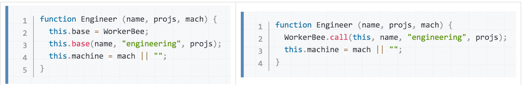     
使用 javascript 的 call() 方法相对明了一些，因为无需 base 方法了。

#### 再谈属性的继承
前面的小节中描述了 JavaScript 构造器和原型如何提供层级结构和继承的实现。本节中对之前未讨论的一些细节进行阐述。

#### 本地值和继承值
正如本章前面所述，在访问一个对象的属性时，JavaScript 将执行下面的步骤：

1. 检查本地值是否存在。如果存在，返回该值。
2. 如果本地值不存在，检查原型链（通过 __proto__ 属性）。
3. 如果原型链中的某个对象具有指定属性的值，则返回该值。
4. 如果这样的属性不存在，则对象没有该属性。
以上步骤的结果依赖于您是如何定义的。最早的例子中具有如下定义：

```
function Employee () {
  this.name = "";
  this.dept = "general";
}
function WorkerBee () {
  this.projects = [];
}
WorkerBee.prototype = new Employee;
```
基于这些定义，假定通过如下的语句创建 WorkerBee 的实例 amy：

```
var amy = new WorkerBee;
```
则 amy 对象将具有一个本地属性，projects。name 和 dept 属性则不是 amy 对象本地的，而是从 amy 对象的 __proto__ 属性获得的。因此，amy 将具有如下的属性值：

```
amy.name == "";
amy.dept == "general";
amy.projects == [];
```
现在，假设修改了与 Employee 的相关联原型中的 name 属性的值：

```
Employee.prototype.name = "Unknown"
```
乍一看，您可能觉得新的值会传播给所有 Employee 的实例。然而，并非如此。

在创建 Employee 对象的任意实例时，该实例的 name 属性将获得一个本地值（空的字符串）。这就意味着在创建一个新的 Employee 对象作为 WorkerBee 的原型时，WorkerBee.prototype 的 name 属性将具有一个本地值。因此，当 JavaScript 查找 amy 对象（WorkerBee 的实例）的 name 属性时，JavaScript 将找到 WorkerBee.prototype 中的本地值。因此，也就不会继续在原型链中向上找到 Employee.prototype 了。

如果想在运行时修改一个对象的属性值并且希望该值被所有该对象的后代所继承，您就不能在该对象的构造器函数中定义该属性。而应该将该属性添加到该对象所关联的原型中。例如，假设将前面的代码作如下修改：

```
function Employee () {
  this.dept = "general";
}
Employee.prototype.name = "";
function WorkerBee () {
  this.projects = [];
}
WorkerBee.prototype = new Employee;
var amy = new WorkerBee;
Employee.prototype.name = "Unknown";
```
在这种情况下，amy 的 name 属性将为 "Unknown"。

正如这些例子所示，如果希望对象的属性具有默认值，并且希望在运行时修改这些默认值，应该在对象的原型中设置这些属性，而不是在构造器函数中。

#### 判断实例的关系
JavaScript 的属性查找机制首先在对象自身的属性中查找，如果指定的属性名称没有找到，将在对象的特殊属性 __proto__ 中查找。这个过程是递归的；被称为“在原型链中查找”。

特殊的 __proto__ 属性是在构建对象时设置的；设置为构造器的 prototype 属性的值。所以表达式 new Foo() 将创建一个对象，其 __proto__ == Foo.prototype。因而，修改 Foo.prototype 的属性，将改变所有通过 new Foo() 创建的对象的属性的查找。

每个对象都有一个 __proto__ 对象属性（除了 Object）；每个函数都有一个 prototype 对象属性。因此，通过“原型继承（prototype inheritance）”，对象与其它对象之间形成关系。通过比较对象的 __proto__ 属性和函数的 prototype 属性可以检测对象的继承关系。JavaScript 提供了便捷方法：instanceof 操作符可以用来将一个对象和一个函数做检测，如果对象继承自函数的原型，则该操作符返回真。例如：

```
var f = new Foo();
var isTrue = (f instanceof Foo);
```
作为详细一点的例子，假定我们使用和在 继承属性 中相同的一组定义。创建 Engineer 对象如下：

```
var chris = new Engineer("Pigman, Chris", ["jsd"], "fiji");
```
对于该对象，以下所有语句均为真：

```
chris.__proto__ == Engineer.prototype;
chris.__proto__.__proto__ == WorkerBee.prototype;
chris.__proto__.__proto__.__proto__ == Employee.prototype;
chris.__proto__.__proto__.__proto__.__proto__ == Object.prototype;
chris.__proto__.__proto__.__proto__.__proto__.__proto__ == null;
```
基于此，可以写出一个如下所示的 instanceOf 函数：

```
function instanceOf(object, constructor) {
   while (object != null) {
      if (object == constructor.prototype)
         return true;
      if (typeof object == 'xml') {
        return constructor.prototype == XML.prototype;
      }
      object = object.__proto__;
   }
   return false;
}
```
在上面的实现中，检查对象的类型是否为 "xml" 的目的在于解决新近版本的 JavaScript 中表达 XML 对象的特异之处。

```
instanceOf (chris, Engineer)
instanceOf (chris, WorkerBee)
instanceOf (chris, Employee)
instanceOf (chris, Object)
```
但如下表达式为假：

```
instanceOf (chris, SalesPerson)
```
#### 构造器中的全局信息
在创建构造器时，在构造器中设置全局信息要小心。例如，假设希望为每一个雇员分配一个唯一标识。可能会为 Employee 使用如下定义：

```
var idCounter = 1;
function Employee (name, dept) {
   this.name = name || "";
   this.dept = dept || "general";
   this.id = idCounter++;
}
```

基于该定义，在创建新的 Employee 时，构造器为其分配了序列中的下一个标识符。然后递增全局的标识符计数器。因此，如果，如果随后的语句如下，则 victoria.id 为 1 而 harry.id 为 2：

```
var victoria = new Employee("Pigbert, Victoria", "pubs")
var harry = new Employee("Tschopik, Harry", "sales")
```
乍一看似乎没问题。但是，无论什么目的，在每一次创建 Employee 对象时，idCounter 都将被递增一次。如果创建本章中所描述的整个 Employee 层级结构，每次设置原型的时候，Employee 构造器都将被调用一次。假设有如下代码：

```
var idCounter = 1;

function Employee (name, dept) {
   this.name = name || "";
   this.dept = dept || "general";
   this.id = idCounter++;
}

function Manager (name, dept, reports) {...}
Manager.prototype = new Employee;

function WorkerBee (name, dept, projs) {...}
WorkerBee.prototype = new Employee;

function Engineer (name, projs, mach) {...}
Engineer.prototype = new WorkerBee;

function SalesPerson (name, projs, quota) {...}
SalesPerson.prototype = new WorkerBee;
var mac = new Engineer("Wood, Mac");
```
还可以进一步假设上面省略掉的定义中包含 base 属性而且调用了原型链中高于它们的构造器。即便在现在这个情况下，在 mac 对象创建时，mac.id 为 5。

依赖于应用程序，计数器额外的递增可能有问题，也可能没问题。如果确实需要准确的计数器，则以下构造器可以作为一个可行的方案：

```
function Employee (name, dept) {
   this.name = name || "";
   this.dept = dept || "general";
   if (name)
      this.id = idCounter++;
}
```
在用作原型而创建新的 Employee 实例时，不会指定参数。使用这个构造器定义，如果不指定参数，构造器不会指定标识符，也不会递增计数器。而如果想让 Employee 分配到标识符，则必需为雇员指定姓名。在这个例子中，mac.id 将为 1。

#### 没有多继承
某些面向对象语言支持多重继承。也就是说，对象可以从无关的多个父对象中继承属性和属性值。JavaScript 不支持多重继承。

JavaScript 属性值的继承是在运行时通过检索对象的原型链来实现的。因为对象只有一个原型与之关联，所以 JavaScript 无法动态地从多个原型链中继承。

在 JavaScript 中，可以在构造器函数中调用多个其它的构造器函数。这一点造成了多重继承的假象。例如，考虑如下语句：

```
function Hobbyist (hobby) {
   this.hobby = hobby || "scuba";
}

function Engineer (name, projs, mach, hobby) {
   this.base1 = WorkerBee;
   this.base1(name, "engineering", projs);
   this.base2 = Hobbyist;
   this.base2(hobby);
   this.machine = mach || "";
}
Engineer.prototype = new WorkerBee;

var dennis = new Engineer("Doe, Dennis", ["collabra"], "hugo")
```
进一步假设使用本章前面所属的 WorkerBee 的定义。此时 dennis 对象具有如下属性：

```
dennis.name == "Doe, Dennis"
dennis.dept == "engineering"
dennis.projects == ["collabra"]
dennis.machine == "hugo"
dennis.hobby == "scuba"
```
dennis 确实从 Hobbyist 构造器中获得了 hobby 属性。但是，假设添加了一个属性到 Hobbyist 构造器的原型：

```
Hobbyist.prototype.equipment = ["mask", "fins", "regulator", "bcd"]
```
dennis 对象不会继承这个新属性。


	    


 