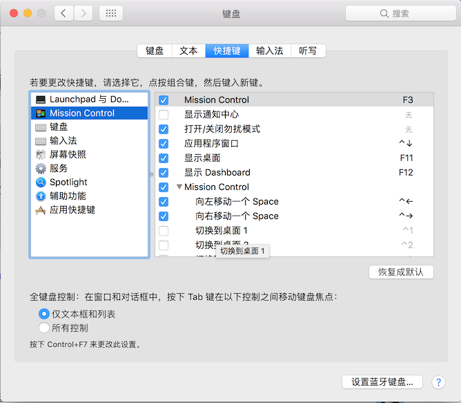
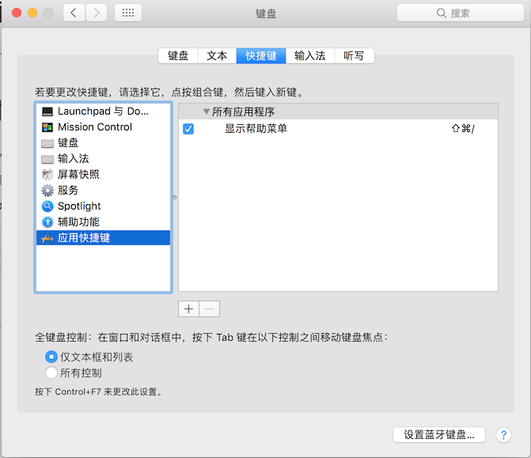
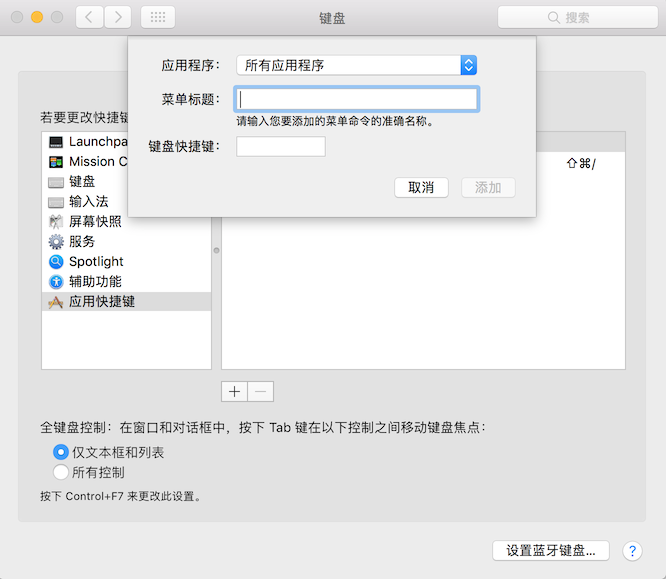
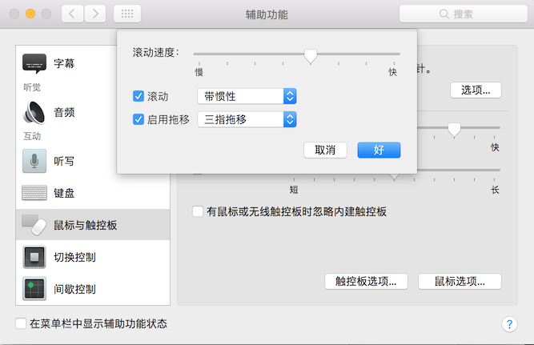
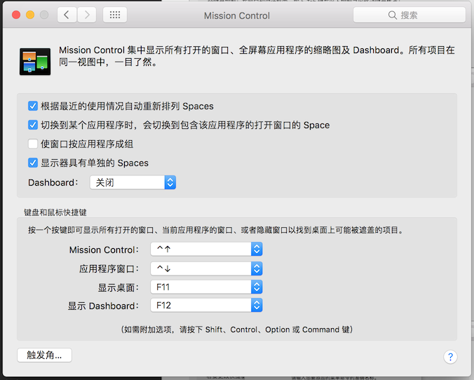
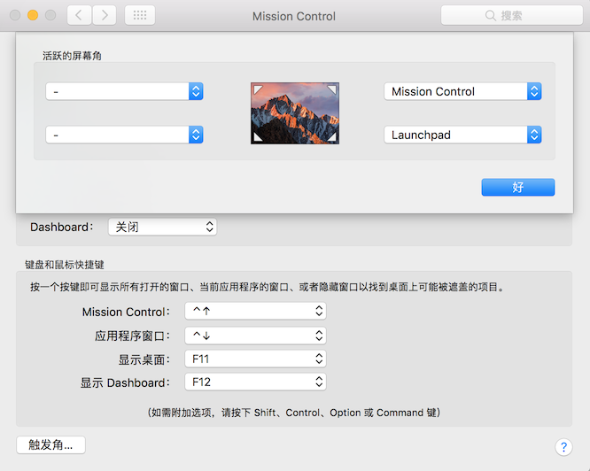

# Mac 键盘快捷键
## 认识虚拟键(修饰键)列表：
键盘        |  虚拟键
-----------|----------
Command    |   ⌘   
Shift      |   ⇧       
Option     |   ⌥
Control    |   ⌃   
Caps Lock  |   ⇪   
Fn         |   功能键

## 剪切、拷贝、粘贴和其他常用快捷键
快捷键                     |       描述
--------------------------|---------------------------
Command-X	                |  剪切所选项并将其拷贝到剪贴板
Command-C	                |  将所选项拷贝到剪贴板。这同样适用于 Finder 中的文件
Command-V	                |  将剪贴板的内容粘贴到当前文稿或应用中
Command-Z	                |  撤销前一个命令。随后您可以按 Command-Shift-Z反撤销
Command-A	                |  全选各项
Command-F	                |  查找文稿中的项目或打开“查找”窗口
Command-G	                |  查找项目出现的下一个位置
Command-Shift-G           |  要查找项目出现的上一个位置
Command-H	                |  隐藏最前面的应用的窗口
Command-Option-H          |  查看最前面的应用但隐藏所有其他应用
Command-M	                |  将最前面的窗口最小化至Dock
Command-Option-M          |  要最小化最前面的应用的所有窗口
Command-N	                |  新建：打开一个新文稿或新窗口
Command-O	                |  打开所选项，或打开一个对话框以选择要打开的文件
Command-P	                |  打印当前文稿
Command-S	                |  存储当前文稿
Command-W	                |  关闭最前面的窗口
Command-Option-W          |  要关闭该应用的所有窗口
Command-Q	                |  退出应用
Option-Command-Esc        |	强制退出：选择要强制退出的应用
Command-Shift-Option-Esc  |  3 秒钟来仅强制最前面的应用退出
Command–空格键	             |  Spotlight：显示或隐藏 Spotlight 搜索栏
Command–Option–空格键      |  要从 Finder 窗口执行 Spotlight 
空格键	                   |  快速查看：使用快速查看来预览所选项。
Command-Tab	             |  切换应用：在打开的应用中切换到下一个最近使用的应用
Shift-Command-波浪号 (~)	   |  切换窗口：切换到最前端应用中下一个最近使用的窗口
Shift-Command-3	         |  屏幕快照：拍摄整个屏幕的屏幕快照。了解更多屏幕快照快捷键
Command-逗号 (,)	         |  偏好设置：打开最前面的应用的偏好设置


## 睡眠、注销和关机快捷键
快捷键                    |     描述
-------------------------|----------------------
电源按钮                  |  按下可打开 Mac 电源或将 Mac 从睡眠状态唤醒当 Mac 处于唤醒状态时，按住此按钮 1.5 秒钟会显示一个对话框，询问您是要睡眠、重新启动还是关机。如果您不想等待 1.5 秒钟，请按下 Control–电源按钮或 Control–介质推出键 。*按住此按钮 5 秒钟会强制 Mac 关机。
Control–Command–电源按钮	 |  强制 Mac 重新启动。*
Control–Shift–电源按钮	 |  将显示器置于睡眠状态。*
Control–Option–Command–电源按钮 |  退出所有应用，然后关闭 Mac。如果任何打开的文稿有未存储的更改，系统将询问您是否要存储这些更改。*
Shift-Command-Q	         |  注销您的 macOS 用户帐户。系统将提示您确认。
Option-Shift-Command-Q	 |  立即注销您的 macOS 用户帐户，且系统不提示您确认。

## 文稿快捷键
快捷键                       |      描述
----------------------------|----------------------
Command-B	             |  以粗体显示所选文本，或者打开或关闭粗体显示功能。 
Command-I	             |  以斜体显示所选文本，或者打开或关闭斜体显示功能。
Command-U	             |  对所选文本加下划线，或者打开或关闭加下划线功能。
Command-T	             |  显示或隐藏“字体”窗口.
Command-D	             |  从“打开”对话框或“存储”对话框中选择“桌面”文件夹。
Control-Command-D	     |  显示或隐藏所选字词的定义。
Shift-Command-冒号 (:)	 |  显示“拼写和语法”窗口。
Command-分号 (;)	         |  查找文稿中拼写错误的字词。
Option-Delete	         |  删除插入点左边的字词。
Control-H	             |  删除插入点左边的字符。也可以使用 Delete 键。
Control-D	             |  删除插入点右边的字符。也可以使用 Fn-Delete。
Fn-Delete	             |  在没有向前删除   键的键盘上向前删除。也可以使用 Control-D。
Control-K	             |  删除插入点与行或段落末尾处之间的文本。
Command-Delete	         |  在包含“删除”或“不存储”按钮的对话框中选择“删除”或“不存储”。
Fn–上箭头	             |  向上翻页：向上滚动一页。 
Fn–下箭头	             |  向下翻页：向下滚动一页。
Fn–左箭头	             |  开头：滚动到文稿开头。
Fn–右箭头	             |  结尾：滚动到文稿末尾。
Command–上箭头	         |  将插入点移至文稿开头。
Command–下箭头	         |  将插入点移至文稿末尾。
Command–左箭头	         |  将插入点移至当前行的行首。
Command–右箭头	         |  将插入点移至当前行的行尾。
Option–左箭头	         |  将插入点移至上一字词的词首。
Option–右箭头	         |  将插入点移至下一字词的词尾。
Shift–Command–上箭头	     |  选中插入点与文稿开头之间的文本。
Shift–Command–下箭头	     |  选中插入点与文稿末尾之间的文本。
Shift–Command–左箭头	     |  选中插入点与当前行行首之间的文本。
Shift–Command–右箭头	     |  选中插入点与当前行行尾之间的文本。
Shift–上箭头	             |  将文本选择范围扩展到上一行相同水平位置的最近字符处。
Shift–下箭头	             |  将文本选择范围扩展到下一行相同水平位置的最近字符处。
Shift–左箭头	             |  将文本选择范围向左扩展一个字符。
Shift–右箭头	             |  将文本选择范围向右扩展一个字符。
Option–Shift–上箭头	     |  将文本选择范围扩展到当前段落的段首，再按一次则扩展到下一段落的段首。
Option–Shift–下箭头	     |  将文本选择范围扩展到当前段落的段尾，再按一次则扩展到下一段落的段尾。
Option–Shift–左箭头	     |  将文本选择范围扩展到当前字词的词首，再按一次则扩展到后一字词的词首。
Option–Shift–右箭头	     |  将文本选择范围扩展到当前字词的词尾，再按一次则扩展到后一字词的词尾。
Control-A	             |  移至行或段落的开头。
Control-E	             |  移至行或段落的末尾。
Control-F	             |  向前移动一个字符。
Control-B	             |  向后移动一个字符。
Control-L	             |  将光标或所选内容置于可见区域中央。
Control-P	             |  上移一行。
Control-N	             |  下移一行。
Control-O	             |  在插入点后插入一行。
Control-T	             |  将插入点后面的字符与插入点前面的字符交换。
Command–左花括号 ({)	     |  左对齐。
Command–右花括号 (})	     |  右对齐。
Shift–Command–竖线 (|)	 |  居中对齐。
Option-Command-F	     |  前往搜索栏。 
Option-Command-T	     |  显示或隐藏应用中的工具栏。
Option-Command-C	     |  拷贝样式：将所选项的格式设置拷贝到剪贴板。
Option-Command-V	     |  粘贴样式：将拷贝的样式应用到所选项。
Option-Shift-Command-V	 |  粘贴并匹配样式：将周围内容的样式应用到粘贴在该内容中的项目。
Option-Command-I	     |  显示或隐藏检查器窗口。
Shift-Command-P	         |  页面设置：显示用于选择文稿设置的窗口。
Shift-Command-S	         |  显示“存储为”对话框或复制当前文稿。
Shift–Command–减号 (-)    |  缩小所选项。
Shift–Command–加号 (+)	 |  放大所选项。
Command–等号 (=)  |  可执行相同的功能。
Shift–Command–问号 (?)	 |  打开“帮助”菜单。

## Finder快捷键
快捷键                           |     描述
--------------------------------|---------------------
Command-D	                  |  复制所选文件。
Command-E	                  |  推出所选磁盘或宗卷。
Command-F	                  |  在 Finder 窗口中开始 Spotlight 搜索。
Command-I	                  |  显示所选文件的“显示简介”窗口。
Shift-Command-C	              |  	打开“电脑”窗口。
Shift-Command-D	              |  	打开“桌面”文件夹。
Shift-Command-F	              |  	打开“我的所有文件”窗口。
Shift-Command-G	              |  	打开“前往文件夹”窗口。
Shift-Command-H	              |  	打开当前 macOS 用户帐户的个人文件夹。
Shift-Command-I	              |  	打开 iCloud Drive。
Shift-Command-K	              |  	打开“网络”窗口。
Option-Command-L	          |  	打开“下载”文件夹。
Shift-Command-O	              |  	打开“文稿”文件夹。
Shift-Command-R	              |  	打开“AirDrop”窗口。
Shift-Command-T	              |  	将所选的 Finder 项目添加到 Dock（OS X Mountain Lion 或更低版本）
Control-Shift-Command-T	      |  	将所选的 Finder 项目添加到 Dock（OS X Mavericks 或更高版本）
Shift-Command-U	              |  	打开“实用工具”文件夹。
Option-Command-D	          |  	显示或隐藏 Dock。即使您未在 Finder 中，此快捷键通常也有效。
Control-Command-T	          |  	将所选项添加到边栏（OS X Mavericks 或更高版本）。
Option-Command-P	          |  	隐藏或显示 Finder 窗口中的路径栏。
Option-Command-S	          |  	隐藏或显示 Finder 窗口中的边栏。
Command–斜线 (/)	              |  	隐藏或显示 Finder 窗口中的状态栏。
Command-J	                  |  	显示“显示”选项。
Command-K	                  |  	打开“连接服务器”窗口。
Command-L	                  |  	为所选项制作替身。
Command-N	                  |  	打开一个新的 Finder 窗口。
Shift-Command-N	              |  	新建文件夹。
Option-Command-N	          |  	新建智能文件夹。
Command-R	                  |  	显示所选替身的原始文件。
Command-T	                  |  	在当前 Finder 窗口中有单个标签页开着的状态下显示或隐藏标签页栏。
Shift-Command-T	              |  	显示或隐藏 Finder 标签页。
Option-Command-T	          |  	在当前 Finder 窗口中有单个标签页开着的状态下显示或隐藏工具栏。
Option-Command-V	          |  	移动：将剪贴板中的文件从其原始位置移动到当前位置。
Option-Command-Y	          |  	显示所选文件的快速查看幻灯片显示。
Command-Y	                  |  	使用“快速查看”预览所选文件。
Command-1	                  |  	以图标方式显示 Finder 窗口中的项目。
Command-2	                  |  	以列表方式显示 Finder 窗口中的项目。
Command-3	                  |  	以分栏方式显示 Finder 窗口中的项目。 
Command-4	                  |  	以 Cover Flow 方式显示 Finder 窗口中的项目。
Command–左中括号 ([)	          |  	前往上一文件夹。
Command–右中括号 (])	          |  	前往下一文件夹。
Command–上箭头	              |  	打开包含当前文件夹的文件夹。
Command–Control–上箭头	      |  	在新窗口中打开包含当前文件夹的文件夹。
Command–下箭头	              |  	打开所选项。
Command–Mission Control	      |  	显示桌面。即使您未在 Finder 中，此快捷键也有效。
Command–调高亮度	              |  	开启或关闭目标显示器模式。
Command–调低亮度	              |  	当 Mac 连接到多个显示器时打开或关闭显示器镜像功能。
右箭头	                      |  	打开所选文件夹。此快捷键仅在列表视图中有效。
左箭头	                      |  	关闭所选文件夹。此快捷键仅在列表视图中有效。
Option-连按	                  |  	在单独的窗口中打开文件夹，并关闭当前窗口。
Command-连按	                  |  	在单独的标签页或窗口中打开文件夹。
Command-Delete	              |  	将所选项移到废纸篓。
Shift-Command-Delete	      |  	清倒废纸篓。
Option-Shift-Command-Delete	  |  	清倒废纸篓而不显示确认对话框。
Command-Y	                  |  	使用“快速查看”预览文件。
Option–调高亮度	              |  	打开“显示器”偏好设置。此快捷键可与任一亮度键搭配使用。
Option–Mission Control	      |  	打开“Mission Control”偏好设置。
Option–调高音量	              |  	打开“声音”偏好设置。此快捷键可与任一音量键搭配使用。
拖移时按 Command 键	          |  	将拖移的项目移到其他宗卷或位置。拖移项目时指针会随之变化。
拖移时按住 Option 键	          |  	拷贝拖移的项目。拖移项目时指针会随之变化。
拖移时按住 Option-Command		  |  为拖移的项目制作替身。拖移项目时指针会随之变化。
Option-点按开合三角形	          |  	打开所选文件夹内的所有文件夹。此快捷键仅在列表视图中有效。
Command-点按窗口标题	          |  	查看包含当前文件夹的文件夹。

## Mac启动组合键
在启动期间按住                   |      描述
-------------------------------|---------------------
Shift (⇧)	                    |  以安全模式启动。
Option (⌥)	                    |  	启动进入启动管理器，您可以从中选取其他启动磁盘（若可用）。
C		                        |  从可用的 CD、DVD 或 USB 闪存驱动器启动（可将 Mac 对应的有效操作系统装入这些介质）。或者，您也可以通过上述操作来使用启动管理器。
D		                        |  从内建的 Apple Hardware Test 或 Apple Diagnostics 实用工具启动，具体取决于您的 Mac 机型。或者，您也可以使用 Option-D 通过互联网从该实用工具启动。
N		                        |  从兼容的 NetBoot 服务器（若可用）启动。要使用 NetBoot 服务器上默认的引导映像，则请按住 Option-N。
Option-Command (⌘)-P-R		    |  重置 NVRAM 或 PRAM。
Command-R		                |  从内建的 macOS 恢复系统启动。或者，您也可以使用 Option-Command-R 或 Shift-Option-Command-R 以通过互联网从 macOS 恢复功能启动。macOS 恢复功能可以安装不同版本的 macOS，具体取决于您在电脑启动时使用的组合键。
Command-S		                |  以单用户模式启动。
T		                        |  以目标磁盘模式启动。
X		                        |  在 Mac 正常会从非 macOS 启动磁盘（例如 Windows 分区）启动的情况下，让电脑从 macOS 启动磁盘启动。或者，您也可以通过上述操作来使用启动管理器。
Command-V		                |  以详细模式启动。
推出键 (⏏)、F12、	                |  鼠标键或触控板按钮	推出可移动介质，如光盘。

## Mac辅助功能快捷键
操作                       |    描述
--------------------------|-----------------
显示辅助功能选项		     |  	Option-Command-F5 或在受支持的机型上1，连按三次 Touch ID（电源按钮）
开启或关闭VoiceOver2 		 |  	Command-F5 或 Fn-Command-F5或在受支持的机型上1，按住 Command 键并连按三次 Touch ID（电源按钮）
打开 VoiceOver 实用工具（如果 VoiceOver 已开启）2		|  	Control-Option-F8 或 Fn-Control-Option-F8
开启或关闭缩放功能3		 |  	Option-Command-8
放大3		             |  	Option-Command-加号 (+)
缩小3		             |  	Option-Command-减号 (-)
开启或关闭反转颜色设置		 |  	Control-Option-Command-8
降低对比度		         |  	Control-Option-Command-逗号 (,)
增强对比度		         |  	Control-Option-Command-句号 (.)

## 在Mac上键入重音符号、表情符号和符号
快捷键                    |  描述
-------------------------|---------------------------
command + ^ + space      |  快速调出emoji 列表


## 创建自己的键盘快捷键
设置--->键盘---->快捷键



三指拖动功能


触控板设置


屏幕四角鼠标焦点设置




* 显示所有文件：
```
defaults write com.apple.finder AppleShowAllFiles -bool true
```
* 仅显示可见文件：
```
defaults write com.apple.finder AppleShowAllFiles -bool false
```


