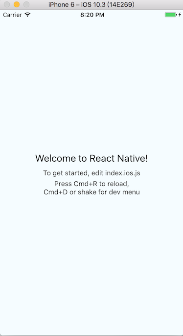
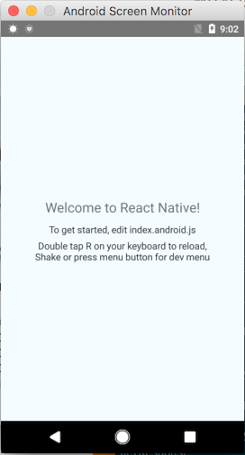

# RN_环境搭建
中文
http://reactnative.cn/docs/0.44/getting-started.html<br>
英文
https://facebook.github.io/react-native/docs/getting-started.html<br>
ECMAScript 6
http://es6.ruanyifeng.com/#docs/intro

### macos 下安装Homebrew
https://brew.sh/index_zh-cn.html
### 安装 Node
两种方式
1.到官网下载安装包
https://nodejs.org/en/
2.命令安装
```
brew install node
```

### React Native的命令行工具（react-native-cli）
```
npm install -g react-native-cli
```

## 推荐安装
### Watchman 
由Facebook提供的监视文件系统变更的工具
```
brew install watchman
```

### Flow
一个静态的JS类型检查工具
```
brew install flow
```

### 创建项目
```
react-native init LearnRN  //安装node依赖模块
cd LearnRN  //项目中有android ios两个平台项目
react-native run-ios  //在ios平台上运行  cmd+d 打开开发菜单
```
效果如下:


### 运行android项目 
将android设备连接
将local.properties文件拷贝到 rn项目的android目录
local.properties内容:
ndk.dir=/Users/junzhao/android/sdk/ndk-bundle
sdk.dir=/Users/junzhao/android/sdk
```
react-native run-android
```



