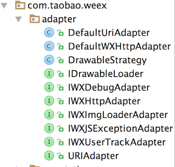

### android端集成
1.源码方式集成方式(方便查看源码) 
  github: https://github.com/apache/incubator-weex
  clone下来后在android文件夹中有sdk module
  导入android项目中即可
  在android项目的Application初始化sdk
  ```java
  InitConfig.Builder builder = new InitConfig.Builder();
  builder.setImgAdapter(new ImageAdapter()); //图片加载适配器
        InitConfig config = builder.build(); //一些初始化配置 需要glide库
        WXSDKEngine.initialize(this, config);
        
        //注册自定义 module
        try {
WXSDKEngine.registerModule("weex_android",WXEventModule.class);
        } catch (WXException e) {
            e.printStackTrace();
        }
 ```
 android项目需要加载weex的Activity中
 1. 实现IWXRenderListener接口
 2. 在oncreate方法中 注册渲染接口
 
 ```
 WXSDKInstance mWXSDKInstance = new WXSDKInstance(this);
 mWXSDKInstance.registerRenderListener(this);
 //加载weex 
 //方式1 远程url
 mWXSDKInstance.renderByUrl(getPackageName(), Config.url, null, null, null);
 //方式2 加载本地js
 mWXSDKInstance.render(WXFileUtils.loadAsset("helloworld.js", this));
 
 //在方法onViewCreated(WXSDKInstance instance, View view) 设置weex的view
 setContentView(view);
    
 ```

### Android APIs
WXSDKEngine 是 Weex 对外的总入口。
主要提供了一下功能:
1.设置相关 Adapter 和获取 adapter。
2.注册自定义 module 和 component
3.重置 JSFramework

#### Adapter weex适配器介绍 
Weex 为了重用 Native 通用库提供了对应的接口进行设置。
1.IWXImgLoaderAdapter 图片适配器。
Weex 会把需要设置图片的 View 和 URL 透露出来，Native 端需要实现这个接口进行图片下载。 Weex 没有提供图片默认实现。
2.IWXHttpAdapter 网络下载适配器。
   可以设置成流行的okhttp库   
3.IWXUserTrackAdapter Weex 相关性能数据 (首屏加载时间、JS-Native 通信时间、dom 更新时间等) 和其他通用信息 (JSLib 文件大小, Weex SDK 版本号等)。
源码中的适配器:


#### Native 和 JS 通信
1.自定义事件通知  本地发送事件向js
多用于某个自定义控件进行事件通知，例如自定义点击事件，响应下拉事件等。
WXSDKInstance.java 中

```
public void fireEvent(String elementRef,final String type, final Map<String, Object> data,final Map<String, Object> domChanges){  }

public void fireEvent(String elementRef,final String type, final Map<String, Object> data){
  fireEvent(elementRef,type,data,null);
}

public void fireEvent(String elementRef, String type){
  fireEvent(ref,type,new HashMap<String, Object>());
}

```
  elementRef：事件发生的控件 ID。
  type: 自定义事件，Weex 默认以 onXxxxx 开头为自定义事件。onPullDown (下拉事件)。
  data: 需要透出的参数，例如当前控件的大小，坐标等其他信息。
  domChanges：更新 ref 对应控件的 Attribute 和 Style。

2.事件回调
多用于 Module 回调，例如定位 Module 完成后需要通知 JS。使用方法如下：

```
public class WXLocation extends WXModule {
  @JSMethod
  public void getLocation(JSCallback callback){
    //获取定位代码.....
    Map<String,String> data=new HashMap<>();
    data.put("x","x");
    data.put("y","y");
    //通知一次
    callback.invoke(data);
    //持续通知
    callback.invokeAndKeepAlive(data);
    //invoke方法和invokeAndKeepAlive两个方法二选一
  }
}

```
3.globalEvent 全局事件
globalEvent 用于监听持久性事件，例如定位信息，陀螺仪等的变化。

```
Map<String,Object> params=new HashMap<>();
params.put("key","value");
mWXSDKInstance.fireGlobalEventCallback("geolocation",params);

var globalEvent = require('@weex-module/globalEvent');
globalEvent.addEventListener("geolocation", function (e) {
  console.log("get geolocation")
});
```
weex 取消监听全局事件

```
var globalEvent = require('@weex-module/globalEvent');
globalEvent.removeEventListener("geolocation");
```
eg:
native端发送
```
Map<String, Object> addressData = new HashMap<>();
addressData.put("address", event.address);
addressData.put("subAddress", event.subAddress);
addressData.put("lngX", event.lngX);
addressData.put("latY", event.latY);
mWXSDKInstance.fireGlobalEventCallback("global_event",addressData);
```
weex端接收
```
var globalEvent = weex.requireModule('globalEvent');
globalEvent.addEventListener("global_event",function(e){
              if (e.url!=undefined) {
                self.courtdata.urlImage = e.url;
                if(e.url.length==10){
                  self.isload=true;
                }
              }if (e.address!=undefined){
                self.courtdata.address=e.address;
                if(e.address.indexOf('球场地址')>-1){
                    self.add_color='#999'
                  }else{
                    self.add_color='#333'
                  }
                self.courtdata.lngX = e.lngX;
                self.courtdata.latY = e.latY;
                // subAdress
              }
              if(e.subAddress!=undefined){
                  self.courtdata.subAdress=e.subAddress;
                }
            });
```


4.native刷新weex页面数据
```
 new Handler().postDelayed(new Runnable() {
            @Override
            public void run() {
                WXBridgeManager manager = WXBridgeManager.getInstance();
                Map<String, String> urlData = new HashMap<String, String>();
                urlData.put("url", "hahaha");
                String jsonStr = JSON.toJSONString(urlData);
                WXRefreshData refreshData = new WXRefreshData(jsonStr, false);
                manager.refreshInstance(mWXSDKInstance.getInstanceId(), refreshData);
            }
        }, 3000);
```

5.利用module 和 Component (weex调用native)
eg: 
native端定义module
```
public class WXAndroidModule extends WXModule {
    // 打开相册
    @JSMethod
    public void openAlbum(String[] urls) {
        SpaceSelectPhotoWindow popupWindow = new SpaceSelectPhotoWindow(
                (Activity)mWXSDKInstance.getContext());
        if (urls != null && urls.length > 0) {
            ACache.get(mWXSDKInstance.getContext()).put("urls", urls);
            popupWindow.setUrlSize(urls.length);
        }
        popupWindow.show();
    }
}

   //在application中注册module
  WXSDKEngine.registerModule("module_event", WXAndroidModule.class);
```
weex 端调用
```
openalbum:function(){
          var album = weex.requireModule('module_event');
          album.openAlbum(this.courtdata.urlImage);
          if(weex.config.env.platform != "iOS"){            
            album.closeKeybord();
          }
        }
```

6.领用WXSDKInstance 加载weex时传递的config参数
eg:
native端
```
 public Map<String, Object> getData() {
        Map<String, Object> hashMap = new HashMap<>();
        if (getIntent().getSerializableExtra("teamFeeData") != null) {
            TeamFeeData teamFeeData = (TeamFeeData)getIntent().getSerializableExtra("teamFeeData");
            hashMap.put("data", teamFeeData); //object类型
            LogUtil.syso("Teamfee", "", "dataJson:" + teamFeeData.userid);
        }
        return hashMap;
    }
 
 mWXSDKInstance.renderByUrl(getPackageName(), IKickerConfig.TEAMFEE_URL, getData(), null,WXRenderStrategy.APPEND_ASYNC);   
```
weex端
```
global.userid=self.$getConfig().data.userid;
global.token=self.$getConfig().data.token;
global.teamid=self.$getConfig().data.teamid;
global.isAdmin=self.$getConfig().data.admin; 
global.url =self.$getConfig().data.url;
```

#### Android 扩展
Weex 提供了扩展机制，可以根据自己的业务进行定制自己的功能。
主要分为两类扩展：
1.Module 扩展非UI的特定功能。例如 sendHttp、openURL 等。
2.Component 扩展 实现特别功能的 Native 控件。例如：RichTextview，RefreshListview 等。
3.Adapter 扩展 Weex 对一些基础功能实现了统一的接口，可实现这些接口来定制自己的业务。例如：图片下载等。
链接:
http://weex.apache.org/cn/references/advanced/extend-to-android.html


一个weex项目开源框架:
https://github.com/osmartian/weex-frame


   
   


